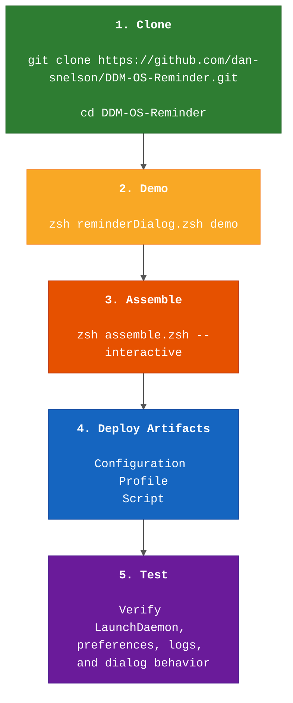

# Executive Overview Diagram

This diagram gives Mac Admins a simple, high-level deployment path for DDM OS Reminder.

## What Each Phase Means

**1. Clone**: Get a local working copy of the project.
**2. Demo**: Run demo mode for the fastest feedback loop on reminder dialog.
**3. Assemble**: Assemble deployable artifacts for your RDNN.
**4. Deploy**: Upload the assembled script and profile through MDM.
**5. Test**: Validate behavior on a test device before production rollout.

## How to Use This Overview

- Use this as a quick-start map for new Mac Admins.
- Refer to [01-system-architecture.md](01-system-architecture.md) for full architecture detail.