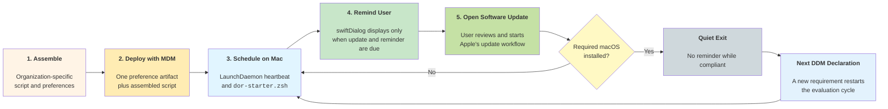

# Executive Overview Diagram

This diagram gives Mac Admins a high-level view of DDM OS Reminder from assembly through the next Apple DDM declaration.

```mermaid
flowchart LR
    Assemble["<b>1. Assemble</b><br/><br/>Organization-specific<br/>script and preferences"]
    MDM["<b>2. Deploy with MDM</b><br/><br/>One preference artifact<br/>plus assembled script"]
    Scheduler["<b>3. Schedule on Mac</b><br/><br/>LaunchDaemon heartbeat<br/>and <code>dor-starter.zsh</code>"]
    Reminder["<b>4. Remind User</b><br/><br/>swiftDialog displays only<br/>when update and reminder are due"]
    Update["<b>5. Open Software Update</b><br/><br/>User reviews and starts<br/>Apple's update workflow"]
    Compliant{"Required macOS<br/>installed?"}
    Quiet["<b>Quiet Exit</b><br/><br/>No reminder while compliant"]
    Next["<b>Next DDM Declaration</b><br/><br/>A new requirement restarts<br/>the evaluation cycle"]

    Assemble --> MDM --> Scheduler --> Reminder --> Update --> Compliant
    Compliant -->|No| Scheduler
    Compliant -->|Yes| Quiet --> Next --> Scheduler

    style Assemble fill:#fff4e6
    style MDM fill:#ffecb3
    style Scheduler fill:#e1f5ff
    style Reminder fill:#c8e6c9
    style Update fill:#c5e1a5
    style Compliant fill:#fff9c4
    style Quiet fill:#cfd8dc
    style Next fill:#e3f2fd
```

## What Each Phase Means

1. **Assemble**: `assemble.zsh` combines runtime code, deployment code, and sample preferences into organization-specific artifacts.
2. **Deploy**: Use either the generated `.plist` or `.mobileconfig` for managed preferences, not both, and execute the assembled script once through your MDM.
3. **Schedule**: A 60-second LaunchDaemon heartbeat runs `dor-starter.zsh`, which checks client-side state before launching the full reminder workflow.
4. **Remind**: `dor.zsh` resolves trustworthy DDM state, verifies that the Mac still needs the update, applies reminder gates, and displays swiftDialog only when appropriate.
5. **Update**: DDM OS Reminder opens System Settings; Apple Software Update performs the download, installation, and enforcement.
6. **Comply and repeat**: Compliant Macs exit quietly until a later DDM declaration creates a new requirement.

## Ownership Boundaries

- **Administrator**: assembles artifacts, deploys preferences and script, and monitors results.
- **DDM OS Reminder**: schedules and displays reminder messaging; it does not perform the macOS update.
- **Apple DDM and Software Update**: declare, download, install, and enforce the macOS update.

See [Deployment Workflow](04-deployment-workflow.md) for implementation steps and [System Architecture](01-system-architecture.md) for component detail.
