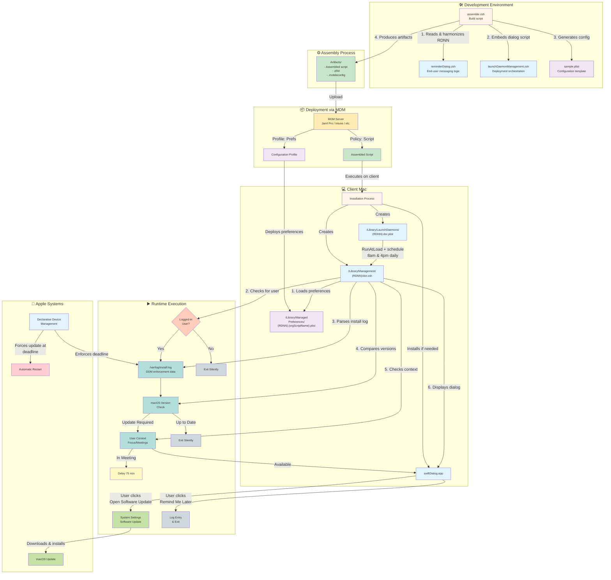

# System Architecture Diagram

This diagram shows the complete DDM OS Reminder ecosystem from development through deployment to runtime execution.



## Component Descriptions

### Development Environment
- **reminderDialog.zsh**: Core logic for end-user messaging, preference management, and dialog display
- **launchDaemonManagement.zsh**: Handles deployment, LaunchDaemon creation, and swiftDialog installation
- **assemble.zsh**: Combines the above scripts into a single deployable artifact
- **sample.plist**: Template configuration file with all customizable preferences

### Assembly Process
- Harmonizes Reverse Domain Name Notation (RDNN) across files
- Embeds reminderDialog.zsh content into launchDaemonManagement.zsh
- Removes demo mode code
- Generates three deployment artifacts:
  - Assembled .zsh script (ready to deploy)
  - .plist configuration file
  - .mobileconfig Configuration Profile

### Deployment
- Administrator uploads assembled script to MDM server
- Script runs via MDM policy (one-time execution)
- Configuration Profile deployed separately for preference management
- Both components work together on client

### Client Installation
- Script installs to `/Library/Management/{RDNN}/`
- LaunchDaemon created and loaded at `/Library/LaunchDaemons/`
- swiftDialog installed if not present (or updated if outdated)
- Managed Preferences deployed via Configuration Profile

### Runtime Execution
1. **LaunchDaemon triggers** at load and on scheduled times (default: 8am, 4pm)
2. **Preference loading** from 3-tier hierarchy (Managed → Local → Defaults)
3. **User validation** ensures someone is logged in
4. **Log parsing** extracts DDM enforcement dates from install.log
5. **Version comparison** determines if update is required
6. **Context checking** respects user's Focus mode and meetings
7. **Dialog display** with deadline-appropriate behavior (blurscreen, button visibility)
8. **User interaction** leads to Software Update or delayed reminder

### Apple Integration
- **DDM** enforces update deadlines and writes enforcement data to install.log
- **Software Update** handles the actual macOS update process
- **Forced restart** occurs at deadline if user hasn't updated

## Data Flow

```
Development → Assembly → MDM → Client Installation → Runtime Execution → User Interaction → macOS Update
     ↑                                                        ↓
     └────────────── Admin monitors logs & adjusts ──────────┘
```

## Key Benefits of Architecture

1. **Single deployment**: One assembled script contains all logic
2. **Flexible configuration**: Preferences managed separately from code
3. **Automated scheduling**: LaunchDaemon ensures regular reminders
4. **User-friendly**: swiftDialog provides polished UI
5. **DDM-aware**: Reads Apple's enforcement data, no MDM API required
6. **Intelligent**: Respects user context (meetings, Focus mode)
7. **Deadline-driven**: Behavior adapts as deadline approaches
