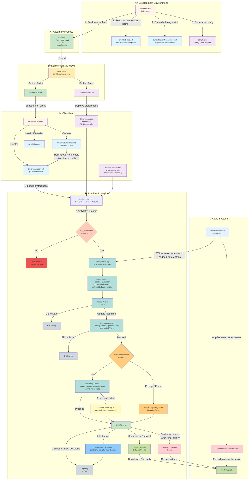

# System Architecture Diagram

This diagram shows the complete DDM OS Reminder ecosystem from development through runtime execution.


```mermaid
graph TB
    subgraph Development["🛠️ Development Environment"]
        RD["reminderDialog.zsh<br>End-user messaging logic"]
        LD["launchDaemonManagement.zsh<br>Deployment orchestration"]
        AS["assemble.zsh<br>Build script"]
        SP["sample.plist<br>Configuration template"]

        style RD fill:#e1f5ff
        style LD fill:#e1f5ff
        style AS fill:#fff4e6
        style SP fill:#f3e5f5
    end

    subgraph Assembly["⚙️ Assembly Process"]
        AS -->|1. Reads & harmonizes RDNN| RD
        AS -->|2. Embeds dialog script| LD
        AS -->|3. Generates config| SP
        AS -->|4. Produces artifacts| ART

        ART["Artifacts/<br>- Assembled script<br>- .plist<br>- .mobileconfig"]

        style ART fill:#c8e6c9
    end

    subgraph Deployment["📦 Deployment via MDM"]
        MDM["MDM Server<br>Jamf Pro / Intune / etc."]
        ART -->|Upload| MDM

        MDM -->|Policy: Script| SCRIPT[Assembled Script]
        MDM -->|Profile: Prefs| PROFILE[Configuration Profile]

        style MDM fill:#ffecb3
        style SCRIPT fill:#c8e6c9
        style PROFILE fill:#f3e5f5
    end

    subgraph Client["💻 Client Mac"]
        SCRIPT -->|Executes on client| INST[Installation Process]
        PROFILE -->|Deploys preferences| MGDPREF

        INST -->|Creates| CLISCRIPT["/Library/Management/<br>(RDNN)/dorm.zsh"]
        INST -->|Creates| CLILD["/Library/LaunchDaemons/<br>(RDNN).dor.plist"]
        INST -->|Installs if needed| SD["swiftDialog.app"]

        MGDPREF["/Library/Managed<br>Preferences/<br>(RDNN).dorm.plist"]
        LOCALPREF["/Library/Preferences/<br>(RDNN).dorm.plist<br>(optional local overrides)"]

        style INST fill:#fff4e6
        style CLISCRIPT fill:#e1f5ff
        style CLILD fill:#e1f5ff
        style SD fill:#e1f5ff
        style MGDPREF fill:#f3e5f5
        style LOCALPREF fill:#f3e5f5
    end

    subgraph Runtime["▶️ Runtime Execution"]
        CLILD -->|RunAtLoad + schedule<br/>8am & 4pm daily| CLISCRIPT

        CLISCRIPT -->|1. Loads preferences| PREFLOAD["Preference Loader<br/>Managed → Local → Defaults"]
        MGDPREF --> PREFLOAD
        LOCALPREF --> PREFLOAD

        PREFLOAD -->|2. Validates runtime| USER{"Logged-in User?<br/>Wait up to 120s"}

        USER -->|No| EXIT1[FATAL ERROR<br/>No user session]
        USER -->|Yes| INSTLOG["/var/log/install.log<br/>DDM enforcement data"]

        INSTLOG --> DDMEVAL["DDM Resolver +<br/>Deadline Evaluation<br/>source-priority parsing +<br/>safe padded-date handling"]
        DDMEVAL --> OSVER["macOS Version<br/>Check"]
        OSVER -->|Up to Date| EXIT2[Exit Silently]
        OSVER -->|Update Required| GATES["Reminder Gates<br/>Display window + periodic (28d)<br/>quiet period (76m)"]

        GATES -->|Skip this run| EXIT3[Exit Silently]
        GATES -->|Proceed| RESTARTCHK{"Post-deadline restart<br/>eligible?"}

        RESTARTCHK -->|No| CONTEXT["Availability Checks<br/>Meeting deferral only when >24h<br/>and not Force mode"]
        RESTARTCHK -->|Prompt / Force| RSMODE["Restart-only dialog mode<br/>Prompt or Force"]

        CONTEXT -->|Assertions active| DELAY["5-minute checks up to<br/>meetingDelay, then proceed"]
        CONTEXT -->|Proceed| DIALOG["swiftDialog UI"]
        DELAY --> DIALOG
        RSMODE --> DIALOG

        DIALOG -->|"Update-flow Button 1"| SU["System Settings<br/>Software Update"]
        DIALOG -->|"Restart action or<br/>Force timer expiry"| RESTARTCMD["Restart Command<br/>Issued"]
        DIALOG -->|"Info button"| INFO["Open InfoButtonAction URL<br/>conditional redisplay near deadline"]
        DIALOG -->|"Dismiss / DND / postpone"| LOG["Log Entry<br/>& Exit"]
        INFO --> LOG

        style USER fill:#ffccbc
        style INSTLOG fill:#b2dfdb
        style DDMEVAL fill:#b2dfdb
        style OSVER fill:#b2dfdb
        style GATES fill:#b2dfdb
        style RESTARTCHK fill:#ffcc80
        style CONTEXT fill:#b2dfdb
        style RSMODE fill:#ffcc80
        style DIALOG fill:#c8e6c9
        style EXIT1 fill:#ef5350
        style EXIT2 fill:#cfd8dc
        style EXIT3 fill:#cfd8dc
        style DELAY fill:#fff9c4
        style SU fill:#c5e1a5
        style RESTARTCMD fill:#ffcdd2
        style INFO fill:#90caf9
        style LOG fill:#cfd8dc
    end

    subgraph External["🍎 Apple Systems"]
        DDM["Declarative Device<br>Management"]
        DDM -->|Writes enforcement and padded-date entries| INSTLOG
        DDM -->|Applies enforcement event| RESTART["Apple-managed Restart/Event"]

        SU -->|Downloads & installs| MACOS[macOS Update]
        RESTARTCMD -->|Restart initiated| MACOS
        RESTART -->|Forced platform behavior| MACOS

        style DDM fill:#e3f2fd
        style RESTART fill:#ffcdd2
        style MACOS fill:#c5e1a5
    end

    classDef default font-size:11px
```

## Component Descriptions

### Development Environment
- **reminderDialog.zsh**: Core logic for end-user messaging, preference management, and dialog display
- **launchDaemonManagement.zsh**: Handles deployment, LaunchDaemon creation, and swiftDialog installation
- **assemble.zsh**: Combines the above scripts into a single deployable artifact
- **sample.plist**: Template configuration file with all customizable preferences

### Assembly Process
- Harmonizes Reverse Domain Name Notation (RDNN) across files
- Embeds reminderDialog.zsh content into launchDaemonManagement.zsh
- Removes demo mode code
- Generates three deployment artifacts:
  - Assembled .zsh script (ready to deploy)
  - .plist configuration file
  - .mobileconfig Configuration Profile

### Deployment
- Administrator uploads assembled script to MDM server
- Script runs via MDM policy (one-time execution)
- Configuration Profile deployed separately for preference management
- Both components work together on client

### Client Installation
- Script installs to `/Library/Management/{RDNN}/`
- LaunchDaemon created and loaded at `/Library/LaunchDaemons/`
- swiftDialog installed if not present (or updated if outdated)
- Managed Preferences deployed via Configuration Profile

### Runtime Execution
1. **LaunchDaemon triggers** at load and on scheduled times (default: 8am, 4pm)
2. **Preference loading** from 3-tier hierarchy (Managed → Local → Defaults)
3. **User validation** requires a non-loginwindow session (fatal after 120s without a user)
4. **Resolver and deadline evaluation** read recent install.log state, fail closed on conflicting/invalid declarations, and use a safe padded date only when it matches the resolved declaration
5. **Version comparison** determines if update is required, treating a matching `BuildVersionString` as compliant and falling back to product-version comparison when Apple omits a usable build match
6. **Reminder gating** applies display-window, periodic reminder, and quiet-period logic
7. **Post-deadline mode evaluation** determines update-flow vs restart-only (Prompt/Force)
8. **Availability checks** apply meeting-delay only when >24h to deadline and not in Force mode
9. **Dialog and actions** route to Software Update, restart action, info URL flow, or logged dismissal

### Apple Integration
- **DDM** writes enforcement state into install.log and controls platform-level enforcement behavior
- **Software Update** handles the actual macOS update process
- **Apple enforcement event** may follow the original deadline using Apple's padded-date path logic

## Data Flow

```
Development → Assembly → MDM → Client Installation → Runtime Execution → User Interaction → macOS Update
     ↑                                                        ↓
     └────────────── Admin monitors logs & adjusts ─────-─────┘
```

## Key Benefits of Architecture

1. **Single deployment**: One assembled script contains all logic
2. **Flexible configuration**: Preferences managed separately from code
3. **Automated scheduling**: LaunchDaemon ensures regular reminders
4. **User-friendly**: swiftDialog provides polished UI
5. **DDM-aware**: Reads Apple's enforcement data, no MDM API required
6. **Context-aware**: Handles meetings, DND return codes, and deadline-proximity exceptions
7. **Deadline-driven**: Behavior adapts before and after deadline, including optional restart workflow
