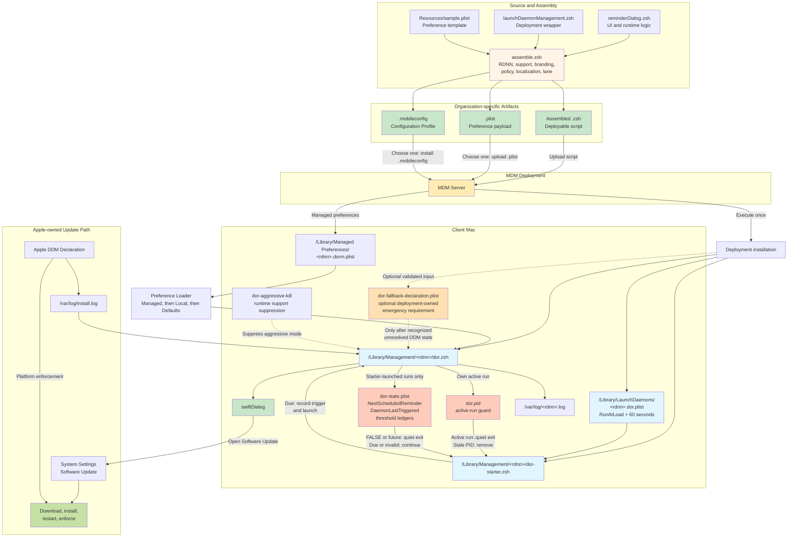

# System Architecture Diagram

This diagram shows how source files become deployable artifacts, how MDM installs them, and how the client-side heartbeat decides when to run the reminder workflow.

```mermaid
flowchart TB
    subgraph Source["Source and Assembly"]
        RD["reminderDialog.zsh<br/>UI and runtime logic"]
        LD["launchDaemonManagement.zsh<br/>Deployment wrapper"]
        SP["Resources/sample.plist<br/>Preference template"]
        AS["assemble.zsh<br/>RDNN, support, branding,<br/>policy, localization, lane"]

        RD --> AS
        LD --> AS
        SP --> AS
    end

    subgraph Artifacts["Organization-specific Artifacts"]
        SCRIPT["Assembled .zsh<br/>Deployable script"]
        PLIST[".plist<br/>Preference payload"]
        MOBILE[".mobileconfig<br/>Configuration Profile"]
    end

    AS --> SCRIPT
    AS --> PLIST
    AS --> MOBILE

    subgraph Deployment["MDM Deployment"]
        MDM["MDM Server"]
    end

    SCRIPT -->|Upload script| MDM
    PLIST -->|Choose one: upload .plist| MDM
    MOBILE -->|Choose one: install .mobileconfig| MDM

    subgraph Client["Client Mac"]
        MANAGED["/Library/Managed Preferences/<br/>&lt;rdnn&gt;.dorm.plist"]
        MAIN["/Library/Management/&lt;rdnn&gt;/dor.zsh"]
        STARTER["/Library/Management/&lt;rdnn&gt;/dor-starter.zsh"]
        STATE["dor-state.plist<br/>NextScheduledReminder<br/>DaemonLastTriggered<br/>threshold ledgers"]
        PID["dor.pid<br/>active-run guard"]
        FALLBACK["dor-fallback-declaration.plist<br/>optional deployment-owned<br/>emergency requirement"]
        KILL["dor-aggressive-kill<br/>runtime support suppression"]
        DAEMON["/Library/LaunchDaemons/<br/>&lt;rdnn&gt;.dor.plist<br/>RunAtLoad + 60 seconds"]
        DIALOG["swiftDialog"]
        LOG["/var/log/&lt;rdnn&gt;.log"]
    end

    MDM -->|Managed preferences| MANAGED
    MDM -->|Execute once| INSTALL["Deployment installation"]
    INSTALL --> MAIN
    INSTALL --> STARTER
    INSTALL --> DAEMON
    INSTALL -.->|Optional validated input| FALLBACK

    DAEMON --> STARTER
    PID -->|Active run: quiet exit<br/>Stale PID: remove| STARTER
    STATE -->|FALSE or future: quiet exit<br/>Due or invalid: continue| STARTER
    STARTER -->|Due: record trigger<br/>and launch| MAIN

    MANAGED --> PREFS["Preference Loader<br/>Managed, then Local, then Defaults"]
    PREFS --> MAIN
    FALLBACK -.->|Only after recognized<br/>unresolved DDM state| MAIN
    KILL -.->|Suppress aggressive mode| MAIN
    MAIN -->|Starter-launched runs only| STATE
    MAIN -->|Own active run| PID
    MAIN --> DIALOG
    MAIN --> LOG

    subgraph Apple["Apple-owned Update Path"]
        DDM["Apple DDM Declaration"]
        INSTALLLOG["/var/log/install.log"]
        SETTINGS["System Settings<br/>Software Update"]
        UPDATE["Download, install,<br/>restart, enforce"]

        DDM --> INSTALLLOG
        INSTALLLOG --> MAIN
        DIALOG -->|Open Software Update| SETTINGS
        SETTINGS --> UPDATE
        DDM -->|Platform enforcement| UPDATE
    end

    style AS fill:#fff4e6
    style SCRIPT fill:#c8e6c9
    style PLIST fill:#c8e6c9
    style MOBILE fill:#c8e6c9
    style MDM fill:#ffecb3
    style DAEMON fill:#e1f5ff
    style STARTER fill:#e1f5ff
    style MAIN fill:#e1f5ff
    style STATE fill:#ffccbc
    style PID fill:#ffccbc
    style FALLBACK fill:#ffe0b2
    style DIALOG fill:#c8e6c9
    style UPDATE fill:#c5e1a5
```

## Assembly Contract

`assemble.zsh` has three primary inputs:

- `reminderDialog.zsh`: end-user interface and reminder runtime
- `launchDaemonManagement.zsh`: deployment, reset, LaunchDaemon, starter, and runtime asset management
- `Resources/sample.plist`: canonical preference and localization surface

Assembly harmonizes RDNN values, embeds the reminder runtime in the deployment wrapper, applies interactive or prior-plist choices, validates syntax, and produces:

- one assembled deployment script
- one organizational `.plist`
- one unsigned `.mobileconfig`

Deploy the script plus either the `.plist` or `.mobileconfig`; do not deploy both preference artifacts.

## Client Runtime Contract

1. The LaunchDaemon invokes `dor-starter.zsh` at load and approximately every 60 seconds.
2. The starter checks `dor.pid` to prevent overlapping runs.
3. The starter reads `NextScheduledReminder` from `dor-state.plist`.
4. `FALSE` or a future timestamp is an expected quiet no-op. A due, missing, or invalid schedule launches `dor.zsh`.
5. Only starter-launched runtime runs write mutable scheduler state or own `dor.pid`; manual and demo runs do not.
6. `dor.zsh` resolves DDM state, compliance, timing, interaction, meeting, restart, and aggressive-mode gates before displaying swiftDialog.

## Configuration Boundaries

- **Managed and local preferences**: administrator-controlled values with per-key precedence `Managed -> Local -> Defaults`.
- **`dor-state.plist`**: mutable scheduler state written by the runtime, never by a Configuration Profile.
- **`dor-fallback-declaration.plist`**: optional deployment-owned emergency metadata, separate from preferences and scheduler state.
- **`dor-aggressive-kill`**: temporary support suppression for aggressive mode, not a preference.

## Enforcement Boundary

DDM OS Reminder displays messaging and opens Software Update. Apple DDM and Software Update remain responsible for downloading, installing, restarting, and enforcing macOS updates.
