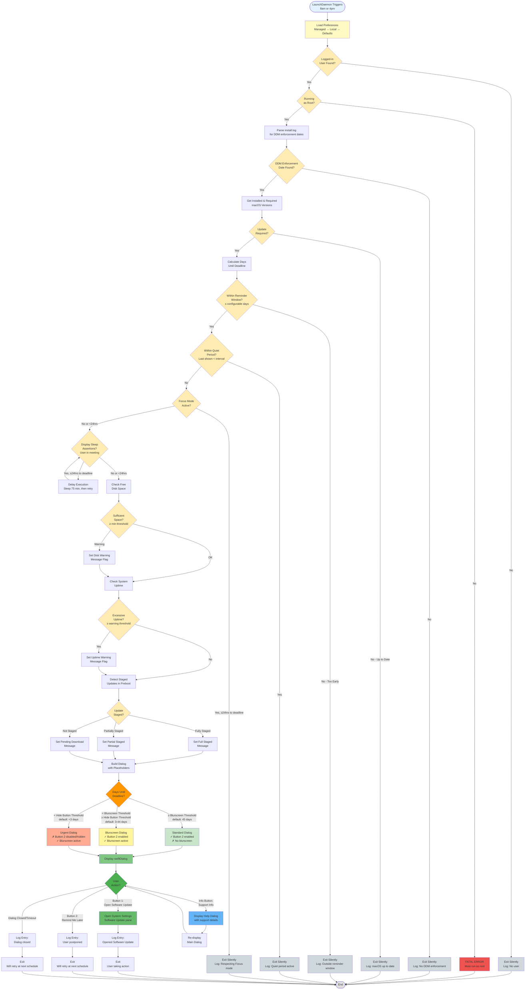

# Runtime Decision Tree

This flowchart shows the complete decision logic executed each time the LaunchDaemon triggers the DDM OS Reminder script.

## Decision Points Explained

### 1. User Validation
- **Check**: Is a user logged in (not loginwindow)?
- **Why**: Dialog requires an active user session
- **Exit if**: No user found

### 2. Root Privileges
- **Check**: Is script running as root?
- **Why**: Required for LaunchDaemon management and system-level operations
- **Exit if**: Not root (fatal error)

### 3. DDM Enforcement
- **Check**: Are DDM enforcement dates present in `/var/log/install.log`?
- **Why**: Script relies on Apple DDM data to determine deadlines
- **Exit if**: No enforcement dates found

### 4. Version Comparison
- **Check**: Is installed macOS version older than DDM-required version?
- **Why**: Only display reminder if update is actually needed
- **Exit if**: Mac is up to date

### 5. Reminder Window
- **Check**: Are we within configured days before deadline (default: 60 days)?
- **Why**: Don't annoy users too early
- **Exit if**: Deadline too far in future

### 6. Quiet Period
- **Check**: Has dialog been shown recently (based on last display timestamp)?
- **Why**: Prevent excessive nagging within same day
- **Exit if**: Recently displayed

### 7. Focus Mode
- **Check**: Is user in Focus/Do Not Disturb mode?
- **Why**: Respect user's concentration time
- **Exception**: Ignored if <24 hours to deadline
- **Exit if**: Focus active and deadline not imminent

### 8. Meeting Detection
- **Check**: Are display sleep assertions active (pmset)?
- **Why**: User likely in video call or presentation
- **Exception**: Ignored if <24 hours to deadline
- **Action if**: Delay 75 minutes and retry (not exit)

### 9. Disk Space Check
- **Check**: Is free disk space below minimum threshold?
- **Why**: Update may fail with insufficient space
- **Action**: Adds warning message to dialog (doesn't block display)

### 10. Uptime Check
- **Check**: Has Mac been on for excessive days without restart?
- **Why**: Restarts improve update reliability
- **Action**: Adds warning message to dialog (doesn't block display)

### 11. Staged Update Detection
- **Check**: Is update already downloaded to Preboot volume?
- **Why**: Installation is faster if already staged
- **Action**: Adds appropriate message (fully staged, partially staged, or pending)

### 12. Deadline-Based Behavior
Based on days remaining until deadline:

#### Standard Dialog (≥45 days, configurable)
- Button 2: **Enabled** ("Remind Me Later")
- Blurscreen: **Disabled**
- Urgency: Low

#### Blurscreen Dialog (3-44 days, configurable)
- Button 2: **Enabled** ("Remind Me Later")
- Blurscreen: **Enabled** (background dimmed)
- Urgency: Medium

#### Urgent Dialog (<3 days, configurable)
- Button 2: **Disabled or Hidden** (can't postpone)
- Blurscreen: **Enabled**
- Urgency: High
- Display assertions: **Ignored** (shows even in meetings)

### 13. User Actions
After dialog displays, user can:

1. **Open Software Update**: 
   - Opens System Settings → Software Update
   - Logs action
   - Exits (user taking responsibility)

2. **Remind Me Later**:
   - Logs postponement
   - Exits (will remind again at next schedule)
   - Note: Disabled/hidden when deadline imminent

3. **View Support Info** (? button):
   - Displays help dialog with support contact info
   - Returns to main dialog after closing help
   - Re-displays main dialog (user can then choose action)

4. **Close/Timeout**:
   - Logs dismissal
   - Exits (will remind again at next schedule)

## Configuration Parameters

Key preferences that affect decision tree:

| Parameter | Default | Affects Decision Point |
|-----------|---------|----------------------|
| `daysBeforeDeadlineDisplayReminder` | 60 | Reminder Window check |
| `daysBeforeDeadlineBlurscreen` | 45 | Blurscreen activation |
| `daysBeforeDeadlineHidingButton2` | 21 | Button 2 disable/hide |
| `daysOfExcessiveUptimeWarning` | 0 (disabled) | Uptime warning threshold |
| `meetingDelay` | 75 minutes | Meeting detection delay |
| `minimumDiskFreePercentage` | 99 (disabled) | Disk space warning |
| `disableButton2InsteadOfHide` | YES | Button 2 behavior (disabled vs hidden) |

## Exit Points

The script has **9 exit points** (plus 1 fatal error):

1. **No logged-in user** - Wait for next scheduled run
2. **No DDM enforcement** - Nothing to remind about
3. **macOS up to date** - Update already completed
4. **Outside reminder window** - Too early to remind
5. **Within quiet period** - Recently reminded
6. **Focus mode active** - Respecting user's concentration
7. **After opening Software Update** - User taking action
8. **After "Remind Me Later"** - User postponed
9. **After dialog close** - User dismissed

Each exit logs appropriate message to `/var/log/{RDNN}.log` for troubleshooting.

## Timing

**Default Schedule**: 8:00 AM and 4:00 PM daily

This ensures:
- Morning reminder catches users starting their day
- Afternoon reminder catches users before end of day
- Not intrusive during lunch (typically 12-1 PM)
- Configurable via LaunchDaemon CalendarInterval

**Re-execution**: Script exits after each run; LaunchDaemon handles re-scheduling automatically.
