# Runtime Decision Tree

This flowchart shows the complete decision logic executed each time the LaunchDaemon triggers the DDM OS Reminder script.

```mermaid
flowchart TD
    Start([LaunchDaemon Triggers<br/>RunAtLoad or 8am/4pm]) --> LoadPrefs[Load Preferences<br/>Managed → Local → Defaults]
    
    LoadPrefs --> CheckUser{Logged-in<br/>User Found?<br/>Wait up to 120s}
    CheckUser -->|No| Exit1[FATAL ERROR<br/>No user after 120s]
    CheckUser -->|Yes| CheckRoot{Running<br/>as Root?}
    
    CheckRoot -->|No| Fatal1[FATAL ERROR<br/>Must run as root]
    CheckRoot -->|Yes| ParseLog[Parse install.log<br/>for DDM enforcement dates]
    
    ParseLog --> CheckDDM{DDM Enforcement<br/>Date Found?}
    CheckDDM -->|No| Exit2[Exit Silently<br/>Log: No DDM enforcement]
    CheckDDM -->|Yes| GetVersions[Get Installed & Required<br/>macOS Versions]
    
    GetVersions --> CompareVersions{Update<br/>Required?}
    CompareVersions -->|No - Up to Date| Exit3[Exit Silently<br/>Log: macOS up to date]
    CompareVersions -->|Yes| CalcDays[Calculate Days<br/>Until Deadline]
    
    CalcDays --> CheckWindow{Within Reminder<br/>Window?<br/>≤ configurable days}
    CheckWindow -->|No - Too Early| Exit4[Exit Silently<br/>Log: Outside reminder window]
    CheckWindow -->|Yes| CheckQuiet{Within Quiet<br/>Period?<br/>Last shown < interval}
    
    CheckQuiet -->|Yes| Exit5[Exit Silently<br/>Log: Quiet period active]
    CheckQuiet -->|No| CheckMeeting{Display Sleep<br/>Assertions?<br/>User in meeting}
    
    CheckMeeting -->|Yes, ≥24hrs to deadline| Delay[Delay Execution<br/>Sleep meetingDelay, then retry]
    CheckMeeting -->|No or <24hrs| CheckDisk[Check Free<br/>Disk Space]
    
    Delay --> CheckMeeting
    
    CheckDisk --> DiskOK{Sufficient<br/>Space?<br/>≥ min threshold}
    DiskOK -->|Warning| SetDiskWarn[Set Disk Warning<br/>Message Flag]
    DiskOK -->|OK| CheckUptime
    SetDiskWarn --> CheckUptime[Check System<br/>Uptime]
    
    CheckUptime --> UptimeOK{Excessive<br/>Uptime?<br/>≥ warning threshold}
    UptimeOK -->|Yes| SetUptimeWarn[Set Uptime Warning<br/>Message Flag]
    UptimeOK -->|No| DetectStaged
    SetUptimeWarn --> CheckYukon{Past deadline by threshold days<br/>and pastDeadlineRestartBehavior != Off?}
    CheckYukon -->|No| DetectStaged[Detect Staged<br/>Updates in Preboot]
    CheckYukon -->|Prompt| YukonPrompt[Restart-only dialog<br/>Button1 = Restart Now]
    CheckYukon -->|Force| YukonForce[Restart-only forced dialog<br/>Timer 60, re-show on dismiss]
    
    DetectStaged --> StagedSignals{Staging Signals<br/>Detected?}
    StagedSignals -->|No| SetPending[Set Pending Download<br/>Message]
    StagedSignals -->|Yes| StagedMetadata{Proposed Version<br/>Metadata Readable?}
    StagedMetadata -->|No| SetPendingFromMetadata[Normalize to Pending Download<br/>Re-check Next Run]
    StagedMetadata -->|Yes| StagedMatch{Proposed Version<br/>Matches DDM Target?}
    StagedMatch -->|No| SetPendingFromMismatch[Normalize to Pending Download<br/>Prevent False Ready State]
    StagedMatch -->|Yes + Fully Staged| SetFullStaged[Set Full Staged<br/>Message]
    StagedMatch -->|Yes + Partially Staged| SetPartialStaged[Set Partial Staged<br/>Message]

    SetFullStaged --> BuildDialog
    SetPartialStaged --> BuildDialog
    SetPending --> BuildDialog[Build Dialog<br/>with Placeholders]
    SetPendingFromMetadata --> BuildDialog
    SetPendingFromMismatch --> BuildDialog
    
    BuildDialog --> CheckDeadline{Days Until<br/>Deadline?}
    
    CheckDeadline -->|≥ Blurscreen Threshold<br/>default: 45 days| Standard[Standard Dialog<br/>✓ Button 2 enabled<br/>✗ No blurscreen]
    CheckDeadline -->|< Blurscreen Threshold<br/>≥ Hide Button Threshold<br/>default: 21-44 days| Blur[Blurscreen Dialog<br/>✓ Button 2 enabled<br/>✓ Blurscreen active]
    CheckDeadline -->|< Hide Button Threshold<br/>default: <21 days| Urgent[Urgent Dialog<br/>✗ Button 2 disabled/hidden<br/>✓ Blurscreen active]
    
    Standard --> Display[Display swiftDialog]
    Blur --> Display
    Urgent --> Display
    YukonPrompt --> Display
    YukonForce --> Display
    
    Display --> UserAction{User<br/>Action?}
    
    UserAction -->|Button 1:<br/>Open Software Update| OpenSU[Open System Settings<br/>Software Update pane]
    UserAction -->|Button 2:<br/>Remind Me Later| LogRemind[Log Entry:<br/>User postponed]
    UserAction -->|Info Button:<br/>Support Info| ShowHelp[Display Help Dialog<br/>with support details]
    UserAction -->|Dialog Closed/Timeout| LogClose[Log Entry:<br/>Dialog closed]
    UserAction -->|Return code 20:<br/>DND active| Exit6[Exit<br/>DND active]
    
    OpenSU --> LogOpen[Log Entry:<br/>Opened Software Update]
    LogOpen --> Exit7[Exit<br/>User taking action]
    
    LogRemind --> Exit8[Exit<br/>Will retry at next schedule]
    
    ShowHelp --> RedisplayAfterHelp[Re-display<br/>Main Dialog]
    RedisplayAfterHelp --> UserAction
    
    LogClose --> Exit9[Exit<br/>Will retry at next schedule]
    
    Exit1 --> End([End])
    Fatal1 --> End
    Exit2 --> End
    Exit3 --> End
    Exit4 --> End
    Exit5 --> End
    Exit6 --> End
    Exit7 --> End
    Exit8 --> End
    Exit9 --> End
    
    style Start fill:#e3f2fd
    style LoadPrefs fill:#fff9c4
    style CheckUser fill:#ffecb3
    style CheckRoot fill:#ffecb3
    style CheckDDM fill:#ffecb3
    style CompareVersions fill:#ffecb3
    style CheckWindow fill:#ffecb3
    style CheckQuiet fill:#ffecb3
    style CheckMeeting fill:#ffecb3
    style DiskOK fill:#ffecb3
    style UptimeOK fill:#ffecb3
    style CheckYukon fill:#ff9800
    style StagedSignals fill:#ffecb3
    style StagedMetadata fill:#ffecb3
    style StagedMatch fill:#ffecb3
    style CheckDeadline fill:#ff9800
    style UserAction fill:#4caf50
    
    style Exit1 fill:#ef5350
    style Exit2 fill:#cfd8dc
    style Exit3 fill:#cfd8dc
    style Exit4 fill:#cfd8dc
    style Exit5 fill:#cfd8dc
    style Exit6 fill:#cfd8dc
    style Fatal1 fill:#ef5350
    
    style Standard fill:#c8e6c9
    style Blur fill:#fff59d
    style Urgent fill:#ffab91
    style YukonPrompt fill:#ffe082
    style YukonForce fill:#ff8a80
    
    style Display fill:#81c784
    style OpenSU fill:#66bb6a
    style ShowHelp fill:#64b5f6
    
    style End fill:#e0e0e0
```

## Decision Points Explained

### 1. User Validation
- **Check**: Is a user logged in (not loginwindow), waiting up to 120 seconds?
- **Why**: Dialog requires an active user session
- **Exit if**: No user found after 120 seconds (fatal error)

### 2. Root Privileges
- **Check**: Is script running as root?
- **Why**: Required for LaunchDaemon management and system-level operations
- **Exit if**: Not root (fatal error)

### 3. DDM Enforcement
- **Check**: Are DDM enforcement dates present in `/var/log/install.log`?
- **Why**: Script relies on Apple DDM data to determine deadlines
- **Exit if**: No enforcement dates found

### 4. Version Comparison
- **Check**: Is installed macOS version older than DDM-required version?
- **Why**: Only display reminder if update is actually needed
- **Exit if**: Mac is up to date

### 5. Reminder Window
- **Check**: Are we within configured days before deadline (default: 60 days)?
- **Why**: Don't annoy users too early
- **Exit if**: Deadline too far in future

### 6. Quiet Period
- **Check**: Has dialog been shown recently (based on last display timestamp)?
- **Why**: Prevent excessive nagging within same day
- **Exit if**: Recently displayed

### 7. Do Not Disturb / Focus (swiftDialog)
- **Check**: swiftDialog returns exit code 20 after the dialog attempt
- **Why**: swiftDialog signals DND/Focus state via return code
- **Exit if**: Return code 20 (logged and exits)

### 8. Meeting Detection
- **Check**: Are display sleep assertions active (pmset)?
- **Why**: User likely in video call or presentation
- **Filtering**: 
  - **Layer 1**: Excludes `coreaudiod` (system daemon, always present)
  - **Layer 2**: If `acceptableAssertionApplicationNames` is configured, only assertions from apps **on the allowlist** trigger deferral; assertions from other apps are ignored
  - **Default behavior** (shipped allowlist: `MSTeams zoom.us Webex`): Only those apps trigger deferral
  - **Legacy/explicit empty allowlist**: All non-coreaudiod assertions trigger deferral
- **Exception**: Ignored if ≤24 hours to deadline
- **Action if**: Delay up to `meetingDelay` and retry; proceed when delay limit reached

### 9. Disk Space Check
- **Check**: Is free disk space below minimum threshold?
- **Why**: Update may fail with insufficient space
- **Action**: Adds warning message to dialog (doesn't block display)

### 10. Uptime Check
- **Check**: Has Mac been on for excessive days without restart?
- **Why**: Restarts improve update reliability
- **Action**: Adds warning message to dialog (doesn't block display)

### 11. Yukon Cornelius Restart Mode
- **Check**: Is `pastDeadlineRestartBehavior` set to `Prompt` or `Force`, while all eligibility conditions are true?
- **Eligibility**:
  - `versionComparisonResult` is `Update Required`
  - DDM deadline is in the past
  - Days past DDM deadline are greater than or equal to `daysPastDeadlineRestartWorkflow`
- **Modes**:
  - `Off`: Keep update-focused behavior
  - `Prompt`: Restart-only dialog, normal dismiss/next-run behavior
  - `Force`: Restart-only dialog with timer 60; timeout restarts, dismissals re-display until restart
- **Deferral behavior**:
  - `Prompt` keeps quiet period and meeting-delay checks
  - `Force` bypasses quiet period and meeting-delay checks

### 12. Staged Update Detection
- **Check**: Is update already downloaded to Preboot volume?
- **Why**: Installation is faster if already staged
- **Action**:
  - Detects staging signals from APFS update snapshots and Preboot size heuristics
  - Reads proposed target metadata from `cryptex1/proposed`
  - Keeps staged state only when proposed version matches DDM-enforced version
  - Normalizes to pending download if metadata is missing or mismatched
  - Adds appropriate message (fully staged, partially staged, or pending)

### 13. Deadline-Based Behavior
Based on days remaining until deadline:

#### Standard Dialog (≥45 days, configurable)
- Button 2: **Enabled** ("Remind Me Later")
- Blurscreen: **Disabled**
- Urgency: Low

#### Blurscreen Dialog (21-44 days, configurable)
- Button 2: **Enabled** ("Remind Me Later")
- Blurscreen: **Enabled** (background dimmed)
- Urgency: Medium

#### Urgent Dialog (<21 days, configurable)
- Button 2: **Disabled or Hidden** (can't postpone)
- Blurscreen: **Enabled**
- Urgency: High

### 14. User Actions
After dialog displays, user can:

1. **Open Software Update**: 
   - Opens System Settings → Software Update
   - Logs action
   - Exits (user taking responsibility)

2. **Remind Me Later**:
   - Logs postponement
   - Exits (will remind again at next schedule)
   - Note: Disabled/hidden when deadline imminent

3. **View Support Info** (? button):
   - Displays help dialog with support contact info
   - Returns to main dialog after closing help
   - Re-displays main dialog (user can then choose action)

4. **Close/Timeout**:
   - Logs dismissal
   - Exits (will remind again at next schedule)

5. **DND/Focus Active (swiftDialog Return Code 20)**:
   - Logs DND/Focus state
   - Exits

6. **Yukon Cornelius Force Dismissal**:
   - For return codes other than restart pathways, dialog re-displays until restart occurs

## Configuration Parameters

Key preferences that affect decision tree:

| Parameter | Default | Affects Decision Point |
|-----------|---------|----------------------|
| `daysBeforeDeadlineDisplayReminder` | 60 | Reminder Window check |
| `daysBeforeDeadlineBlurscreen` | 45 | Blurscreen activation |
| `daysBeforeDeadlineHidingButton2` | 21 | Button 2 disable/hide |
| `daysOfExcessiveUptimeWarning` | 0 (disabled) | Uptime warning threshold |
| `daysPastDeadlineRestartWorkflow` | 2 | Days-past-deadline threshold for Yukon mode |
| `pastDeadlineRestartBehavior` | Off | Yukon Cornelius mode (`Off` / `Prompt` / `Force`) |
| `meetingDelay` | 75 minutes | Meeting detection delay |
| `acceptableAssertionApplicationNames` | MSTeams zoom.us Webex | Meeting app allowlist filter |
| `minimumDiskFreePercentage` | 99 | Disk space warning |
| `disableButton2InsteadOfHide` | YES | Button 2 behavior (disabled vs hidden) |

## Exit Points

The script has **8 exit points** (plus 2 fatal errors):

1. **No DDM enforcement** - Nothing to remind about
2. **macOS up to date** - Update already completed
3. **Outside reminder window** - Too early to remind
4. **Within quiet period** - Recently reminded
5. **DND/Focus active (swiftDialog return code 20)** - Dialog attempt exits
6. **After opening Software Update** - User taking action
7. **After "Remind Me Later"** - User postponed
8. **After dialog close** - User dismissed

Each exit logs appropriate message to `/var/log/{RDNN}.log` for troubleshooting.

Fatal errors include no logged-in user after 120 seconds and running without root privileges.

## Timing

**Default Schedule**: RunAtLoad plus 8:00 AM and 4:00 PM daily

This ensures:
- Morning reminder catches users starting their day
- Afternoon reminder catches users before end of day
- Not intrusive during lunch (typically 12-1 PM)
- Configurable via LaunchDaemon CalendarInterval

**Re-execution**: Script exits after each run; LaunchDaemon handles re-scheduling automatically.
