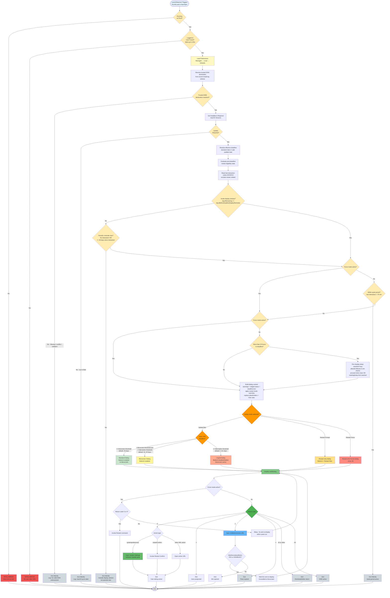

# Runtime Decision Tree

This flowchart shows the complete decision logic executed each time the LaunchDaemon triggers the DDM OS Reminder script.

```mermaid
flowchart TD
    Start([LaunchDaemon Triggers<br/>RunAtLoad or 8am/4pm]) --> CheckRoot{Running<br/>as Root?}

    CheckRoot -->|No| Fatal1[FATAL ERROR<br/>Must run as root]
    CheckRoot -->|Yes| CheckUser{Logged-in<br/>User Found?<br/>Wait up to 120s}
    CheckUser -->|No| Exit1[FATAL ERROR<br/>No user after 120s]
    CheckUser -->|Yes| LoadPrefs[Load Preferences<br/>Managed → Local → Defaults]

    LoadPrefs --> ParseLog[Resolve trusted DDM declaration<br/>from recent install.log window]
    ParseLog --> CheckDDM{Trusted DDM<br/>declaration resolved?}
    CheckDDM -->|No - Missing / conflict / noMatch| Exit2[Exit Silently<br/>Log: No valid DDM enforcement]
    CheckDDM -->|Yes| GetVersions[Get Installed & Required<br/>macOS Versions]

    GetVersions --> CompareVersions{Update<br/>Required?}
    CompareVersions -->|No - Up to Date| Exit3[Exit Silently<br/>Log: macOS up to date]
    CompareVersions -->|Yes| ResolveDeadline[Resolve effective deadline<br/>declared date or safe padded date]
    ResolveDeadline --> EvalYukon[Evaluate post-deadline<br/>restart eligibility state]

    EvalYukon --> GetInteraction[Read last interaction<br/>codes 0/2/3/4/10<br/>exclude restart-related]
    GetInteraction --> CheckWindow{Inside display window?<br/>daysRemaining <=<br/>daysBeforeDeadlineDisplayReminder}
    CheckWindow -->|No| PeriodicGate{Periodic reminder due?<br/>No interaction OR<br/>>= 28 days since interaction}
    PeriodicGate -->|No| Exit4[Exit Silently<br/>Outside display window<br/>not periodic-due]
    PeriodicGate -->|Yes| ForceQuietBypass
    CheckWindow -->|Yes| ForceQuietBypass{Force mode active?}

    ForceQuietBypass -->|Yes| ForceMeetingBypass
    ForceQuietBypass -->|No| CheckQuiet{Within quiet period?<br/>last interaction < 76 min}
    CheckQuiet -->|Yes| Exit5[Exit Silently<br/>Quiet period active]
    CheckQuiet -->|No| ForceMeetingBypass{Force mode active?}

    ForceMeetingBypass -->|Yes| BuildDialog
    ForceMeetingBypass -->|No| Deadline24{More than 24 hours<br/>to deadline?}
    Deadline24 -->|No| BuildDialog
    Deadline24 -->|Yes| MeetingLoop[Run display-sleep assertion loop<br/>allowlist-filtered; 5-min checks<br/>proceed when clear OR<br/>meetingDelay limit reached]
    MeetingLoop --> BuildDialog[Build dialog content<br/>warnings + staged status + deadline text<br/>apply restart-mode overrides<br/>replace placeholders + hide rules]

    BuildDialog --> DialogMode{Dialog mode selected?}
    DialogMode -->|Update flow| CheckDeadline{Days Until<br/>Deadline?}
    DialogMode -->|Restart Prompt| PromptDialog[Restart-only dialog<br/>Button1 = Restart Now]
    DialogMode -->|Restart Force| ForceDialog[Restart-only forced dialog<br/>--timer 60]

    CheckDeadline -->|>= blurscreen threshold<br/>default: 45 days| Standard[Standard Dialog<br/>Button2 enabled<br/>no blurscreen]
    CheckDeadline -->|< blurscreen threshold and<br/>> hide-button threshold<br/>default: 44..22 days| Blur[Blurscreen Dialog<br/>Button2 enabled]
    CheckDeadline -->|<= hide-button threshold<br/>default: <=21 days| Urgent[Urgent Dialog<br/>Button2 disabled/hidden<br/>blurscreen active]

    Standard --> Display[Display swiftDialog]
    Blur --> Display
    Urgent --> Display
    PromptDialog --> Display
    ForceDialog --> Display

    Display --> ForceReturnMode{Force mode active?}
    ForceReturnMode -->|Yes| ForceReturn{Return code 0 or 4?}
    ForceReturn -->|Yes| RestartNow[Invoke Restart command]
    ForceReturn -->|No| ForceRedisplay[Sleep ~5s and re-display<br/>within same run]
    ForceRedisplay --> Display

    ForceReturnMode -->|No| NormalReturn{Return code}
    NormalReturn -->|0| ActionType{Action type}
    ActionType -->|systempreferences| OpenSU[Open System Settings<br/>Software Update pane]
    ActionType -->|restartConfirm| RestartConfirm[Invoke Restart Confirm]
    ActionType -->|other URL action| OpenAction[Open action URL]
    OpenSU --> Exit7[Exit<br/>User taking action]
    RestartConfirm --> Exit7
    OpenAction --> Exit7

    NormalReturn -->|2| Exit8[Exit<br/>User postponed]
    NormalReturn -->|3| OpenInfo[Open InfoButtonAction URL]
    OpenInfo --> InfoRedisplay{hideSecondaryButton<br/>YES or DISABLED?}
    InfoRedisplay -->|Yes| InfoWait[Wait 61s and re-display<br/>moveable/no blurscreen]
    InfoWait --> Display
    InfoRedisplay -->|No| Exit9[Exit<br/>Info opened]
    NormalReturn -->|4| Exit10[Exit<br/>Timer expired]
    NormalReturn -->|10 or other| Exit11[Exit<br/>Dismissed/other return]
    NormalReturn -->|20| Exit6[Exit<br/>DND active]

    End([End])
    RestartNow --> End

    Exit1 --> End
    Fatal1 --> End
    Exit2 --> End
    Exit3 --> End
    Exit4 --> End
    Exit5 --> End
    Exit6 --> End
    Exit7 --> End
    Exit8 --> End
    Exit9 --> End
    Exit10 --> End
    Exit11 --> End
    
    style Start fill:#e3f2fd
    style LoadPrefs fill:#fff9c4
    style CheckUser fill:#ffecb3
    style CheckRoot fill:#ffecb3
    style CheckDDM fill:#ffecb3
    style CompareVersions fill:#ffecb3
    style CheckWindow fill:#ffecb3
    style CheckQuiet fill:#ffecb3
    style PeriodicGate fill:#ffecb3
    style ForceQuietBypass fill:#ffecb3
    style ForceMeetingBypass fill:#ffecb3
    style CheckQuiet fill:#ffecb3
    style Deadline24 fill:#ffecb3
    style DialogMode fill:#ff9800
    style CheckDeadline fill:#ff9800
    style NormalReturn fill:#4caf50
    
    style Exit1 fill:#ef5350
    style Exit2 fill:#cfd8dc
    style Exit3 fill:#cfd8dc
    style Exit4 fill:#cfd8dc
    style Exit5 fill:#cfd8dc
    style Exit6 fill:#cfd8dc
    style Exit10 fill:#cfd8dc
    style Exit11 fill:#cfd8dc
    style Fatal1 fill:#ef5350
    
    style Standard fill:#c8e6c9
    style Blur fill:#fff59d
    style Urgent fill:#ffab91
    style PromptDialog fill:#ffe082
    style ForceDialog fill:#ff8a80
    
    style Display fill:#81c784
    style OpenSU fill:#66bb6a
    style OpenInfo fill:#64b5f6
    
    style End fill:#e0e0e0
```

## Decision Points Explained

### 1. Root Privileges
- **Check**: Is script running as root?
- **Why**: Required for system access and dialog launch context
- **Exit if**: Not root (fatal error)

### 2. User Validation
- **Check**: Is a non-`loginwindow` user logged in, waiting up to 120 seconds?
- **Why**: Dialog requires an active user session
- **Exit if**: No valid user found after 120 seconds (fatal error)

### 3. Preference Load Order
- **Order**: Managed Preferences → Local Preferences → Script Defaults
- **Why**: Enterprise policy should override local/testing values
- **Normalization**: Boolean and restart-mode values are normalized before use

### 4. DDM Enforcement Resolver + Version Comparison
- **Check**: Can the script resolve one trustworthy DDM declaration from the recent `/var/log/install.log` window, and is update still required?
- **Exit if**:
  - No DDM enforcement entry found
  - Multiple conflicting declarations exist in the highest-priority source class
  - The resolved declaration has an invalid version string
  - The resolved declaration no longer maps to an available update (`MADownloadNoMatchFound` / `pallasNoPMVMatchFound`)
  - Installed macOS is already compliant
- **Resolver priority**:
  - `defaultApplicableDeclaration`
  - `foundDdmEnforcedInstall`
  - generic `EnforcedInstallDate` fallback

### 5. Effective Deadline Resolution
- **Check**: Is a safe future `setPastDuePaddedEnforcementDate` present after the resolved declaration without a later conflicting declaration?
- **Behavior**:
  - If yes, use the padded deadline as the effective enforcement timestamp
  - If no, continue with the declared `EnforcedInstallDate`

### 6. Post-Deadline Restart Eligibility (Yukon)
- **Computed before reminder gating**:
  - Deadline is in the past
  - Days past deadline `>= daysPastDeadlineRestartWorkflow`
  - Uptime `>= 75` minutes
  - `pastDeadlineRestartBehavior` is not `Off`
- **Modes**:
  - `Off`: Normal update-focused flow
  - `Prompt`: Restart-only dialog, normal per-run exit behavior
  - `Force`: Restart-only dialog with forced redisplay loop
- **Suppression case**: If past-deadline day threshold is met but uptime is below 75 minutes, restart mode is suppressed for that run

### 7. Reminder Window + Periodic Reminder Logic
- **Inside window** (`daysRemaining <= daysBeforeDeadlineDisplayReminder`): proceed
- **Outside window**: only proceed if no interaction history exists or last interaction is `>= 28` days old
- **Exit if**: Outside window and periodic reminder is not due

### 8. Quiet-Period Suppression
- **Check**: Most recent interaction (`Return Code: 0|2|3|4|10`) is within 76 minutes
- **Special handling**: Restart-related interactions are excluded from quiet-period suppression
- **Bypass**: `Force` mode skips quiet-period suppression

### 9. Meeting Detection
- **When used**: Only when not in `Force` mode and more than 24 hours remain to deadline
- **How it works**:
  - Scans `pmset -g assertions`
  - Excludes `coreaudiod`
  - Applies allowlist filter (`acceptableAssertionApplicationNames`) when populated
  - Retries every 5 minutes until assertions clear or `meetingDelay` budget is exhausted
- **Bypasses**:
  - `Force` mode
  - Deadline within 24 hours

### 10. Dialog Content Assembly
- Computes disk/uptime warning blocks
- Computes staged update status message (full/partial/pending)
- Computes deadline enforcement sentence and infobox highlights
- Applies post-deadline dialog overrides (restart prompt/force)
- Replaces placeholders and applies hide rules

### 11. Deadline UI Mode (Update Flow)
When not overridden by restart mode:

- **Standard Dialog** (`daysRemaining >= daysBeforeDeadlineBlurscreen`)
  - Button 2 enabled, no blurscreen
- **Blurscreen Dialog** (`daysBeforeDeadlineHidingButton2 < daysRemaining < daysBeforeDeadlineBlurscreen`)
  - Button 2 enabled, blurscreen enabled
- **Urgent Dialog** (`daysRemaining <= daysBeforeDeadlineHidingButton2`)
  - Button 2 disabled or hidden, blurscreen enabled

### 12. Return-Code Action Handling
- **Force mode**:
  - `0` or `4` triggers restart command
  - Any other return code re-displays within the same run after ~5 seconds
- **Non-force modes**:
  - `0`:
    - `systempreferences` action opens Software Update
    - `restartConfirm` action triggers restart-confirm command (Prompt mode)
    - Other URL actions are opened
  - `2`: postpone and exit
  - `3`: open `InfoButtonAction` URL; re-display only when within hide-button window
  - `4`: timer expired, exit
  - `10`: keyboard quit, exit
  - `20`: DND/Focus, exit
  - Other codes: log and exit

## Configuration Parameters

Key preferences that affect decision tree:

| Parameter | Default | Affects Decision Point |
|-----------|---------|----------------------|
| `daysBeforeDeadlineDisplayReminder` | 60 | Reminder Window check |
| `daysBeforeDeadlineBlurscreen` | 45 | Blurscreen activation |
| `daysBeforeDeadlineHidingButton2` | 21 | Button 2 disable/hide |
| `daysOfExcessiveUptimeWarning` | 0 (immediate) | Uptime warning threshold (`0` = always warn; `7` = one week) |
| `daysPastDeadlineRestartWorkflow` | 2 | Days-past-deadline threshold for Yukon mode |
| `pastDeadlineRestartBehavior` | Off | Yukon Cornelius mode (`Off` / `Prompt` / `Force`) |
| `meetingDelay` | 75 minutes | Meeting detection delay |
| `acceptableAssertionApplicationNames` | MSTeams zoom.us Webex | Meeting app allowlist filter |
| `minimumDiskFreePercentage` | 99 | Disk space warning |
| `disableButton2InsteadOfHide` | YES | Button 2 behavior (disabled vs hidden) |

Additional runtime constants used by the decision tree:
- `quietPeriodSeconds = 4560` (76 minutes)
- `periodicReminderDays = 28`
- `pastDeadlineRestartMinimumUptimeMinutes = 75`
- `pastDeadlineForceTimerSeconds = 60`
- `pastDeadlineRedisplayDelaySeconds = 5`

## Exit Points

The script has **10 common exit points** (plus 2 fatal errors):

1. **No valid DDM enforcement** - Nothing trustworthy to remind about
2. **macOS up to date** - Update already completed
3. **Outside window and periodic reminder not due** - Too early and not periodic-due
4. **Within quiet period** - Recently interacted
5. **DND/Focus active (return code 20)** - Dialog attempt exits
6. **After opening Software Update / URL action** - User taking action
7. **After restart command (Prompt/Force)** - Restart action issued
8. **After "Remind Me Later"** - User postponed
9. **After info URL open (non-urgent window)** - No forced redisplay path
10. **After close/timeout/other non-force return** - User dismissed or timer expired

Each exit logs appropriate message to `/var/log/{RDNN}.log` for troubleshooting.

Fatal errors include no logged-in user after 120 seconds and running without root privileges.

## Timing

**Default Schedule**: RunAtLoad plus 8:00 AM and 4:00 PM daily

This ensures:
- Morning reminder catches users starting their day
- Afternoon reminder catches users before end of day
- Not intrusive during lunch (typically 12-1 PM)
- Configurable via LaunchDaemon CalendarInterval

**Re-execution**: Script exits after each run; LaunchDaemon handles re-scheduling automatically.
