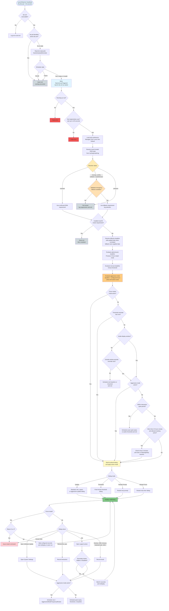

# Runtime Decision Tree

This flowchart follows a daemon-managed run from the 60-second heartbeat through scheduling, DDM resolution, reminder gates, dialog actions, and the next scheduled run.

```mermaid
flowchart TD
    Heartbeat([LaunchDaemon heartbeat<br/>RunAtLoad + 60 seconds]) --> MainExists{dor.zsh<br/>executable?}
    MainExists -->|No| StarterError[Log error and exit]
    MainExists -->|Yes| PID{dor.pid identifies<br/>active dor.zsh?}
    PID -->|Yes| StarterNoop[Quiet exit<br/>overlap prevented]
    PID -->|No or stale| ReadState[Read dor-state.plist<br/>NextScheduledReminder]
    ReadState --> Due{Schedule state}
    Due -->|FALSE| StarterNoop
    Due -->|Future| StarterNoop
    Due -->|Due, empty, or invalid| Trigger[Write DaemonLastTriggered<br/>launch dor.zsh as starter]

    Trigger --> Root{Running as root?}
    Root -->|No| FatalRoot[Fatal error]
    Root -->|Yes| User{Non-loginwindow user?<br/>wait up to 120 seconds}
    User -->|No| FatalUser[Fatal error]
    User -->|Yes| Preferences[Load each preference<br/>Managed, then Local, then Default]

    Preferences --> Resolve[Resolve recent trusted DDM state<br/>from /var/log/install.log]
    Resolve --> Status{Resolver status}
    Status -->|resolved| Requirement[Use confirmed DDM requirement]
    Status -->|missing, conflict,<br/>noMatch, invalidVersion| ReadFallback{Validated emergency<br/>fallback available?}
    Status -->|unknown| Suppress[Fail closed<br/>log suppression and exit]
    ReadFallback -->|No| Suppress
    ReadFallback -->|Yes| RequirementFallback[Use fallback requirement<br/>log selection]

    Requirement --> Compare{Installed macOS<br/>meets requirement?}
    RequirementFallback --> Compare
    Compare -->|Yes| Compliant[Quiet exit<br/>Mac compliant]
    Compare -->|No| Deadline[Resolve effective deadline<br/>safe padded date when correlated<br/>fallback uses supplied date]

    Deadline --> RestartMode[Evaluate optional post-deadline<br/>Prompt or Force restart mode]
    RestartMode --> Threshold[Evaluate next pre-deadline<br/>minute threshold]
    Threshold --> Aggressive[Evaluate aggressive mode<br/>deadline + configured hours<br/>unless kill switch exists]

    Aggressive --> Force{Force restart<br/>mode active?}
    Force -->|Yes| Build
    Force -->|No| ThresholdDue{Threshold reminder<br/>due now?}
    ThresholdDue -->|Yes| Build
    ThresholdDue -->|No| Window{Inside display window?}
    Window -->|No| Periodic{Outside-window periodic<br/>reminder due?}
    Periodic -->|No| ScheduleBaseline[Schedule next baseline or threshold<br/>and exit]
    Periodic -->|Yes| QuietBypass
    Window -->|Yes| QuietBypass{Aggressive mode<br/>active?}
    QuietBypass -->|Yes| Build
    QuietBypass -->|No| Quiet{Within interaction<br/>quiet period?}
    Quiet -->|Yes| ScheduleQuiet[Schedule exact quiet expiry<br/>or earlier threshold and exit]
    Quiet -->|No| Meeting{More than 24 hours remain<br/>and allowed meeting active?}
    Meeting -->|Yes| MeetingWait[Check every 5 minutes<br/>until clear or MeetingDelay reached]
    Meeting -->|No| Build
    MeetingWait --> Build[Build localized dialog<br/>and apply active mode]

    Build --> Mode{Dialog mode}
    Mode -->|Update| UpdateDialog[Standard, blur, urgent,<br/>or aggressive update dialog]
    Mode -->|Threshold| ThresholdDialog[Final-minute threshold dialog]
    Mode -->|Restart Prompt| PromptDialog[Restart-only prompt]
    Mode -->|Restart Force| ForceDialog[Restart-only timer dialog]

    UpdateDialog --> Display[Display swiftDialog]
    ThresholdDialog --> Display
    PromptDialog --> Display
    ForceDialog --> Display

    Display --> ForceReturn{Force mode?}
    ForceReturn -->|Yes| RestartReturn{Return 0 or 4?}
    RestartReturn -->|Yes| Restart[Issue restart command]
    RestartReturn -->|No| ForceRedisplay[Wait configured seconds<br/>and redisplay in same run]
    ForceRedisplay --> Display

    ForceReturn -->|No| Return{Dialog return}
    Return -->|Open Software Update| SoftwareUpdate[Open System Settings]
    Return -->|Restart Now| Restart
    Return -->|Remind Me Later| Postpone[Record interaction]
    Return -->|Info| Info[Open support action]
    Return -->|Dismiss, DND, timeout,<br/>keyboard quit, other| Dismiss[Record result]

    SoftwareUpdate --> NextSchedule
    Postpone --> NextSchedule
    Info --> InfoRedisplay{Secondary button<br/>hidden or disabled?}
    InfoRedisplay -->|Yes| InfoWait[Wait 61 seconds<br/>and redisplay]
    InfoWait --> Display
    InfoRedisplay -->|No| NextSchedule
    Dismiss --> NextSchedule{Aggressive mode active?}
    NextSchedule -->|Yes| ExactAggressive[Schedule now +<br/>AggressiveModeFrequencyMinutes]
    NextSchedule -->|No| NormalSchedule[Schedule quiet expiry,<br/>threshold, or baseline]

    style Heartbeat fill:#e3f2fd
    style StarterNoop fill:#cfd8dc
    style Trigger fill:#e1f5ff
    style Status fill:#ffecb3
    style ReadFallback fill:#ffe0b2
    style Suppress fill:#cfd8dc
    style Compliant fill:#cfd8dc
    style Aggressive fill:#ffcc80
    style Build fill:#fff9c4
    style Display fill:#81c784
    style FatalRoot fill:#ef5350
    style FatalUser fill:#ef5350
    style Restart fill:#ffcdd2
```

## Scheduler Decisions

- `dor.pid` prevents overlap. A stale or malformed PID is removed without terminating unrelated processes.
- `NextScheduledReminder=FALSE` disables daemon-driven reminders.
- A future `NextScheduledReminder` produces an expected quiet no-op, including after reboot.
- Due, empty, missing, or invalid scheduler state causes the starter to run the full workflow so it can repair or advance scheduling.
- Manual and demo runs bypass scheduler writes; only starter-launched runs own `dor.pid` and mutate `dor-state.plist`.

## DDM and Fallback Decisions

Normal DDM resolution always runs first:

- `resolved`: confirmed DDM wins and persisted fallback stays inactive.
- `missing`, `conflict`, `noMatch`, or `invalidVersion`: runtime may select a valid emergency fallback.
- Missing, corrupt, incomplete, wrong-type, or invalid fallback data preserves the original suppression result.
- Unknown resolver states fail closed without fallback selection.

Fallback metadata changes reminder inputs only. It does not download an update, create Apple enforcement, or replace DDM.

## Reminder Timing Decisions

Scheduling combines four sources:

1. **Baseline slots** from `DailyReminderTimes`.
2. **Final-minute thresholds** from `MinutesBeforeDeadlineReminderSchedule`.
3. **Interaction quiet period** from `QuietPeriodMinutes`, measured from user interaction rather than initial dialog display.
4. **Aggressive cadence** from `AggressiveModePastDeadlineHours` and `AggressiveModeFrequencyMinutes` after the effective deadline.

The earliest applicable exact time wins. Threshold reminders bypass quiet-period suppression. Force restart mode bypasses quiet-period and meeting checks.

## Dialog Modes

| Mode | Activation | Result |
|------|------------|--------|
| Standard | Inside display window, before blur threshold | Normal dialog, Button 2 available |
| Blur | Inside blur window | Blurscreen, Button 2 available |
| Urgent | At or inside hide-button threshold | Blurscreen, Button 2 disabled or hidden |
| Threshold | Configured final-minute threshold due | Threshold-specific copy; delivered once per declaration signature |
| Aggressive | Past effective deadline by configured hours | Update-focused copy and exact redisplay cadence |
| Restart Prompt | Optional restart workflow eligible | Restart-only prompt |
| Restart Force | Optional force workflow eligible | Timer plus same-run redisplay until restart |

## Observable Exit Paths

Every meaningful branch logs through the existing structured log format. Common quiet exits include active PID, future or disabled schedule, unresolved requirement without valid fallback, compliance, outside-window suppression, active quiet period, and DND/Focus return. Use `dor-state.plist` before treating a heartbeat no-op as failure.
