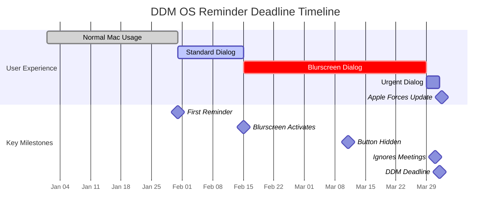

# Deadline Timeline Visualization

This timeline shows how DDM OS Reminder's behavior evolves as the update deadline approaches, providing increasingly urgent messaging and UI changes.



## Timeline Phases

### Phase 1: Quiet Period (Outside Reminder Window)
**Timeline**: More than 60 days before deadline (configurable)

**Behavior**:
- ❌ No reminders displayed
- Mac operates normally
- DDM enforcement date exists but deadline is far away

**Rationale**: Don't annoy users when deadline is distant

**Configuration**: `daysBeforeDeadlineDisplayReminder = 60`

---

### Phase 2: Standard Reminders (Early Warning)
**Timeline**: 60 to 45 days before deadline (configurable range)

**Dialog Appearance**:
```
┌─────────────────────────────────────────────────┐
│  macOS Update Required                       X │
├─────────────────────────────────────────────────┤
│                                                 │
│  Happy Monday, Dan!                             │
│                                                 │
│  Please update to macOS Sequoia 15.2 to        │
│  ensure your Mac remains secure and compliant.  │
│                                                 │
│  [Open Software Update]  [Remind Me Later]     │
│                                                 │
└─────────────────────────────────────────────────┘
```

**Characteristics**:
- ✅ Button 2 enabled ("Remind Me Later")
- ❌ No blurscreen
- ℹ️ Informational tone
- 📅 Shows days remaining
- 🔄 Displayed 2x daily (8am, 4pm)
- 🤝 Respects Focus mode and meetings

**User Options**:
1. Click "Open Software Update" → Opens System Settings
2. Click "Remind Me Later" → Dismissed until next schedule
3. Close dialog → Same as "Remind Me Later"

**Configuration**:
- `daysBeforeDeadlineDisplayReminder = 60`
- `daysBeforeDeadlineBlurscreen = 45`

---

### Phase 3: Blurscreen Warnings (Escalating Urgency)
**Timeline**: 44 to 3 days before deadline (configurable range)

**Dialog Appearance**:
```
╔═════════════════════════════════════════════════╗
║  🔴 macOS Update Required                    X ║
╠═════════════════════════════════════════════════╣
║  ░░░░░░░░░░░░ BLURRED BACKGROUND ░░░░░░░░░░░░  ║
║                                                 ║
║  ⚠️  Only 14 days remaining!                    ║
║                                                 ║
║  Your Mac will automatically restart and        ║
║  update on Fri, 31-Mar-2026 if not updated.    ║
║                                                 ║
║  [Open Software Update]  [Remind Me Later]     ║
║                                                 ║
╚═════════════════════════════════════════════════╝
```

**Characteristics**:
- ✅ Button 2 still enabled
- ✅ **Blurscreen active** (background dimmed)
- ⚠️ Warning tone intensifies
- 🔴 Visual urgency increased
- 📅 Emphasizes days remaining
- 🔄 Still 2x daily
- 🤝 Still respects Focus mode and meetings (if >24hrs remaining)

**Visual Effect**:
- Background desktop blurred/dimmed
- Dialog appears in center with elevated importance
- User must interact with dialog to restore full visibility

**User Options**:
1. Click "Open Software Update" → Opens System Settings
2. Click "Remind Me Later" → Dismissed but returns next schedule
3. Cannot easily ignore due to blurscreen

**Configuration**:
- `daysBeforeDeadlineBlurscreen = 45`
- `daysBeforeDeadlineHidingButton2 = 21`

---

### Phase 4: Urgent/Critical (Deadline Imminent)
**Timeline**: 3 days or less before deadline (configurable)

**Dialog Appearance**:
```
╔═════════════════════════════════════════════════╗
║  🔴🔴 URGENT: macOS Update Required           X ║
╠═════════════════════════════════════════════════╣
║  ░░░░░░░░░░░░ BLURRED BACKGROUND ░░░░░░░░░░░░  ║
║                                                 ║
║  🚨 CRITICAL: Only 2 days remaining!            ║
║                                                 ║
║  Your Mac WILL automatically restart and        ║
║  update on Wed, 01-Apr-2026, 8:00 AM            ║
║  if you do not update before the deadline.      ║
║                                                 ║
║  [Open Software Update]  [Remind Me Later] ❌  ║
║                          ^^^^^^^^^^^^^^^^^^^^   ║
║                          DISABLED OR HIDDEN     ║
║                                                 ║
╚═════════════════════════════════════════════════╝
```

**Characteristics**:
- ❌ **Button 2 disabled (greyed out) or hidden**
- ✅ Blurscreen remains active
- 🚨 Urgent/critical messaging
- ⏰ Shows specific deadline date/time
- 🔄 Still 2x daily (may increase frequency in custom config)
- 🚫 **Ignores Focus mode** if <24 hours
- 🚫 **Ignores meeting detection** if <24 hours

**Key Change**: User can no longer postpone

**User Options**:
1. Click "Open Software Update" → Opens System Settings (ONLY option)
2. Close dialog → Returns next schedule (cannot avoid)

**Rationale**: 
- Deadline is imminent; postponement no longer appropriate
- User must take action or accept automatic restart

**Configuration**:
- `daysBeforeDeadlineHidingButton2 = 21`
- `disableButton2InsteadOfHide = YES` (controls disabled vs hidden)

---

### Phase 5: Apple DDM Enforcement (Deadline Reached)
**Timeline**: Day 0 - Deadline date/time

**What Happens**:
- 🍎 **Apple DDM takes control**
- 🔄 **Mac automatically restarts**
- 📦 **macOS update installs** (forced by Apple)
- 🚫 User cannot cancel or postpone
- ⏳ Process may take 30-60 minutes depending on update size

**DDM OS Reminder Role**:
- Script stops displaying reminders (update no longer pending)
- After update completes and Mac restarts, script detects Mac is up-to-date
- Future runs exit silently until next DDM enforcement

**User Experience**:
1. Mac shows Apple's update screen
2. Progress bar displays installation status
3. Mac restarts automatically
4. User logs back in to updated macOS

---

## Configuration Matrix

| Days to Deadline | Blurscreen | Button 2 | Ignores Focus | Ignores Meetings | Frequency |
|------------------|------------|----------|---------------|------------------|-----------|
| 60+ days         | ❌ No      | ✅ Enabled | ❌ No         | ❌ No            | None (too early) |
| 45-60 days       | ❌ No      | ✅ Enabled | ❌ No         | ❌ No            | 2x daily |
| 3-44 days        | ✅ Yes     | ✅ Enabled | ❌ No         | ❌ No            | 2x daily |
| 1-3 days         | ✅ Yes     | ❌ Disabled | ❌ No         | ❌ No            | 2x daily |
| <24 hours        | ✅ Yes     | ❌ Disabled | ✅ Yes        | ✅ Yes           | 2x daily |
| 0 (deadline)     | N/A        | N/A      | N/A           | N/A              | Apple forces update |

## Customizing the Timeline

All thresholds are configurable via Configuration Profile or local preferences:

### Via Configuration Profile (Recommended)

```xml
<key>DaysBeforeDeadlineDisplayReminder</key>
<integer>60</integer>

<key>DaysBeforeDeadlineBlurscreen</key>
<integer>45</integer>

<key>DaysBeforeDeadlineHidingButton2</key>
<integer>21</integer>
```

### Via Local Preferences Plist

```bash
sudo defaults write /Library/Preferences/org.churchofjesuschrist.dorm \
    DaysBeforeDeadlineDisplayReminder -int 60

sudo defaults write /Library/Preferences/org.churchofjesuschrist.dorm \
    DaysBeforeDeadlineBlurscreen -int 45

sudo defaults write /Library/Preferences/org.churchofjesuschrist.dorm \
    DaysBeforeDeadlineHidingButton2 -int 21
```

### Common Configurations

#### Conservative (Less Intrusive)
```
DaysBeforeDeadlineDisplayReminder = 30
DaysBeforeDeadlineBlurscreen = 14
DaysBeforeDeadlineHidingButton2 = 7
```
- Later reminders
- Shorter blurscreen period
- More time with postponement option

#### Aggressive (More Urgent)
```
DaysBeforeDeadlineDisplayReminder = 90
DaysBeforeDeadlineBlurscreen = 60
DaysBeforeDeadlineHidingButton2 = 30
```
- Earlier reminders
- Longer blurscreen period
- Earlier button removal

#### Balanced (Default)
```
DaysBeforeDeadlineDisplayReminder = 60
DaysBeforeDeadlineBlurscreen = 45
DaysBeforeDeadlineHidingButton2 = 21
```
- 2-month warning
- 1.5-month blurscreen
- 3-week urgency escalation

## Visual Progression Examples

### Day -60: First Reminder

*Clean, informational dialog with both buttons enabled*

### Day -30: Blurscreen Active

*Background dimmed, increased visual urgency*

### Day -2: Urgent/Critical

*"Remind Me Later" button disabled/hidden, critical messaging*

### Day 0: Apple Enforcement

*Apple's forced update process begins*

---

## Additional Timeline Considerations

### Staged Updates
If macOS update is **pre-downloaded** to Preboot volume:
- Dialog shows "Good news! Update is ready to install"
- Installation time significantly reduced
- More likely user will proceed immediately
- Detection happens in all phases

### Excessive Uptime Warning
If Mac hasn't restarted recently (configurable threshold):
- Dialog adds warning: "Your Mac has been powered-on for X days"
- Recommendation to restart before updating
- Applies to all phases where dialog displays

### Low Disk Space Warning
If free disk space below threshold:
- Dialog adds warning: "Only X GB available, may prevent update"
- User directed to free space before updating
- Applies to all phases where dialog displays

### Quiet Period
Between dialog displays (same day):
- Prevents excessive nagging
- Enforces minimum time between reminders
- Typically several hours
- Configurable per organization

---

## FAQ

**Q: Can users bypass the reminders?**  
A: During early phases (>3 days), yes—users can postpone. In urgent phase (<3 days), Button 2 is disabled. At deadline (Day 0), Apple DDM forces the update regardless.

**Q: What if user is on vacation during deadline?**  
A: Mac will update automatically at deadline per Apple DDM enforcement. User returns to updated Mac. This is why early reminders (60 days) are important.

**Q: Can admin disable blurscreen?**  
A: Not recommended, but theoretically possible by setting very low threshold. Blurscreen is key differentiator from Apple's subtle notification.

**Q: What if user needs to postpone due to critical work?**  
A: User can postpone during early/medium phases. For critical systems, consider extending DDM deadline via MDM before reaching urgent phase.

**Q: How does this interact with Apple's own notifications?**  
A: DDM OS Reminder supplements (not replaces) Apple's notifications. Apple's notification appears but is subtle. This provides prominent, configurable reminders with better visibility.
