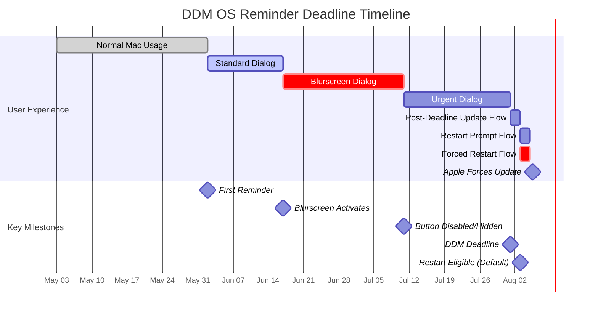

# Deadline Timeline Visualization

This timeline shows how DDM OS Reminder's behavior evolves as the update deadline approaches and after it passes, including the optional 2.6.0 post-deadline restart workflow.


```mermaid
gantt
    title DDM OS Reminder Deadline Timeline
    dateFormat YYYY-MM-DD
    axisFormat %b %d
    
    section User Experience
    Normal Mac Usage            :done, normal, 2026-05-03, 30d
    Standard Dialog             :active, standard, 2026-06-02, 15d
    Blurscreen Dialog           :crit, blur, 2026-06-17, 24d
    Urgent Dialog               :urgent, 2026-07-11, 21d
    Post-Deadline Update Flow   :postupdate, 2026-08-01, 2d
    Restart Prompt Flow         :postprompt, 2026-08-03, 2d
    Forced Restart Flow         :crit, postforce, 2026-08-03, 2d
    Apple Forces Update         :milestone, force, 2026-08-05, 1d
    
    section Key Milestones
    First Reminder              :milestone, m1, 2026-06-02, 0d
    Blurscreen Activates        :milestone, m2, 2026-06-17, 0d
    Button Disabled/Hidden      :milestone, m3, 2026-07-11, 0d
    DDM Deadline                :milestone, m4, 2026-08-01, 0d
    Restart Eligible (Default)  :milestone, m5, 2026-08-03, 0d
```

**Note**: Dates above are illustrative only. Post-deadline behavior depends on `PastDeadlineRestartBehavior`, `DaysPastDeadlineRestartWorkflow`, and uptime eligibility.

## Timeline Phases

### Phase 1: Quiet Period (Outside Reminder Window)
**Timeline**: More than 60 days before deadline (configurable)

**Behavior**:
- ❌ No regular reminders displayed
- Mac operates normally
- DDM enforcement date exists but deadline is far away
- ℹ️ A periodic reminder can still appear every 28 days if no recent interaction is found

**Rationale**: Don't annoy users when deadline is distant

**Configuration**: `daysBeforeDeadlineDisplayReminder = 60`

---

### Phase 2: Standard Reminders (Early Warning)
**Timeline**: 60 to 45 days before deadline (configurable range)

**Dialog Appearance**:
```
┌─────────────────────────────────────────────────┐
│  macOS Update Required                       X │
├─────────────────────────────────────────────────┤
│                                                 │
│  Happy Monday, Dan!                             │
│                                                 │
│  Please update to macOS Sequoia 15.2 to        │
│  ensure your Mac remains secure and compliant.  │
│                                                 │
│  [Open Software Update]  [Remind Me Later]     │
│                                                 │
└─────────────────────────────────────────────────┘
```

**Characteristics**:
- ✅ Button 2 enabled ("Remind Me Later")
- ❌ No blurscreen
- ℹ️ Informational tone
- 📅 Shows days remaining
- 🔄 Triggered by LaunchDaemon at load and scheduled times (default 8:00/16:00)
- 🤝 Respects meeting detection

**User Options**:
1. Click "Open Software Update" → Opens System Settings
2. Click "Remind Me Later" → Dismissed until next schedule
3. Close dialog → Same as "Remind Me Later"

**Configuration**:
- `daysBeforeDeadlineDisplayReminder = 60`
- `daysBeforeDeadlineBlurscreen = 45`

---

### Phase 3: Blurscreen Warnings (Escalating Urgency)
**Timeline**: 44 to 21 days before deadline (configurable range)

**Dialog Appearance**:
```
╔═════════════════════════════════════════════════╗
║  🔴 macOS Update Required                    X ║
╠═════════════════════════════════════════════════╣
║  ░░░░░░░░░░░░ BLURRED BACKGROUND ░░░░░░░░░░░░  ║
║                                                 ║
║  ⚠️  Only 14 days remaining!                    ║
║                                                 ║
║  Your Mac will automatically restart and        ║
║  update on Sat, 01-Aug-2026 if not updated.    ║
║                                                 ║
║  [Open Software Update]  [Remind Me Later]     ║
║                                                 ║
╚═════════════════════════════════════════════════╝
```

**Characteristics**:
- ✅ Button 2 still enabled
- ✅ **Blurscreen active** (background dimmed)
- ⚠️ Warning tone intensifies
- 🔴 Visual urgency increased
- 📅 Emphasizes days remaining
- 🔄 Triggered by LaunchDaemon at load and scheduled times (default 8:00/16:00)
- 🤝 Respects meeting detection

**Visual Effect**:
- Background desktop blurred/dimmed
- Dialog appears in center with elevated importance
- User must interact with dialog to restore full visibility

**User Options**:
1. Click "Open Software Update" → Opens System Settings
2. Click "Remind Me Later" → Dismissed but returns next schedule
3. Cannot easily ignore due to blurscreen

**Configuration**:
- `daysBeforeDeadlineBlurscreen = 45`
- `daysBeforeDeadlineHidingButton2 = 21`

---

### Phase 4: Urgent/Critical (Deadline Imminent)
**Timeline**: 21 days or less before deadline (configurable)

**Dialog Appearance**:
```
╔═════════════════════════════════════════════════╗
║  🔴🔴 URGENT: macOS Update Required           X ║
╠═════════════════════════════════════════════════╣
║  ░░░░░░░░░░░░ BLURRED BACKGROUND ░░░░░░░░░░░░  ║
║                                                 ║
║  🚨 CRITICAL: Only 2 days remaining!            ║
║                                                 ║
║  Your Mac WILL automatically restart and        ║
║  update on Sat, 01-Aug-2026, 8:00 AM            ║
║  if you do not update before the deadline.      ║
║                                                 ║
║  [Open Software Update]  [Remind Me Later] ❌  ║
║                          ^^^^^^^^^^^^^^^^^^^^   ║
║                          DISABLED OR HIDDEN     ║
║                                                 ║
╚═════════════════════════════════════════════════╝
```

**Characteristics**:
- ❌ **Button 2 disabled (greyed out) or hidden**
- ✅ Blurscreen remains active
- 🚨 Urgent/critical messaging
- ⏰ Shows specific deadline date/time
- 🔄 Triggered by LaunchDaemon at load and scheduled times (default 8:00/16:00)
- ⚠️ Meeting deferral is ignored when less than 24 hours remain

**Key Change**: User can no longer postpone

**User Options**:
1. Click "Open Software Update" → Opens System Settings (ONLY option)
2. Close dialog → Returns next schedule (cannot avoid)

**Rationale**: 
- Deadline is imminent; postponement no longer appropriate
- User must take action or accept automatic restart

**Configuration**:
- `daysBeforeDeadlineHidingButton2 = 21`
- `disableButton2InsteadOfHide = YES` (controls disabled vs hidden)

---

### Phase 5: Post-Deadline Workflow (2.6.0)
**Timeline**: After the deadline has passed and update is still required

**Eligibility Gate for Restart Workflow**:
- `PastDeadlineRestartBehavior` is not `Off`
- The Mac still requires the enforced update/upgrade
- Days past deadline are `>= DaysPastDeadlineRestartWorkflow` (default: `2`)
- Current uptime is at least 75 minutes (fixed runtime gate)

**Mode Behavior**:
- `Off` (default): Continue normal update-focused reminder flow
- `Prompt`: Switch to restart-only dialog (`Restart Now`), but user can still dismiss and be reminded again later
- `Force`: Switch to restart-only dialog with 60-second timer; non-restart dismissal re-displays after ~5 seconds until restart occurs

**Runtime Notes**:
- If restart mode is eligible by days but uptime is below 75 minutes, restart mode is temporarily suppressed and update-focused flow continues
- Force mode bypasses quiet-period suppression and meeting-delay checks

**Configuration**:
- `PastDeadlineRestartBehavior = Off|Prompt|Force`
- `DaysPastDeadlineRestartWorkflow = 0-999` (default `2`)

---

### Phase 6: Apple DDM Enforcement (Deadline Reached / Padded Enforcement Time)
**Timeline**: At Apple's enforced restart/update event

**What Happens**:
- 🍎 **Apple DDM takes control**
- 🔄 **Mac automatically restarts**
- 📦 **macOS update installs** (forced by Apple)
- 🚫 User cannot cancel or postpone
- ⏳ Process may take 30-60 minutes depending on update size

**DDM OS Reminder Role**:
- Script continues to run and evaluate update state until device is compliant
- After update completes and Mac restarts, script detects Mac is up-to-date
- Future runs exit silently until next DDM enforcement

**User Experience**:
1. Mac shows Apple's update screen
2. Progress bar displays installation status
3. Mac restarts automatically
4. User logs back in to updated macOS

---

## Configuration Matrix

| Window / Condition | Primary UX | Button 2 | Meeting Deferral | Trigger Behavior |
|--------------------|------------|----------|------------------|------------------|
| `> DaysBeforeDeadlineDisplayReminder` (default: `>60`) | No regular dialog (periodic 28-day reminder still possible) | N/A when no dialog | N/A when no dialog | LaunchDaemon at load + schedule |
| `60` to `45` days before deadline (default) | Standard reminder | ✅ Enabled | ✅ Yes (if >24h to deadline) | LaunchDaemon at load + schedule |
| `44` to `22` days before deadline (default) | Blurscreen reminder | ✅ Enabled | ✅ Yes (if >24h to deadline) | LaunchDaemon at load + schedule |
| `21` to `2` days before deadline (default) | Urgent reminder | ❌ Disabled/hidden | ✅ Yes (if >24h to deadline) | LaunchDaemon at load + schedule |
| `<24` hours before deadline | Urgent reminder | ❌ Disabled/hidden | ❌ No (ignored) | LaunchDaemon at load + schedule |
| Past deadline + restart mode `Off` or not eligible | Update-focused reminder continues | ❌ Disabled/hidden (by threshold) | ❌ No (deadline window) | LaunchDaemon at load + schedule |
| Past deadline + restart mode `Prompt` + eligible | Restart-only prompt dialog | Hidden | ❌ No (deadline window) | LaunchDaemon at load + schedule |
| Past deadline + restart mode `Force` + eligible | Restart-only forced loop (`--timer 60`) | Hidden | ❌ No (explicit bypass) | Re-displays every ~5 seconds until restart |
| Apple enforcement event | Apple-controlled restart/update | N/A | N/A | macOS/DDM enforcement |

## Customizing the Timeline

Most thresholds are configurable via Configuration Profile or local preferences:

### Via Configuration Profile (Recommended)

```xml
<key>DaysBeforeDeadlineDisplayReminder</key>
<integer>60</integer>

<key>DaysBeforeDeadlineBlurscreen</key>
<integer>45</integer>

<key>DaysBeforeDeadlineHidingButton2</key>
<integer>21</integer>

<key>PastDeadlineRestartBehavior</key>
<string>Off</string>

<key>DaysPastDeadlineRestartWorkflow</key>
<integer>2</integer>
```

### Via Local Preferences Plist

```bash
sudo defaults write /Library/Preferences/org.churchofjesuschrist.dorm \
    DaysBeforeDeadlineDisplayReminder -int 60

sudo defaults write /Library/Preferences/org.churchofjesuschrist.dorm \
    DaysBeforeDeadlineBlurscreen -int 45

sudo defaults write /Library/Preferences/org.churchofjesuschrist.dorm \
    DaysBeforeDeadlineHidingButton2 -int 21

sudo defaults write /Library/Preferences/org.churchofjesuschrist.dorm \
    PastDeadlineRestartBehavior -string "Off"

sudo defaults write /Library/Preferences/org.churchofjesuschrist.dorm \
    DaysPastDeadlineRestartWorkflow -int 2
```

### Common Configurations

#### Conservative (Less Intrusive)
```
DaysBeforeDeadlineDisplayReminder = 30
DaysBeforeDeadlineBlurscreen = 14
DaysBeforeDeadlineHidingButton2 = 7
PastDeadlineRestartBehavior = Off
DaysPastDeadlineRestartWorkflow = 2
```
- Later reminders
- Shorter blurscreen period
- More time with postponement option

#### Aggressive (More Urgent)
```
DaysBeforeDeadlineDisplayReminder = 90
DaysBeforeDeadlineBlurscreen = 60
DaysBeforeDeadlineHidingButton2 = 30
PastDeadlineRestartBehavior = Prompt
DaysPastDeadlineRestartWorkflow = 1
```
- Earlier reminders
- Longer blurscreen period
- Earlier button removal

#### Balanced (Default)
```
DaysBeforeDeadlineDisplayReminder = 60
DaysBeforeDeadlineBlurscreen = 45
DaysBeforeDeadlineHidingButton2 = 21
PastDeadlineRestartBehavior = Off
DaysPastDeadlineRestartWorkflow = 2
```
- 2-month warning
- 1.5-month blurscreen
- 3-week urgency escalation

## Visual Examples (See `images/`)

- `images/ddmOSReminder_swiftDialog_1.png` — Primary reminder dialog example
- `images/ddmOSReminder_swiftDialog_2.png` — Support info dialog example
- `images/ddmOSReminder_Demo.png` — Demo mode example
- `images/ddmOSReminder_Notification.png` — macOS notification comparison

---

## Additional Timeline Considerations

### Staged Updates
If macOS update is **pre-downloaded** to Preboot volume:
- Dialog shows "Good news! Update is ready to install"
- Installation time significantly reduced
- More likely user will proceed immediately
- Detection happens in all phases

### Excessive Uptime Warning
If Mac hasn't restarted recently (configurable threshold):
- Dialog adds warning: "Your Mac has been powered-on for X days"
- Recommendation to restart before updating
- Suppressed in restart-only mode and in specific low-uptime suppression paths

### Low Disk Space Warning
If free disk space below threshold:
- Dialog adds warning: "Only X GB available, may prevent update"
- User directed to free space before updating
- Applies to all phases where dialog displays

### Quiet Period
Between dialog displays (same day):
- Prevents excessive nagging
- Enforces minimum time between reminders
- Default: 76 minutes
- Currently hard-coded in runtime logic (not profile-driven)
- Bypassed in post-deadline `Force` mode

### Meeting Deferral
Display-sleep assertion checks (`meetingDelay`) are availability controls, not absolute blockers:
- Used when more than 24 hours remain to deadline
- Ignored within 24 hours of deadline
- Ignored in post-deadline `Force` mode

---

## FAQ

**Q: Can users bypass the reminders?**  
A: During early phases (>21 days by default), users can postpone. In urgent phase (<=21 days by default), Button 2 is disabled/hidden. In post-deadline `Force` mode, dismissal loops until restart. Apple DDM enforcement still ultimately controls the final forced update/restart event.

**Q: What if user is on vacation during deadline?**  
A: Mac updates at Apple's DDM enforcement event (which can be after the original deadline when macOS applies its padded enforcement date). User returns to an updated Mac. This is why early reminders remain important.

**Q: Can admin disable blurscreen?**  
A: Not recommended, but theoretically possible by setting very low threshold. Blurscreen is key differentiator from Apple's subtle notification.

**Q: What if user needs to postpone due to critical work?**  
A: User can postpone during early/medium phases. Within 24 hours of deadline, meeting deferral is ignored. If post-deadline restart `Force` mode is enabled and eligible, postponement is not available.

**Q: When does the post-deadline restart workflow start?**  
A: Only when all gates pass: restart behavior not `Off`, deadline has passed by `DaysPastDeadlineRestartWorkflow`, update is still required, and uptime is at least 75 minutes.

**Q: How does this interact with Apple's own notifications?**  
A: DDM OS Reminder supplements (not replaces) Apple's notifications. Apple's notification appears but is subtle. This provides prominent, configurable reminders with better visibility.
