# Deployment Workflow Diagram

This diagram guides administrators through the complete deployment process for DDM OS Reminder.

```mermaid
flowchart TD
    Start([🚀 Start Deployment]) --> PreReq[📋 Prerequisites Check]
    
    PreReq --> CheckMDM{"MDM Solution<br>Available?"}
    CheckMDM -->|No| StopMDM["❌ DDM OS Reminder<br>requires MDM"]
    CheckMDM -->|Yes| CheckDDM{"Apple DDM<br>Configured?"}
    
    CheckDDM -->|No| ConfigDDM[📱 Configure DDM<br/>in your MDM]
    CheckDDM -->|Yes| CheckGit{Have Git<br/>Repository?}
    
    ConfigDDM --> CheckGit
    
    CheckGit -->|No| Download[⬇️ Download Release<br/>from GitHub]
    CheckGit -->|Yes| Clone[📦 Clone Repository<br/>git clone]
    
    Download --> CustomizePhase
    Clone --> CustomizePhase[🎨 Customization Phase]
    
    CustomizePhase --> CustomizeReminder[Edit reminderDialog.zsh]
    CustomizeReminder --> EditBranding[🏢 Organization Branding<br/>- reverseDomainNameNotation<br/>- Support team info<br/>- Icons/logos]
    
    EditBranding --> EditTiming[⏰ Timing Preferences<br/>- Days before deadline<br/>- Blurscreen threshold<br/>- Button hiding threshold]
    
    EditTiming --> EditMessages[💬 Message Content<br/>- Dialog text<br/>- Button labels<br/>- Help text]
    
    EditMessages --> CustomizeLaunchDaemon[Edit launchDaemonManagement.zsh]
    CustomizeLaunchDaemon --> EditSchedule[📅 Schedule Configuration<br/>- Daily trigger times<br/>- Calendar intervals]
    
    EditSchedule --> ReviewCustom{Review<br/>Customizations?}
    ReviewCustom -->|Need Changes| CustomizeReminder
    ReviewCustom -->|Ready| AssemblePhase[⚙️ Assembly Phase]
    
    AssemblePhase --> RunAssemble[▶️ Run Assembly Script<br/>zsh assemble.zsh]
    
    RunAssemble --> PromptRDNN[💭 Prompt: Enter RDNN<br/>or accept default]
    PromptRDNN --> ProcessAssembly[🔧 Processing...<br/>- Harmonize RDNN<br/>- Embed reminderDialog<br/>- Remove demo mode<br/>- Validate syntax]
    
    ProcessAssembly --> GenerateArtifacts[📦 Generate Artifacts]
    GenerateArtifacts --> Artifact1["✅ Assembled Script<br>ddm-os-reminder-(RDNN)-(timestamp).zsh"]
    GenerateArtifacts --> Artifact2["✅ Configuration Plist<br>(RDNN).dorm-(timestamp).plist"]
    GenerateArtifacts --> Artifact3["✅ Configuration Profile<br>(RDNN).dorm-(timestamp)-unsigned.mobileconfig"]
    
    Artifact1 --> CheckArtifacts{Artifacts<br/>Generated?}
    Artifact2 --> CheckArtifacts
    Artifact3 --> CheckArtifacts
    
    CheckArtifacts -->|Errors| FixErrors[🔍 Review Errors<br/>Fix syntax issues]
    FixErrors --> RunAssemble
    CheckArtifacts -->|Success| TestPhase[🧪 Test Deployment Phase]
    
    TestPhase --> TestVM[💻 Deploy to Test Mac/VM]
    TestVM --> UploadTestScript[⬆️ Upload Script to MDM<br/>as Policy/Package]
    UploadTestScript --> DeployTestProfile[⬆️ Deploy Config Profile<br/>to Test Device/Group]
    
    DeployTestProfile --> RunTestScript[▶️ Execute Script<br/>on Test Mac]
    RunTestScript --> VerifyTest[✅ Verify Installation<br/>- LaunchDaemon loaded?<br/>- Script in place?<br/>- Logs created?]
    
    VerifyTest --> TriggerTest["🎬 Trigger Test Display<br>Option 1: Wait for schedule<br>Option 2: zsh reminderDialog.zsh demo"]
    
    TriggerTest --> ReviewDialog{Dialog Displays<br/>Correctly?}
    
    ReviewDialog -->|No - Issues Found| DiagnoseIssues[🔍 Diagnose Issues<br/>- Check logs<br/>- Verify preferences<br/>- Test dialog binary]
    DiagnoseIssues --> FixCustom{Issue Type?}
    FixCustom -->|Configuration| AdjustPrefs[📝 Adjust Preferences<br/>in Configuration Profile]
    FixCustom -->|Script Logic| CustomizeReminder
    FixCustom -->|LaunchDaemon| CustomizeLaunchDaemon
    
    AdjustPrefs --> RunAssemble
    
    ReviewDialog -->|Yes - Looks Good| ProdPhase[🚀 Production Deployment Phase]
    
    ProdPhase --> ChooseMethod{Deployment<br/>Method?}
    
    ChooseMethod -->|Standard| StandardDeploy[📋 Standard Deployment]
    ChooseMethod -->|Self-Extracting| SelfExtract[📦 Self-Extracting Package]
    
    StandardDeploy --> UploadProdScript[⬆️ Upload Assembled Script<br/>to MDM Production]
    UploadProdScript --> CreatePolicy[📝 Create MDM Policy<br/>- Scope: Target computers<br/>- Frequency: Once per computer<br/>- Trigger: Recurring check-in]
    
    CreatePolicy --> DeployProdProfile[⬆️ Deploy Config Profile<br/>to Production Scope]
    DeployProdProfile --> ProdComplete
    
    SelfExtract --> RunDeploy[▶️ Run Resources/createSelfExtracting.zsh<br/>Creates self-contained script]
    RunDeploy --> UploadSelfExtract[⬆️ Upload Self-Extracting Script]
    UploadSelfExtract --> CreateSEPolicy[📝 Create Policy for<br/>Self-Extracting Script]
    CreateSEPolicy --> DeployProdProfile
    
    ProdComplete[✅ Production Deployment Complete] --> MonitorPhase[📊 Monitoring Phase]
    
    MonitorPhase --> MonitorLogs["📋 Monitor Logs<br>tail -f /var/log/(RDNN).log"]
    MonitorLogs --> CheckEA[📊 Check Extension Attributes<br/>- DDM enforcement status<br/>- Days to deadline<br/>- Last dialog display]
    
    CheckEA --> MonitorIssues{Issues<br/>Reported?}
    
    MonitorIssues -->|Yes| Troubleshoot[🔧 Troubleshooting<br/>- Review client logs<br/>- Check preferences<br/>- Verify DDM enforcement<br/>- Test dialog display]
    Troubleshoot --> ResolveIssue{Issue<br/>Resolved?}
    ResolveIssue -->|No| EscalateIssue[🆘 Escalate to Support<br/>- GitHub Issues<br/>- Mac Admins Slack]
    ResolveIssue -->|Yes| MonitorLogs
    EscalateIssue --> MonitorLogs
    
    MonitorIssues -->|No| MaintainPhase[🔄 Maintenance Phase]
    
    MaintainPhase --> CheckUpdates[🔍 Check for Updates<br/>github.com/dan-snelson<br/>/DDM-OS-Reminder]
    CheckUpdates --> UpdateAvail{New Version<br/>Available?}
    
    UpdateAvail -->|Yes| ReviewChangelog[📖 Review CHANGELOG.md]
    ReviewChangelog --> UpgradeDecision{Deploy<br/>Update?}
    UpgradeDecision -->|Yes| CustomizePhase
    UpgradeDecision -->|No| CheckUpdates
    
    UpdateAvail -->|No| PolicyChanges{DDM Policy<br/>Changes?}
    
    PolicyChanges -->|Yes| AdjustThresholds[⚙️ Adjust Thresholds<br/>Modify Configuration Profile]
    AdjustThresholds --> DeployUpdatedProfile[⬆️ Deploy Updated Profile]
    DeployUpdatedProfile --> MonitorLogs
    
    PolicyChanges -->|No| PeriodicReview[📅 Periodic Review<br/>Quarterly assessment]
    PeriodicReview --> Success[🎉 DDM OS Reminder<br/>Running Successfully]
    
    Success --> End([✅ End])
    StopMDM --> End
    
    style Start fill:#e3f2fd
    style PreReq fill:#fff9c4
    style CustomizePhase fill:#e1bee7
    style AssemblePhase fill:#c5cae9
    style TestPhase fill:#ffccbc
    style ProdPhase fill:#c8e6c9
    style MonitorPhase fill:#b2dfdb
    style MaintainPhase fill:#f0f4c3
    style Success fill:#a5d6a7
    style End fill:#e0e0e0
    style StopMDM fill:#ef5350
```



## Detailed Step-by-Step Guide

### Phase 1: Prerequisites (📋)

#### 1.1 Verify Requirements

**MDM Solution**:
- ✅ Jamf Pro
- ✅ Microsoft Intune
- ✅ Kandji
- ✅ Mosyle
- ✅ Any MDM supporting script execution and Configuration Profiles

**Apple DDM Configuration**:
```
MDM → Declarative Device Management → Software Update Enforcement
- Configure macOS version requirement
- Set enforcement deadline
- Enable enforcement
```

**Local Tools**:
- macOS computer with zsh shell
- Terminal access
- Git (optional, for cloning repository)
- Text editor (VS Code, BBEdit, nano, etc.)

#### 1.2 Obtain DDM OS Reminder Files

**Option A: Clone Repository** (Recommended for version control)
```bash
cd ~/Documents/GitHub
git clone https://github.com/dan-snelson/DDM-OS-Reminder.git
cd DDM-OS-Reminder
```

**Option B: Download Release**
```bash
# Download latest release from GitHub
# Extract to desired location
```

---

### Phase 2: Customization (🎨)

#### 2.1 Edit reminderDialog.zsh

**Organization Variables** (Lines ~65-85):
```bash
# Organization's Script Human-readable Name
humanReadableScriptName="DDM OS Reminder End-user Message"

# Organization's Reverse Domain Name Notation
reverseDomainNameNotation="org.churchofjesuschrist"

# Organization's Script Name
organizationScriptName="dorm"
```

**Timing Preferences** (Lines ~150-156):
```bash
["daysBeforeDeadlineDisplayReminder"]="numeric|60"
["daysBeforeDeadlineBlurscreen"]="numeric|45"
["daysBeforeDeadlineHidingButton2"]="numeric|21"
["meetingDelay"]="numeric|75"
```

**Support Team Information** (Lines ~165-171):
```bash
["supportTeamName"]="string|IT Support"
["supportTeamPhone"]="string|+1 (801) 555-1212"
["supportTeamEmail"]="string|rescue@domain.org"
["supportTeamWebsite"]="string|https://support.domain.org"
```

**Branding** (Lines ~162-163):
```bash
["organizationOverlayiconURL"]="string|https://your-icon-url.com/icon.png"
["swapOverlayAndLogo"]="boolean|NO"
```

**Message Content** (Lines ~180-200):
```bash
["title"]="string|macOS {titleMessageUpdateOrUpgrade} Required"
["message"]="string|**A required macOS update...**"
["button1text"]="string|Open Software Update"
["button2text"]="string|Remind Me Later"
```

#### 2.2 Edit launchDaemonManagement.zsh

**RDNN Validation** (Lines ~65-70):
```bash
reverseDomainNameNotation="org.churchofjesuschrist"
organizationScriptName="dor"
```

**LaunchDaemon Schedule** (Lines ~380-395):
```xml
<key>StartCalendarInterval</key>
<array>
    <dict>
        <key>Hour</key>
        <integer>8</integer>
        <key>Minute</key>
        <integer>0</integer>
    </dict>
    <dict>
        <key>Hour</key>
        <integer>16</integer>
        <key>Minute</key>
        <integer>0</integer>
    </dict>
</array>
```

---

### Phase 3: Assembly (⚙️)

#### 3.1 Run Assembly Script

```bash
cd /path/to/DDM-OS-Reminder
zsh assemble.zsh
```

**Interactive Prompts**:
1. **RDNN Prompt**: Enter your organization's Reverse Domain Name Notation
   - Example: `com.company.division`
   - Default: Value from scripts (if matching)
   - Press `X` to exit

2. **Processing Output**:
```
===============================================================
🧩 Assemble DDM OS Reminder (2.5.0b1)
===============================================================

Full Paths:
        Reminder Dialog: /path/to/reminderDialog.zsh
LaunchDaemon Management: /path/to/launchDaemonManagement.zsh
      Working Directory: /path/to/DDM-OS-Reminder
    Resources Directory: /path/to/Resources

🔍 Checking Reverse Domain Name Notation …
Enter Your Organization's RDNN [org.churchofjesuschrist]: com.myorg

🔧 Inserting reminderDialog.zsh into launchDaemonManagement.zsh …
✅ Assembly complete [2026-01-19-143022]
   → Artifacts/ddm-os-reminder-assembled-2026-01-19-143022.zsh

🔍 Performing syntax check …
    ✅ Syntax check passed.

🗂  Generating LaunchDaemon plist …
   → Artifacts/com.myorg.dorm-2026-01-19-143022.plist

🧩 Generating Configuration Profile (.mobileconfig) …
   → Artifacts/com.myorg.dorm-2026-01-19-143022-unsigned.mobileconfig

🏁 Done.

Deployment Artifacts:
        Assembled Script: Artifacts/ddm-os-reminder-com.myorg-2026-01-19-143022.zsh
    Organizational Plist: Artifacts/com.myorg.dorm-2026-01-19-143022.plist
   Configuration Profile: Artifacts/com.myorg.dorm-2026-01-19-143022-unsigned.mobileconfig
```

#### 3.2 Verify Artifacts

```bash
ls -lh Artifacts/
```

Expected files:
- `ddm-os-reminder-{RDNN}-{timestamp}.zsh` - Executable script
- `{RDNN}.dorm-{timestamp}.plist` - Preferences file
- `{RDNN}.dorm-{timestamp}-unsigned.mobileconfig` - Configuration Profile

---

### Phase 4: Test Deployment (🧪)

#### 4.1 Upload to MDM (Test)

**Jamf Pro**:
1. Settings → Computer Management → Scripts
2. Upload assembled .zsh file
3. Set options:
   - Priority: After
   - Parameter 4 Label: "Reset Configuration"
   - Parameter 4 Default: "All"

**Intune**:
1. Devices → macOS → Shell scripts
2. Upload assembled .zsh file
3. Configure:
   - Run script as: root
   - Hide script notification: No

#### 4.2 Deploy Configuration Profile

**Jamf Pro**:
1. Configuration Profiles → Upload
2. Select .mobileconfig file
3. Scope to test computer/group
4. Deploy

**Intune**:
1. Devices → macOS → Configuration profiles
2. Import .mobileconfig file
3. Assign to test devices

#### 4.3 Execute Test Script

**Jamf Pro**:
1. Create policy
2. Add script
3. Scope to test computer
4. Trigger: Check-in
5. Run policy on test Mac

**Intune**:
1. Script auto-deploys to assigned devices
2. Wait for check-in or sync manually

#### 4.4 Verify Installation

```bash
# Check LaunchDaemon
sudo launchctl list | grep org.churchofjesuschrist.dor

# Check script file
ls -lh /Library/Management/org.churchofjesuschrist/dor.zsh

# Check managed preferences
ls -lh /Library/Managed\ Preferences/org.churchofjesuschrist.dorm.plist

# Check logs
tail -50 /var/log/org.churchofjesuschrist.log
```

Expected output:
```
[PRE-FLIGHT]      DDM OS Reminder (2.5.0b1)
[PRE-FLIGHT]      Initiating …
[NOTICE]          Reset All Configuration Files …
[NOTICE]          Create 'DDM OS Reminder' script
[NOTICE]          Create LaunchDaemon
```

#### 4.5 Test Dialog Display

**Option 1: Wait for Schedule** (RunAtLoad, 8am, or 4pm)

**Option 2: Manual Trigger** (Immediate)
```bash
zsh reminderDialog.zsh demo
```
Note: Demo mode is removed during `assemble.zsh`, so use the source script for demo.

**Option 3: Force Run** (Respects all logic)
```bash
sudo launchctl start org.churchofjesuschrist.dor
```

#### 4.6 Troubleshooting Tests

**No dialog appears**:
```bash
# Check if user logged in
who

# Check DDM enforcement
grep -i "EnforcedInstallDate" /var/log/install.log

# Check script logs
tail -100 /var/log/org.churchofjesuschrist.log

# Check swiftDialog
/usr/local/bin/dialog --version
```

**Dialog appears but incorrect branding**:
- Check managed preferences deployed correctly
- Verify RDNN matches between script and profile
- Check icon URLs are accessible

**LaunchDaemon not loading**:
```bash
# Check plist syntax
plutil -lint /Library/LaunchDaemons/org.churchofjesuschrist.dor.plist

# Manually load
sudo launchctl bootstrap system /Library/LaunchDaemons/org.churchofjesuschrist.dor.plist

# Check status
sudo launchctl print system/org.churchofjesuschrist.dor
```

---

### Phase 5: Production Deployment (🚀)

#### 5.1 Standard Deployment Method

**Step 1: Upload Assembled Script to Production**
```
MDM → Scripts → Upload
- Use same assembled .zsh file tested successfully
- Configure same parameters as test
```

**Step 2: Create Production Policy**
```
MDM → Policies → New
- Name: "Deploy DDM OS Reminder"
- Scope: Production computers or smart group
- Frequency: Once per computer
- Trigger: Recurring check-in
- Execution frequency: Ongoing
- Scripts: Select uploaded script
- Parameter 4: "All" (reset and deploy fresh)
```

**Step 3: Deploy Configuration Profile**
```
MDM → Configuration Profiles
- Upload .mobileconfig
- Scope: Same as script policy
- Deploy
```

**Step 4: Monitor Rollout**
```bash
# On client Macs (via SSH or remote management)
tail -f /var/log/org.churchofjesuschrist.log
```

#### 5.2 Self-Extracting Script Method

**Step 1: Generate Self-Extracting Script**
```bash
cd /path/to/DDM-OS-Reminder
zsh Resources/createSelfExtracting.zsh
```

**Step 2: Upload Self-Extracting Script**
```
MDM → Scripts → Upload self-extracting script
```

**Step 3: Deploy**
```
- Scope to production
- Single execution creates both script and LaunchDaemon
- Preferences still deployed via separate Configuration Profile
```

**Benefits of Self-Extracting**:
- Single script contains everything
- Simpler deployment
- Easier for organizations without package management

---

### Phase 6: Monitoring (📊)

#### 6.1 Monitor Client Logs

**View Live Logs**:
```bash
# SSH to client Mac
ssh admin@client-mac.local

# Tail log file
sudo tail -f /var/log/org.churchofjesuschrist.log
```

**Key Log Entries to Monitor**:
```
[NOTICE]          Reset All Configuration Files …
[PRE-FLIGHT]      Initiating …
[NOTICE]          LaunchDaemon Status
[INFO]            Installed macOS vs. DDM-enforced macOS Comparison
[NOTICE]          Display Reminder Dialog
```

#### 6.2 Extension Attributes (Jamf Pro)

Create EAs to report:
- DDM enforcement status
- Days until deadline
- Last dialog display timestamp
- Current macOS version vs. required

**Example EA**:
```bash
#!/bin/bash
logFile="/var/log/org.churchofjesuschrist.log"
lastDisplay=$(grep "Display Reminder Dialog" "$logFile" | tail -1 | awk '{print $1, $2}')
echo "<result>$lastDisplay</result>"
```

#### 6.3 Common Issues and Solutions

| Issue | Cause | Solution |
|-------|-------|----------|
| Dialog not appearing | No DDM enforcement date | Configure DDM policy in MDM |
| Wrong branding | Preferences not deployed | Deploy Configuration Profile |
| LaunchDaemon not running | Plist syntax error | Validate with `plutil -lint` |
| Script not found | Installation failed | Check MDM policy logs |
| Old swiftDialog version | swiftDialog not updating | Run script manually to trigger update |

---

### Phase 7: Maintenance (🔄)

#### 7.1 Update Workflow

**When New Version Released**:
1. Review [CHANGELOG.md](../CHANGELOG.md)
2. Note breaking changes or new features
3. Pull latest changes: `git pull origin main`
4. Re-customize scripts (compare with previous customizations)
5. Re-run `zsh assemble.zsh`
6. Test on pilot group
7. Deploy to production

#### 7.2 Configuration Updates

**Adjust Timing Thresholds**:
1. Edit Configuration Profile in MDM
2. Change preference values:
   - `DaysBeforeDeadlineDisplayReminder`
   - `DaysBeforeDeadlineBlurscreen`
   - `DaysBeforeDeadlineHidingButton2`
3. Save and re-deploy
4. Changes take effect at next script execution

**Update Branding/Messages**:
- Option A: Update Configuration Profile (for simple text changes)
- Option B: Re-customize and re-assemble script (for structural changes)

#### 7.3 Uninstall (If Needed)

**Full Uninstall**:
```bash
# Run management script with Uninstall parameter
sudo zsh /path/to/assembled-script.zsh Uninstall
```

**What Gets Removed**:
- LaunchDaemon unloaded and deleted
- Client-side script removed
- Empty management directories removed
- Preferences remain (manual removal if needed)

**Manual Cleanup** (if script unavailable):
```bash
# Unload LaunchDaemon
sudo launchctl bootout system /Library/LaunchDaemons/org.churchofjesuschrist.dor.plist

# Remove files
sudo rm /Library/LaunchDaemons/org.churchofjesuschrist.dor.plist
sudo rm /Library/Management/org.churchofjesuschrist/dor.zsh
sudo rm -rf /Library/Managed\ Preferences/org.churchofjesuschrist.dorm.plist

# Remove logs (optional)
sudo rm /var/log/org.churchofjesuschrist.log
```

---

## Deployment Checklist

### Pre-Deployment
- [ ] MDM solution confirmed and accessible
- [ ] Apple DDM configured with enforcement deadline
- [ ] DDM OS Reminder files downloaded/cloned
- [ ] Text editor available for customization

### Customization
- [ ] RDNN updated in both scripts
- [ ] Support team information customized
- [ ] Organization branding configured (icons, logos)
- [ ] Timing thresholds reviewed and adjusted
- [ ] Message content reviewed and customized
- [ ] LaunchDaemon schedule confirmed

### Assembly
- [ ] `assemble.zsh` executed successfully
- [ ] Three artifacts generated in Artifacts/ directory
- [ ] Syntax check passed
- [ ] Artifacts reviewed for correctness

### Testing
- [ ] Script uploaded to MDM (test)
- [ ] Configuration Profile uploaded to MDM (test)
- [ ] Policy created and scoped to test device
- [ ] Script executed on test Mac
- [ ] LaunchDaemon verified loaded
- [ ] Script file verified in place
- [ ] Managed preferences verified
- [ ] Dialog manually triggered and reviewed
- [ ] Branding, messaging, buttons validated
- [ ] User interaction tested (both buttons)
- [ ] Logs reviewed for errors

### Production Deployment
- [ ] Script uploaded to MDM (production)
- [ ] Configuration Profile uploaded to MDM (production)
- [ ] Policy created for production scope
- [ ] Phased rollout planned (pilot → production)
- [ ] Communication sent to IT staff
- [ ] Communication sent to end users (optional)

### Monitoring
- [ ] Client logs monitored
- [ ] Extension Attributes configured (if applicable)
- [ ] Support tickets reviewed for feedback
- [ ] Adjustment thresholds documented

### Ongoing Maintenance
- [ ] GitHub repository watched for updates
- [ ] Quarterly review scheduled
- [ ] Update procedure documented
- [ ] Backup of customizations maintained

---

## Deployment Timeline Estimate

| Phase | Time Required | Notes |
|-------|---------------|-------|
| Prerequisites | 30 minutes | Assuming DDM already configured |
| Customization | 1-2 hours | First time; faster with template |
| Assembly | 5 minutes | Automated process |
| Test Deployment | 1-2 hours | Includes troubleshooting |
| Production Deployment | 30 minutes | If testing successful |
| Initial Monitoring | 1 week | Watch for issues |
| **Total Initial Setup** | **4-6 hours** | Spread over 1-2 weeks |

**Subsequent Updates**: 30-60 minutes (customization + assembly + testing)
