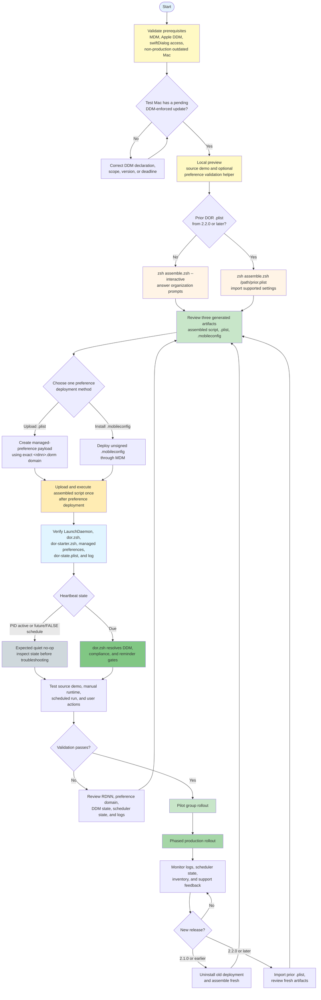

# Deployment Workflow Diagram

This guide presents an MDM-agnostic deployment path for DDM OS Reminder: validate Apple DDM first, preview locally, assemble organization-specific artifacts, deploy preferences and script, verify the client heartbeat, and then expand rollout.


```mermaid
flowchart TD
    Start([Start]) --> Prerequisites["Validate prerequisites<br/>MDM, Apple DDM, swiftDialog access,<br/>non-production outdated Mac"]
    Prerequisites --> DDMReady{"Test Mac has a pending<br/>DDM-enforced update?"}
    DDMReady -->|No| FixDDM["Correct DDM declaration,<br/>scope, version, or deadline"]
    FixDDM --> DDMReady
    DDMReady -->|Yes| Preview["Local preview<br/>source demo and optional<br/>preference validation helper"]

    Preview --> Assemble{"Prior DOR .plist<br/>from 2.2.0 or later?"}
    Assemble -->|No| Interactive["zsh assemble.zsh --interactive<br/>answer organization prompts"]
    Assemble -->|Yes| Import["zsh assemble.zsh /path/prior.plist<br/>import supported settings"]
    Interactive --> Artifacts["Review three generated artifacts<br/>assembled script, .plist, .mobileconfig"]
    Import --> Artifacts

    Artifacts --> PreferenceMethod{"Choose one preference<br/>deployment method"}
    PreferenceMethod -->|Upload .plist| ManagedPayload["Create managed-preference payload<br/>using exact &lt;rdnn&gt;.dorm domain"]
    PreferenceMethod -->|Install .mobileconfig| Mobileconfig["Deploy unsigned .mobileconfig<br/>through MDM"]
    ManagedPayload --> DeployScript
    Mobileconfig --> DeployScript["Upload and execute assembled script once<br/>after preference deployment"]

    DeployScript --> Verify["Verify LaunchDaemon, dor.zsh,<br/>dor-starter.zsh, managed preferences,<br/>dor-state.plist, and log"]
    Verify --> Heartbeat{"Heartbeat state"}
    Heartbeat -->|PID active or future/FALSE schedule| ExpectedNoop["Expected quiet no-op<br/>inspect state before troubleshooting"]
    Heartbeat -->|Due| Runtime["dor.zsh resolves DDM,<br/>compliance, and reminder gates"]
    ExpectedNoop --> ClientTest
    Runtime --> ClientTest["Test source demo, manual runtime,<br/>scheduled run, and user actions"]

    ClientTest --> Pass{"Validation passes?"}
    Pass -->|No| Diagnose["Review RDNN, preference domain,<br/>DDM state, scheduler state, and logs"]
    Diagnose --> Artifacts
    Pass -->|Yes| Pilot["Pilot group rollout"]
    Pilot --> Production["Phased production rollout"]
    Production --> Monitor["Monitor logs, scheduler state,<br/>inventory, and support feedback"]

    Monitor --> Upgrade{"New release?"}
    Upgrade -->|No| Monitor
    Upgrade -->|2.1.0 or earlier| Fresh["Uninstall old deployment<br/>and assemble fresh"]
    Upgrade -->|2.2.0 or later| Reimport["Import prior .plist,<br/>review fresh artifacts"]
    Fresh --> Artifacts
    Reimport --> Artifacts

    style Start fill:#e3f2fd
    style Prerequisites fill:#fff9c4
    style Preview fill:#fff9c4
    style Interactive fill:#fff4e6
    style Import fill:#fff4e6
    style Artifacts fill:#c8e6c9
    style DeployScript fill:#ffecb3
    style Verify fill:#e1f5ff
    style ExpectedNoop fill:#cfd8dc
    style Runtime fill:#81c784
    style Pilot fill:#c8e6c9
    style Production fill:#a5d6a7
```

## 1. Validate Prerequisites

Use a non-production Mac that intentionally runs an older macOS version and is in scope for a real pending DDM-enforced update. Physical hardware is preferred when validating restart, installation, and enforcement behavior.

Confirm:

- An MDM can deploy a Configuration Profile or managed preference payload and execute a root-level Zsh script.
- Apple DDM declares a required macOS version and timezone-bearing enforcement deadline for the test Mac.
- The Mac has an interactive user session and network access to required update and branding resources.
- Your deployment can install or update swiftDialog.
- The expected DDM state appears in `/var/log/install.log` before troubleshooting reminder behavior.

DDM OS Reminder is messaging and scheduling software. It does not create the Apple declaration, download macOS, or enforce the update.

## 2. Preview Locally

Run the source script's demo mode for the fastest reminder-dialog smoke test:

```zsh
zsh reminderDialog.zsh demo
```

Use the preference helper when validating an existing or generated preference file:

```zsh
zsh Resources/reminderDialogPreferenceTest.zsh --help
```

Demo and preview modes validate appearance, localization, placeholders, and actions. They do not prove DDM resolution, heartbeat scheduling, meeting deferral, or production restart behavior.

## 3. Assemble Organization-specific Artifacts

### New deployment

```zsh
zsh assemble.zsh --interactive
```

Interactive assembly can collect or confirm:

- optional previous `.plist` import
- RDNN
- internal support contact information
- info-button and knowledge-base behavior
- support-assistance messaging
- branding
- post-deadline restart policy
- aggressive-mode timing
- localization scope
- deployment lane (`dev`, `test`, or `prod`)

### Upgrade-assisted deployment

For a previous DDM OS Reminder `.plist` from version `2.2.0` or later:

```zsh
zsh assemble.zsh /path/to/previous-config.plist
```

Assembly imports supported values, infers RDNN when possible, and infers deployment lane only when the filename ends exactly in `-dev.plist`, `-test.plist`, or `-prod.plist`.

### Non-interactive options

```zsh
zsh assemble.zsh example.org --lane test
zsh assemble.zsh example.org --lane prod --minimal
zsh assemble.zsh example.org --lane prod --languages en,fr
```

Review current options before automation:

```zsh
zsh assemble.zsh --help
```

## 4. Review Generated Artifacts

Assembly produces three lane-suffixed files under `Artifacts/`:

- `ddm-os-reminder-<rdnn>-<timestamp>-<lane>.zsh`
- `<rdnn>.dorm-<timestamp>-<lane>.plist`
- `<rdnn>.dorm-<timestamp>-<lane>-unsigned.mobileconfig`

Review all three for the same RDNN and intended lane. Validate configuration syntax:

```zsh
/usr/bin/plutil -lint /path/to/generated.plist
/usr/bin/plutil -lint /path/to/generated-unsigned.mobileconfig
```

Use normalized output when comparing an imported configuration with a new artifact:

```zsh
diff -u <(/usr/bin/plutil -p OLD.plist) <(/usr/bin/plutil -p NEW.plist)
```

## 5. Deploy Preferences, Then Script

Choose exactly one preference-delivery method:

1. Upload the generated `.plist` through your MDM's managed-preference or custom-settings workflow, using the exact preference domain `<rdnn>.dorm`.
2. Install the generated unsigned `.mobileconfig` through your MDM.

Do not deploy both preference artifacts. They represent the same configuration surface.

After managed preferences reach the test Mac, upload and execute the assembled script once as root. The deployment wrapper installs or refreshes:

- `/Library/Management/<rdnn>/dor.zsh`
- `/Library/Management/<rdnn>/dor-starter.zsh`
- `/Library/LaunchDaemons/<rdnn>.dor.plist`
- swiftDialog when required

The wrapper also creates or validates scheduler assets, applies controlled reset behavior, hardens the generated LaunchDaemon plist, and verifies the loaded label before reporting completion.

Provider-specific parameter mapping for reset and optional emergency fallback values is documented in [Resources/README.md](../Resources/README.md#ddm-emergency-fallback).

## 6. Verify Client Installation

Replace `example.org` with the deployed RDNN.

```zsh
sudo /bin/launchctl print system/example.org.dor

ls -l /Library/LaunchDaemons/example.org.dor.plist
ls -l /Library/Management/example.org/dor.zsh
ls -l /Library/Management/example.org/dor-starter.zsh
ls -l /Library/Management/example.org/dor-state.plist
ls -l /Library/Managed\ Preferences/example.org.dorm.plist

sudo tail -100 /var/log/example.org.log
```

Use the bundled read-only monitor for one consolidated view:

```zsh
zsh Resources/monitorRemoteSession.zsh --rdnn example.org
zsh Resources/monitorRemoteSession.zsh --rdnn example.org --watch 5
```

### Expected heartbeat behavior

At load and approximately every 60 seconds, the LaunchDaemon runs `dor-starter.zsh`.

- Active matching `dor.pid`: starter exits to prevent overlap.
- Stale PID: starter removes it and continues.
- `NextScheduledReminder=FALSE`: starter exits quietly.
- Future `NextScheduledReminder`: starter exits quietly.
- Due, empty, or invalid schedule: starter records `DaemonLastTriggered` and launches `dor.zsh`.

A quiet heartbeat is not evidence of failure. Inspect `dor-state.plist` before changing the LaunchDaemon or forcing another run.

## 7. Test Reminder Behavior

Use separate checks for separate layers:

### Appearance test

```zsh
zsh reminderDialog.zsh demo
```

### Runtime logic test

On an approved non-production Mac with a pending DDM requirement:

```zsh
sudo /Library/Management/example.org/dor.zsh
```

A direct manual run evaluates production logic but intentionally does not mutate daemon scheduler state or own `dor.pid`.

### Scheduler test

Wait for a configured `DailyReminderTimes` slot or an existing exact `NextScheduledReminder`, while monitoring:

```zsh
zsh Resources/monitorRemoteSession.zsh --rdnn example.org --watch 5
```

Validate:

- `DaemonLastTriggered` changes when the starter launches the main script.
- A future schedule remains intact across heartbeat cycles and reboot.
- `Remind Me Later` starts the quiet period from interaction time.
- A pending final-minute threshold can schedule earlier than quiet-period expiry.
- Aggressive mode uses exact redisplay scheduling after its configured post-deadline threshold.
- Manual and demo runs do not change `dor-state.plist` or `dor.pid`.

### User-action test

Confirm expected behavior for:

- Open Software Update
- Remind Me Later
- info-button action
- close or keyboard dismissal
- Focus/DND return
- optional restart Prompt or Force mode on dedicated test hardware

## 8. Diagnose Failed Validation

Work from state toward symptoms:

1. Confirm RDNN matches assembled script, LaunchDaemon label, management directory, log, and preference domain.
2. Confirm the MDM-delivered preference file exists and contains expected types and values.
3. Inspect `dor-state.plist` for a disabled or future schedule.
4. Inspect `dor.pid` and matching processes before treating an overlap exit as a failure.
5. Review recent `/var/log/install.log` declaration state and the project log's resolver decision.
6. Confirm the installed macOS version is still below the resolved requirement.
7. Confirm the reminder is inside a display, periodic, threshold, or aggressive window.
8. Confirm meeting, quiet-period, or support kill-switch suppression is expected.

For macOS 27 LaunchDaemon failures, audit only the target plist's quarantine attribute and prefer controlled redeployment with version `4.1.0` or later. Do not use broad `xattr -c` remediation.

## 9. Roll Out and Monitor

Promote the exact tested artifacts through pilot and production scopes. Keep preference deployment ahead of script execution so the first managed runtime has intended settings.

Monitor:

- `/var/log/<rdnn>.log`
- `dor-state.plist` and the Next Scheduled Reminder Extension Attribute when used
- native DDM pending-date and pending-version inventory
- support feedback about timing, branding, and actions
- compliance in the MDM's Apple update declaration reporting

Pending-update Extension Attributes intentionally report native DDM resolver health, not an effective emergency fallback requirement.

## 10. Upgrade

### Version 2.1.0 or earlier

Uninstall the old deployment and assemble a fresh current deployment. Do not rely on prior-plist import for these versions.

### Version 2.2.0 or later

Import the prior generated `.plist`, review every fresh artifact, update the deployed preference artifact when its values or supported keys changed, replace the assembled script, and make the MDM execute the updated script once on each target Mac.

Do not assume every release changes the Configuration Profile. Compare normalized preference output and release notes before redeploying it.

## 11. Uninstall

Use the assembled deployment wrapper's `Uninstall` reset action through the same root-level deployment channel. It unloads matching DDM OS Reminder LaunchDaemons, stops only a PID-validated active runtime and its owned children, removes runtime assets, and leaves preference removal under administrator control.

## Deployment Checklist

### Before assembly

- [ ] Non-production outdated Mac is in scope for a pending DDM-enforced update.
- [ ] Source demo and required localization/branding previews pass.
- [ ] Organization RDNN and support details are approved.

### Before client deployment

- [ ] Generated script, `.plist`, and `.mobileconfig` share the intended RDNN and lane.
- [ ] Exactly one preference artifact is selected.
- [ ] Preference domain is exactly `<rdnn>.dorm`.
- [ ] Preferences will deploy before the assembled script executes.

### Before production rollout

- [ ] LaunchDaemon label loads and verifies.
- [ ] Starter, main script, state plist, preferences, and log exist at expected paths.
- [ ] Future or disabled heartbeat no-op behavior is understood and observed.
- [ ] Manual runtime and scheduled runtime tests pass.
- [ ] Dialog actions, quiet period, thresholds, and optional post-deadline behavior pass.
- [ ] Pilot rollout and rollback ownership are documented.
