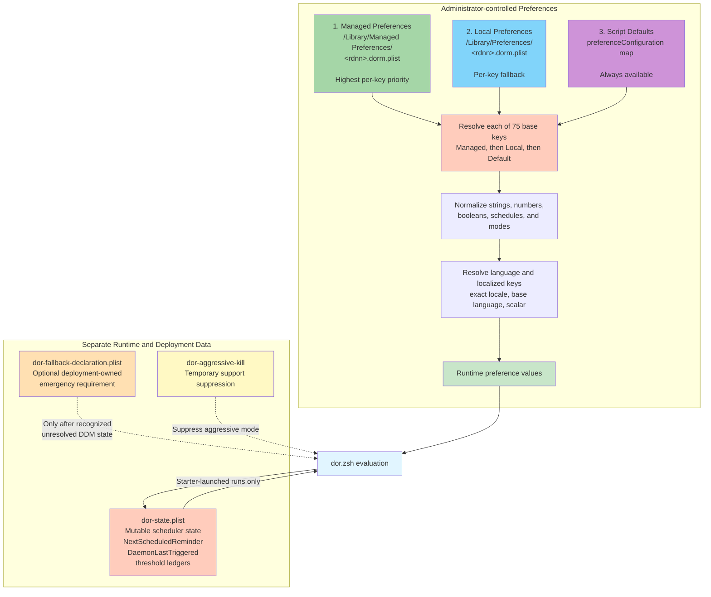

# Configuration Hierarchy Diagram

This diagram shows per-key preference precedence and separates administrator-controlled preferences from mutable scheduler state and deployment-owned emergency fallback data.


```mermaid
flowchart TB
    subgraph Admin["Administrator-controlled Preferences"]
        Managed["1. Managed Preferences<br/>/Library/Managed Preferences/<br/>&lt;rdnn&gt;.dorm.plist<br/><br/>Highest per-key priority"]
        Local["2. Local Preferences<br/>/Library/Preferences/<br/>&lt;rdnn&gt;.dorm.plist<br/><br/>Per-key fallback"]
        Defaults["3. Script Defaults<br/>preferenceConfiguration map<br/><br/>Always available"]

        Managed --> Resolve["Resolve each of 75 base keys<br/>Managed, then Local, then Default"]
        Local --> Resolve
        Defaults --> Resolve
        Resolve --> Types["Normalize strings, numbers,<br/>booleans, schedules, and modes"]
        Types --> Localize["Resolve language and localized keys<br/>exact locale, base language, scalar"]
        Localize --> Runtime["Runtime preference values"]
    end

    subgraph Separate["Separate Runtime and Deployment Data"]
        State["dor-state.plist<br/>Mutable scheduler state<br/>NextScheduledReminder<br/>DaemonLastTriggered<br/>threshold ledgers"]
        Fallback["dor-fallback-declaration.plist<br/>Optional deployment-owned<br/>emergency requirement"]
        Kill["dor-aggressive-kill<br/>Temporary support suppression"]
    end

    Runtime --> Main["dor.zsh evaluation"]
    State --> Main
    Fallback -.->|Only after recognized<br/>unresolved DDM state| Main
    Kill -.->|Suppress aggressive mode| Main
    Main -->|Starter-launched runs only| State

    style Managed fill:#a5d6a7
    style Local fill:#81d4fa
    style Defaults fill:#ce93d8
    style Resolve fill:#ffccbc
    style Runtime fill:#c8e6c9
    style State fill:#ffccbc
    style Fallback fill:#ffe0b2
    style Kill fill:#fff9c4
    style Main fill:#e1f5ff
```

## Per-key Precedence

Preference resolution happens independently for each key:

```text
if managed key exists:
    use managed value
else if local key exists:
    use local value
else:
    use script default
```

The presence of a managed preference file does not suppress every local key. A managed value wins only for that same key; missing managed keys can still fall back to local values, then defaults.

## Tier 1: Managed Preferences

**Path**: `/Library/Managed Preferences/<rdnn>.dorm.plist`

**Purpose**: Production configuration delivered and enforced through MDM.

**Use for**:

- reminder windows and timing
- `DailyReminderTimes`
- final-minute threshold schedule
- aggressive-mode timing
- optional restart policy
- support details and actions
- branding
- localization and dialog copy

Example payload values:

```xml
<dict>
    <key>DailyReminderTimes</key>
    <string>08:00,12:00,16:00</string>
    <key>MinutesBeforeDeadlineReminderSchedule</key>
    <string>45,30,15,10,5</string>
    <key>AggressiveModePastDeadlineHours</key>
    <integer>2</integer>
    <key>AggressiveModeFrequencyMinutes</key>
    <integer>20</integer>
    <key>SupportTeamName</key>
    <string>Enterprise IT Services</string>
</dict>
```

Deploy either the assembled `.plist` through your MDM's managed-preference workflow or the assembled `.mobileconfig`, not both. The preference domain must match `<rdnn>.dorm` exactly.

## Tier 2: Local Preferences

**Path**: `/Library/Preferences/<rdnn>.dorm.plist`

**Purpose**: Local testing or an explicit per-key fallback when no matching managed key exists.

Example:

```zsh
sudo defaults write /Library/Preferences/example.org.dorm \
    DaysBeforeDeadlineDisplayReminder -int 30

sudo defaults write /Library/Preferences/example.org.dorm \
    LanguageOverride -string "fr"
```

Local preferences do not override matching managed values. When testing a local value, first confirm that the same key is absent from managed preferences.

## Tier 3: Script Defaults

**Location**: `preferenceConfiguration` in `reminderDialog.zsh`

The runtime defines 75 base preference keys with string, numeric, or boolean defaults. These values keep the script functional when neither managed nor local configuration supplies a key.

Representative defaults:

```zsh
["daysBeforeDeadlineDisplayReminder"]="numeric|60"
["dailyReminderTimes"]="string|08:00,12:00,16:00"
["minutesBeforeDeadlineReminderSchedule"]="string|45,30,15,10,5"
["aggressiveModePastDeadlineHours"]="numeric|2"
["aggressiveModeFrequencyMinutes"]="numeric|20"
["supportTeamName"]="string|IT Support"
```

Assembly can generate full, minimal-English, or selected-language artifacts without changing runtime precedence.

## Localization Resolution

After base preference loading:

1. `LanguageOverride`, when not `auto`, requests a language directly.
2. Otherwise runtime reads the logged-in user's preferred language.
3. Localized values resolve from exact locale to base language to scalar/base key.
4. `DateFormatDeadlineHumanReadableLocalized_<code>` follows exact locale, base language, global date format, then built-in default.

Managed localized keys retain per-key priority over matching local localized keys.

## Data Outside Preference Precedence

### Scheduler state

`/Library/Management/<rdnn>/dor-state.plist` contains mutable runtime data, including:

- `NextScheduledReminder`
- `DaemonLastTriggered`
- `PreDeadlineThresholdSignature`
- delivered and skipped threshold ledgers

Only starter-launched runtime runs should mutate this file. Never place scheduler values in a Configuration Profile, local preference file, or `Resources/sample.plist`.

### Emergency fallback

`/Library/Management/<rdnn>/dor-fallback-declaration.plist` contains an optional deployment-owned version and deadline requirement. It is evaluated only after normal DDM resolution returns `missing`, `conflict`, `noMatch`, or `invalidVersion`.

Confirmed DDM always wins. Invalid or absent fallback data preserves suppression, and unknown resolver states fail closed. Fallback keys are not preferences and do not belong in `Resources/sample.plist` or `dor-state.plist`.

### Aggressive-mode kill switch

`/Library/Management/<rdnn>/dor-aggressive-kill` temporarily suppresses aggressive mode for support operations. It does not change configured values or restart policy semantics.

## Correct Precedence Examples

### Managed value wins

| Source | `DaysBeforeDeadlineDisplayReminder` | Selected? |
|--------|-------------------------------------|-----------|
| Managed | `90` | Yes |
| Local | `30` | No |
| Default | `60` | No |

Final value: `90`.

### Local value fills a missing managed key

| Source | `LanguageOverride` | Selected? |
|--------|--------------------|-----------|
| Managed | not set | No |
| Local | `fr` | Yes |
| Default | `auto` | No |

Final value: `fr`.

### Default fills both missing sources

| Source | `MeetingDelay` | Selected? |
|--------|----------------|-----------|
| Managed | not set | No |
| Local | not set | No |
| Default | `75` | Yes |

Final value: `75` minutes.

## Troubleshooting

Check both sources with `PlistBuddy`, matching runtime read behavior:

```zsh
sudo /usr/libexec/PlistBuddy -c "Print :DailyReminderTimes" \
    /Library/Managed\ Preferences/example.org.dorm.plist

sudo /usr/libexec/PlistBuddy -c "Print :DailyReminderTimes" \
    /Library/Preferences/example.org.dorm.plist
```

Validate payload syntax and data types:

```zsh
/usr/bin/plutil -lint /path/to/preferences.plist
/usr/bin/plutil -p /path/to/preferences.plist
```

Common causes:

| Symptom | Check |
|---------|-------|
| Local value ignored | Same key exists in managed preferences |
| Managed value ignored | Wrong preference domain, scope, key spelling, or type |
| Baseline time appears unchanged | Inspect `DailyReminderTimes`, then current `NextScheduledReminder` |
| Heartbeat exits quietly | Inspect `dor.pid` and `dor-state.plist` before changing preferences |
| Fallback reminder absent | Inspect normal resolver status and deployment-owned fallback validation |

## Summary

- Preferences resolve per key: `Managed -> Local -> Default`.
- Localization adds exact-locale and base-language fallback after normal preference loading.
- Scheduler state, emergency fallback data, and support kill switch remain outside the preference hierarchy.
- Administrators control policy; starter-launched runtime owns mutable scheduling state.
