# Configuration Hierarchy Diagram

This diagram illustrates the 3-tier preference system used by DDM OS Reminder, showing how configuration values are loaded and which sources take precedence.

```mermaid
graph TB
    subgraph LoadingProcess["⚙️ Preference Loading Process"]
        Start([Script Execution Begins]) --> LoadDefaults[📝 Load Built-in Defaults<br/>From preferenceConfiguration map]
        
        LoadDefaults --> CheckManaged{Managed Preferences<br/>File Exists?}
        
        CheckManaged -->|Yes| ReadManaged["📖 Read Managed Preferences<br>/Library/Managed Preferences/<br>(RDNN).{orgScriptName}.plist"]
        CheckManaged -->|No| CheckLocal
        
        ReadManaged --> ParseManaged[🔍 Parse Managed Values<br/>Using PlistBuddy]
        ParseManaged --> CheckLocal{Local Preferences<br/>File Exists?}
        
        CheckLocal -->|Yes| ReadLocal["📖 Read Local Preferences<br>/Library/Preferences/<br>(RDNN).{orgScriptName}.plist"]
        CheckLocal -->|No| ApplyValues
        
        ReadLocal --> ParseLocal[🔍 Parse Local Values<br/>Using PlistBuddy]
        ParseLocal --> ApplyValues[✅ Apply Values<br/>Managed → Local → Default]
        
        ApplyValues --> ValidateTypes[🔧 Validate Data Types<br/>String, Numeric, Boolean]
        ValidateTypes --> BuildVars[🏗️ Build Runtime Variables]
        BuildVars --> ResolveLocalized[🌐 Resolve Language + Localized Keys<br/>Override/Auto + fallback chain]
        ResolveLocalized --> ReplacePlaceholders[🔄 Replace Placeholders<br/>Multi-pass resolution]
        ReplacePlaceholders --> Ready([✅ Configuration Ready])
        
        style Start fill:#e3f2fd
        style LoadDefaults fill:#fff9c4
        style ReadManaged fill:#c8e6c9
        style ReadLocal fill:#b3e5fc
        style ApplyValues fill:#ffccbc
        style Ready fill:#a5d6a7
    end
    
    subgraph Tier1["🔒 Tier 1: Managed Preferences (Highest Priority)"]
        MDM[MDM Server<br/>Jamf Pro / Intune / etc.]
        Profile[Configuration Profile<br/>.mobileconfig]
        
        MDM -->|Deploys| Profile
        Profile -->|Writes to| ManagedPlist["/Library/Managed Preferences/<br>(RDNN).{orgScriptName}.plist<br><br>✅ Enforced by MDM<br>❌ Cannot be modified locally<br>🔐 Root-protected"]
        
        ManagedPlist -.->|Precedence: 1st| ReadManaged
        
        style MDM fill:#ffecb3
        style Profile fill:#c8e6c9
        style ManagedPlist fill:#a5d6a7
    end
    
    subgraph Tier2["⚙️ Tier 2: Local Preferences (Fallback)"]
        Admin[Local Administrator]
        CLI[Command Line<br/>defaults write]
        
        Admin -->|Executes| CLI
        CLI -->|Writes to| LocalPlist["/Library/Preferences/<br>(RDNN).{orgScriptName}.plist<br><br>⚙️ Local customization<br>✏️ Can be modified manually<br>📝 Used when no managed pref"]
        
        LocalPlist -.->|Precedence: 2nd| ReadLocal
        
        style Admin fill:#b3e5fc
        style CLI fill:#b3e5fc
        style LocalPlist fill:#81d4fa
    end
    
    subgraph Tier3["📋 Tier 3: Script Defaults (Baseline)"]
        ScriptCode[reminderDialog.zsh<br/>preferenceConfiguration map]
        
        ScriptCode -->|Defines| DefaultValues[Built-in Default Values<br/><br/>📋 Embedded in script<br/>🔧 Developer-defined<br/>✅ Always available]
        
        DefaultValues -.->|Precedence: 3rd| LoadDefaults
        
        style ScriptCode fill:#e1bee7
        style DefaultValues fill:#ce93d8
    end
    
    subgraph Example["📊 Example: Support Team Name"]
        E_Script[Script Default:<br/>'IT Support']
        E_Local[Local Preference:<br/>'Help Desk Team']
        E_Managed[Managed Preference:<br/>'Enterprise IT Services']
        
        E_Script -.->|If no local or managed| E_Result
        E_Local -.->|If no managed| E_Result
        E_Managed -.->|Takes precedence| E_Result[Final Value:<br/>'Enterprise IT Services']
        
        style E_Script fill:#ce93d8
        style E_Local fill:#81d4fa
        style E_Managed fill:#a5d6a7
        style E_Result fill:#ffab91
    end
```



## Tier Precedence Rules

### Priority Order (Highest to Lowest)

1. **🔒 Managed Preferences** (MDM-deployed, enforced)
2. **⚙️ Local Preferences** (Manually configured, fallback)
3. **📋 Script Defaults** (Built-in, baseline)

**Decision Logic**:
```
IF Managed Preference exists:
    USE Managed Preference
ELSE IF Local Preference exists:
    USE Local Preference
ELSE:
    USE Script Default
```

**Note**: `preferenceDomain` is `${reverseDomainNameNotation}.${organizationScriptName}` (for example, `org.example.dorm`).

**Localization Resolution**:
1. `LanguageOverride` (if not `auto`) sets the active language directly.
2. Otherwise the script reads logged-in user `AppleLanguages:0` and normalizes to `en`, `de`, or `fr`.
3. For each localized field, fallback is `selected language` → scalar key.

---

## Tier 1: Managed Preferences (MDM)

### Deployment Method

**Via Configuration Profile** (Recommended):
```xml
<?xml version="1.0" encoding="UTF-8"?>
<!DOCTYPE plist PUBLIC "-//Apple//DTD PLIST 1.0//EN" "http://www.apple.com/DTDs/PropertyList-1.0.dtd">
<plist version="1.0">
<dict>
    <key>PayloadContent</key>
    <array>
        <dict>
            <key>PayloadContent</key>
            <dict>
                <key>org.churchofjesuschrist.dorm</key>
                <dict>
                    <key>Forced</key>
                    <array>
                        <dict>
                            <key>mcx_preference_settings</key>
                            <dict>
                                <key>DaysBeforeDeadlineDisplayReminder</key>
                                <integer>60</integer>
                                <key>DaysBeforeDeadlineBlurscreen</key>
                                <integer>45</integer>
                                <key>SupportTeamName</key>
                                <string>Enterprise IT Services</string>
                            </dict>
                        </dict>
                    </array>
                </dict>
            </dict>
            <key>PayloadType</key>
            <string>com.apple.ManagedClient.preferences</string>
        </dict>
    </array>
</dict>
</plist>
```

### Characteristics

| Attribute | Value |
|-----------|-------|
| **File Path** | `/Library/Managed Preferences/{RDNN}.{orgScriptName}.plist` |
| **Permissions** | Root-owned, system-managed |
| **Modifiable** | ❌ No (enforced by MDM) |
| **Scope** | Organization-wide enforcement |
| **Precedence** | 🥇 Highest (overrides all other sources) |
| **Deployment** | Via MDM Configuration Profile |

### When to Use

✅ **Use Managed Preferences when**:
- Enforcing organization-wide standards
- Ensuring consistent configuration across all Macs
- Preventing local modifications
- Compliance requirements mandate central control
- Managing large fleet (100+ devices)

### Example Managed Preferences

```xml
<dict>
    <!-- Timing Configuration -->
    <key>DaysBeforeDeadlineDisplayReminder</key>
    <integer>60</integer>
    
    <key>DaysBeforeDeadlineBlurscreen</key>
    <integer>45</integer>
    
    <key>DaysBeforeDeadlineHidingButton2</key>
    <integer>21</integer>
    
    <!-- Support Team Information -->
    <key>SupportTeamName</key>
    <string>Enterprise IT Services</string>
    
    <key>SupportTeamPhone</key>
    <string>+1 (555) 123-4567</string>
    
    <key>SupportTeamEmail</key>
    <string>helpdesk@enterprise.com</string>
    
    <key>SupportTeamWebsite</key>
    <string>https://helpdesk.enterprise.com</string>
    
    <!-- Branding -->
    <key>OrganizationOverlayIconURL</key>
    <string>https://cdn.enterprise.com/icons/it-icon.png</string>
    
    <!-- Logging -->
    <key>ScriptLog</key>
    <string>/var/log/com.enterprise.log</string>

    <!-- Localization -->
    <key>LanguageOverride</key>
    <string>de</string>
    <key>MessageLocalized_de</key>
    <string>**Eine erforderliche macOS-Aktualisierung ist jetzt verfugbar**</string>
</dict>
```

---

## Tier 2: Local Preferences

### Deployment Method

**Via `defaults write` Command**:
```bash
# Set timing preferences
sudo defaults write /Library/Preferences/org.churchofjesuschrist.dorm \
    DaysBeforeDeadlineDisplayReminder -int 60

sudo defaults write /Library/Preferences/org.churchofjesuschrist.dorm \
    DaysBeforeDeadlineBlurscreen -int 45

# Set support team information
sudo defaults write /Library/Preferences/org.churchofjesuschrist.dorm \
    SupportTeamName -string "Local IT Support"

sudo defaults write /Library/Preferences/org.churchofjesuschrist.dorm \
    SupportTeamPhone -string "+1 (555) 987-6543"

# Set branding
sudo defaults write /Library/Preferences/org.churchofjesuschrist.dorm \
    OrganizationOverlayIconURL -string "https://local-server/icon.png"

# Set localization behavior
sudo defaults write /Library/Preferences/org.churchofjesuschrist.dorm \
    LanguageOverride -string "fr"

# Set boolean preference
sudo defaults write /Library/Preferences/org.churchofjesuschrist.dorm \
    SwapOverlayAndLogo -bool YES
```

**Via Direct Plist Editing**:
```bash
sudo nano /Library/Preferences/org.churchofjesuschrist.dorm.plist
```

### Characteristics

| Attribute | Value |
|-----------|-------|
| **File Path** | `/Library/Preferences/{RDNN}.{orgScriptName}.plist` |
| **Permissions** | Root-owned, locally editable |
| **Modifiable** | ✅ Yes (with admin privileges) |
| **Scope** | Single Mac or small groups |
| **Precedence** | 🥈 Medium (overridden by managed prefs) |
| **Deployment** | Manual or via script |

### When to Use

✅ **Use Local Preferences when**:
- Testing configuration changes before MDM deployment
- Managing small number of Macs (<10)
- Site-specific customizations needed
- No MDM available
- Development/testing environments
- Temporary overrides for specific scenarios

### Example Local Preferences

```xml
<?xml version="1.0" encoding="UTF-8"?>
<!DOCTYPE plist PUBLIC "-//Apple//DTD PLIST 1.0//EN" "http://www.apple.com/DTDs/PropertyList-1.0.dtd">
<plist version="1.0">
<dict>
    <key>DaysBeforeDeadlineDisplayReminder</key>
    <integer>30</integer>
    
    <key>SupportTeamName</key>
    <string>Local IT Support</string>
    
    <key>SupportTeamPhone</key>
    <string>+1 (555) 987-6543</string>
</dict>
</plist>
```

---

## Tier 3: Script Defaults

### Definition Location

**In reminderDialog.zsh** (Lines ~150-210):
```bash
declare -A preferenceConfiguration=(
    # Logging and Timing
    ["scriptLog"]="string|/var/log/org.churchofjesuschrist.log"
    ["daysBeforeDeadlineDisplayReminder"]="numeric|60"
    ["daysBeforeDeadlineBlurscreen"]="numeric|45"
    ["daysBeforeDeadlineHidingButton2"]="numeric|21"
    ["daysOfExcessiveUptimeWarning"]="numeric|0"
    ["meetingDelay"]="numeric|75"
    ["minimumDiskFreePercentage"]="numeric|99"
    
    # Branding
    ["organizationOverlayiconURL"]="string|https://usw2.ics.services.jamfcloud.com/icon/hash_xxx"
    ["swapOverlayAndLogo"]="boolean|NO"
    
    # Support Team
    ["supportTeamName"]="string|IT Support"
    ["supportTeamPhone"]="string|+1 (801) 555-1212"
    ["supportTeamEmail"]="string|rescue@domain.org"
    ["supportTeamWebsite"]="string|https://support.domain.org"
    
    # UI Text
    ["title"]="string|macOS {titleMessageUpdateOrUpgrade} Required"
    ["button1text"]="string|Open Software Update"
    ["button2text"]="string|Remind Me Later"
    
    # ... 67 total preferences
)
```

### Characteristics

| Attribute | Value |
|-----------|-------|
| **Location** | Embedded in reminderDialog.zsh |
| **Permissions** | Part of script code |
| **Modifiable** | Only by re-customizing and re-assembling script |
| **Scope** | Baseline for all installations |
| **Precedence** | 🥉 Lowest (fallback only) |
| **Deployment** | Via script deployment |

### When to Use

✅ **Script Defaults are used when**:
- No managed or local preferences exist
- Initial script deployment
- Providing sensible baseline values
- Ensuring script always has valid configuration

### Example Script Defaults

```bash
# Format: ["key"]="type|default_value"

["daysBeforeDeadlineDisplayReminder"]="numeric|60"
# Type: Numeric (0-999)
# Default: 60 days
# Meaning: Start showing reminders 60 days before deadline

["supportTeamName"]="string|IT Support"
# Type: String
# Default: "IT Support"
# Meaning: Support team name displayed in help dialog

["swapOverlayAndLogo"]="boolean|NO"
# Type: Boolean (YES/NO, true/false, 1/0)
# Default: NO
# Meaning: Don't swap overlay and logo positions
```

---

## Preference Loading Process

### Step-by-Step Execution

#### Step 1: Initialize with Script Defaults
```bash
function loadDefaultPreferences() {
    for prefKey in "${(@k)preferenceConfiguration}"; do
        IFS='|' read -r prefType defaultValue <<< "${preferenceConfiguration[$prefKey]}"
        printf -v "${prefKey}" '%s' "${defaultValue}"
    done
}
```

**Result**: All 67 preferences have baseline values.

#### Step 2: Check for Managed Preferences
```bash
if [[ -f ${managedPreferencesPlist}.plist ]]; then
    preFlight "Reading preference overrides from managed preferences"
    hasManagedPrefs=true
fi
```

**Result**: Script knows if MDM-deployed prefs exist.

#### Step 3: Read Managed Preferences (if exist)
```bash
for prefKey in "${(@k)preferenceConfiguration}"; do
    plistKey="${plistKeyMap[$prefKey]:-$prefKey}"
    managedValue=$(/usr/libexec/PlistBuddy -c "Print :${plistKey}" \
        "${managedPreferencesPlist}.plist" 2>/dev/null)
done
```

**Result**: Managed values extracted from plist file.

#### Step 4: Check for Local Preferences
```bash
if [[ -f ${localPreferencesPlist}.plist ]]; then
    preFlight "Reading preference overrides from local preferences"
    hasLocalPrefs=true
fi
```

**Result**: Script knows if local prefs exist.

#### Step 5: Read Local Preferences (if exist)
```bash
for prefKey in "${(@k)preferenceConfiguration}"; do
    plistKey="${plistKeyMap[$prefKey]:-$prefKey}"
    localValue=$(/usr/libexec/PlistBuddy -c "Print :${plistKey}" \
        "${localPreferencesPlist}.plist" 2>/dev/null)
done
```

**Result**: Local values extracted from plist file.

#### Step 6: Apply Precedence Rules
```bash
function setPreferenceValue() {
    local targetVariable="${1}"
    local managedValue="${2}"
    local localValue="${3}"
    local defaultValue="${4}"
    
    if [[ -n "${managedValue}" ]]; then
        chosenValue="${managedValue}"
    elif [[ -n "${localValue}" ]]; then
        chosenValue="${localValue}"
    else
        chosenValue="${defaultValue}"
    fi
    
    printf -v "${targetVariable}" '%s' "${chosenValue}"
}
```

**Result**: Each preference gets value from highest-priority source.

#### Step 7: Validate Data Types
```bash
function setNumericPreferenceValue() {
    # Validate numeric values (0-999)
    if [[ "${managedValue}" =~ ^[0-9]+$ ]] && (( managedValue >= 0 && managedValue <= 999 )); then
        candidate="${managedValue}"
    elif [[ -n "${localValue}" && "${localValue}" == <-> ]]; then
        candidate="${localValue}"
    else
        candidate="${defaultValue}"
    fi
}

function setBooleanPreferenceValue() {
    # Normalize boolean values (YES/NO, true/false, 1/0)
    # Convert to "YES" or "NO"
}
```

**Result**: Type safety ensures valid values.

#### Step 8: Build Runtime Variables
```bash
function updateRequiredVariables() {
    # Use loaded preferences to build final variables
    applyLocalizedDialogText
    supportTeamInfo="${supportTeamName}"
    dialogTitle="${title}"
    # ... etc
}
```

**Result**: All script variables populated with final values.

---

## Precedence Examples

### Example 1: Support Team Name

| Source | Value | Used? |
|--------|-------|-------|
| **Script Default** | "IT Support" | ❌ (overridden) |
| **Local Preference** | "Help Desk Team" | ❌ (overridden) |
| **Managed Preference** | "Enterprise IT Services" | ✅ **USED** |

**Final Value**: `"Enterprise IT Services"`

---

### Example 2: Days Before Deadline (Blurscreen)

| Source | Value | Used? |
|--------|-------|-------|
| **Script Default** | 45 | ❌ (overridden) |
| **Local Preference** | 30 | ✅ **USED** |
| **Managed Preference** | *(not set)* | ❌ |

**Final Value**: `30`

---

### Example 3: Meeting Delay

| Source | Value | Used? |
|--------|-------|-------|
| **Script Default** | 75 | ✅ **USED** |
| **Local Preference** | *(not set)* | ❌ |
| **Managed Preference** | *(not set)* | ❌ |

**Final Value**: `75`

---

## Complete Configuration Example

### Scenario: Enterprise Deployment

**Goal**: 
- Enforce specific timing across all Macs
- Customize support team information
- Use custom branding

**Implementation**:

1. **Customize Script Defaults** (for baseline):
   ```bash
   ["scriptLog"]="string|/var/log/com.enterprise.log"
   ["supportTeamName"]="string|IT Support"  # Fallback
   ```

2. **Deploy Managed Preferences** (for enforcement):
   ```xml
   <key>DaysBeforeDeadlineDisplayReminder</key>
   <integer>90</integer>
   
   <key>DaysBeforeDeadlineBlurscreen</key>
   <integer>60</integer>
   
   <key>SupportTeamName</key>
   <string>Enterprise IT Services</string>
   
   <key>SupportTeamPhone</key>
   <string>+1 (555) 100-2000</string>
   
   <key>OrganizationOverlayIconURL</key>
   <string>https://cdn.enterprise.com/it-icon.png</string>
   ```

3. **Local Preferences for Testing** (optional):
   ```bash
   # On test Mac only
   sudo defaults write /Library/Preferences/com.enterprise.dorm \
       DaysBeforeDeadlineDisplayReminder -int 30
   ```

**Result**:
- Production Macs use managed values (90 days, 60 days)
- Test Mac uses local override (30 days) for managed pref, but inherits managed support team info
- All Macs fall back to script defaults for any unspecified preferences

---

## Troubleshooting Configuration

### Verify Which Preference Source is Active

```bash
# Check if managed preferences exist
ls -lh /Library/Managed\ Preferences/org.churchofjesuschrist.dorm.plist

# Check if local preferences exist
ls -lh /Library/Preferences/org.churchofjesuschrist.dorm.plist

# Read managed preference value
sudo /usr/libexec/PlistBuddy -c "Print :DaysBeforeDeadlineDisplayReminder" \
    /Library/Managed\ Preferences/org.churchofjesuschrist.dorm.plist

# Read local preference value
sudo /usr/libexec/PlistBuddy -c "Print :DaysBeforeDeadlineDisplayReminder" \
    /Library/Preferences/org.churchofjesuschrist.dorm.plist

# Check script logs to see which preferences were loaded
grep "Reading preference overrides" /var/log/org.churchofjesuschrist.log
```

### Common Issues

| Issue | Cause | Solution |
|-------|-------|----------|
| Managed prefs not taking effect | Configuration Profile not deployed | Verify profile scope in MDM |
| Local prefs ignored | Managed prefs exist (override) | Remove managed profile if testing locally |
| Incorrect data type | String used for numeric preference | Fix plist value type |
| Preference not loading | Key name mismatch | Check plistKeyMap in script |
| Script using defaults despite preferences | Plist file syntax error | Validate with `plutil -lint` |

---

## Best Practices

### For Administrators

1. **Use Managed Preferences for Production**
   - Ensures consistency
   - Prevents user/local modifications
   - Centralized management

2. **Use Local Preferences for Testing**
   - Quick iteration without MDM
   - Site-specific overrides
   - Development/debugging

3. **Document Script Defaults**
   - Keep baseline values sensible
   - Document any changes made during customization

4. **Version Control Configuration Profiles**
   - Track changes over time
   - Easy rollback if needed

5. **Test Preference Precedence**
   - Verify managed prefs override locals
   - Ensure fallback to defaults works

### For Developers

1. **Always Provide Sensible Defaults**
   - Script should work without external preferences

2. **Validate Data Types**
   - Numeric: 0-999
   - Boolean: YES/NO normalization
   - String: Any value

3. **Use Clear Key Names**
   - CamelCase for plist keys
   - Descriptive names

4. **Document Each Preference**
   - Purpose
   - Type
   - Default value
   - Valid range

---

## Summary

DDM OS Reminder's 3-tier configuration system provides:

✅ **Flexibility**: Customize at multiple levels  
✅ **Control**: MDM enforcement when needed  
✅ **Fallback**: Always has sensible defaults  
✅ **Simplicity**: Clear precedence rules  
✅ **Testability**: Easy local testing before production  

**Precedence Mantra**: **Managed → Local → Default**
