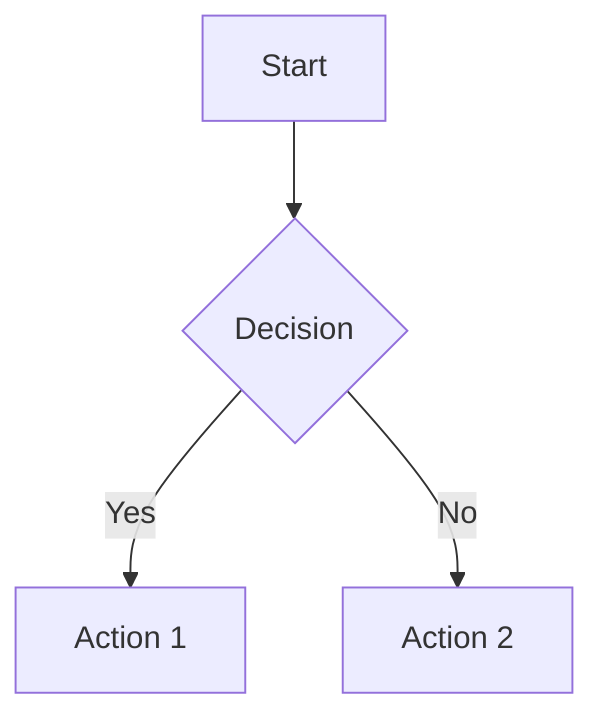
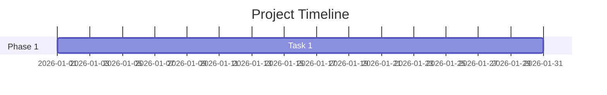
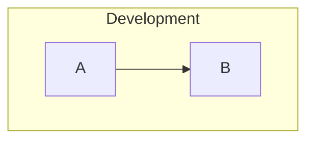
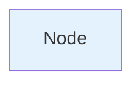

# DDM OS Reminder - Documentation Diagrams

This directory contains comprehensive, **AI-generated** visual diagrams to augment the DDM OS Reminder documentation at [snelson.us/ddm](https://snelson.us/ddm).

## 📊 Available Diagrams

### 1. [System Architecture](01-system-architecture.md)
**Purpose**: Complete ecosystem overview from development through runtime execution

**Shows**:
- Development environment components
- Assembly process workflow
- Deployment via MDM
- Client-side installation structure
- Runtime execution flow
- Apple DDM integration

**Best For**: Understanding how all components fit together

---

### 2. [Runtime Decision Tree](02-runtime-decision-tree.md)
**Purpose**: Complete decision logic executed each time the LaunchDaemon triggers

**Shows**:
- Language resolution (`LanguageOverride` vs user locale auto-detect)
- Localized dialog text fallback behavior (`selected language` → `English` → scalar key)
- User validation checks
- DDM enforcement date parsing
- Version comparison logic
- Context detection (Focus mode, meetings)
- Deadline-based behavior branching
- User interaction outcomes

**Best For**: Understanding script behavior and troubleshooting

---

### 3. [Deadline Timeline](03-deadline-timeline.md)
**Purpose**: Visual representation of how user experience changes as deadline approaches

**Shows**:
- Phase 1: Quiet period (no reminders)
- Phase 2: Standard reminders (early warning)
- Phase 3: Blurscreen warnings (escalating urgency)
- Phase 4: Urgent/critical (deadline imminent)
- Phase 5: Apple DDM enforcement

**Best For**: Understanding deadline-driven behavior changes

---

### 4. [Deployment Workflow](04-deployment-workflow.md)
**Purpose**: Step-by-step guide for administrators deploying DDM OS Reminder

**Shows**:
- Prerequisites verification
- Customization process
- Assembly execution
- Test deployment
- Production rollout
- Monitoring and maintenance

**Best For**: Implementation and deployment planning

---

### 5. [Configuration Hierarchy](05-configuration-hierarchy.md)
**Purpose**: 3-tier preference system showing precedence rules

**Shows**:
- Tier 1: Managed Preferences (MDM-deployed)
- Tier 2: Local Preferences (manual configuration)
- Tier 3: Script Defaults (built-in baseline)
- Precedence rules and examples

**Best For**: Understanding configuration management and customization

---

### 6. [Configuration Reference](06-configuration-reference.md)
**Purpose**: Complete reference for all 67 configurable preferences

**Shows**:
- Quick reference table (all variables at a glance)
- Detailed documentation by category
- Localization keys and language selection behavior
- Complete placeholder reference
- Configuration methods and examples
- Common deployment scenarios
- Troubleshooting guide

**Best For**: Customizing DDM OS Reminder, looking up specific variables

**Note**: Text reference only (no Mermaid diagram to render)

---

## 🎨 Rendering Diagrams

All Mermaid diagrams (01–05) use **Mermaid.js** syntax for maximum portability and version control. The configuration reference (06) is text-only and does not export to an image.

### View on GitHub
Mermaid blocks render automatically on GitHub inside `.md` files. Text-only files render as standard Markdown.

**Direct viewing**:
```
https://github.com/dan-snelson/DDM-OS-Reminder/blob/main/Diagrams/01-system-architecture.md
```

### Render Locally

#### Option 1: VS Code with Mermaid Extension
1. Install [Mermaid Preview Extension](https://marketplace.visualstudio.com/items?itemName=bierner.markdown-mermaid)
2. Open any diagram `.md` file
3. Press `Cmd+Shift+V` (macOS) or `Ctrl+Shift+V` (Windows/Linux)

#### Option 2: Mermaid Live Editor
1. Copy Mermaid code from any diagram
2. Open [Mermaid Live Editor](https://mermaid.live/)
3. Paste code and view rendered diagram
4. Export as SVG, PNG, or PDF

#### Option 3: Mermaid CLI
```bash
# Install Mermaid CLI
npm install -g @mermaid-js/mermaid-cli

# Render to PNG
mmdc -i 01-system-architecture.md -o 01-system-architecture.png

# Render to SVG
mmdc -i 01-system-architecture.md -o 01-system-architecture.svg

# Render all Mermaid diagrams (01–05)
for file in 0[1-5]-*.md; do
    mmdc -i "$file" -o "${file%.md}.png"
done
```

### Export for Documentation Website

#### As PNG Images (Recommended for blog posts)
```bash
# High resolution PNG (300 DPI)
mmdc -i 01-system-architecture.md -o 01-system-architecture.png -w 2400

# Standard resolution
mmdc -i 01-system-architecture.md -o 01-system-architecture.png
```

#### As SVG (Recommended for scaling)
```bash
mmdc -i 01-system-architecture.md -o 01-system-architecture.svg
```

#### Embed in Markdown
```markdown
<!-- Mermaid (renders on GitHub) -->
~~~mermaid
graph TD
    A --> B
~~~

<!-- Image (works everywhere) -->

```

#### Embed in HTML
```html
<!-- Mermaid.js library -->
<script src="https://cdn.jsdelivr.net/npm/mermaid/dist/mermaid.min.js"></script>
<script>mermaid.initialize({startOnLoad:true});</script>

<!-- Diagram -->
<div class="mermaid">
graph TD
    A --> B
</div>
```

---

## 📝 Diagram Format

### File Naming Convention
```
[number]-[descriptive-name].md

Examples:
01-system-architecture.md
02-runtime-decision-tree.md
03-deadline-timeline.md
```

PNG exports mirror the `.md` base name (for example, `01-system-architecture.png`).

### Markdown Structure
```markdown
# [Diagram Title]

[Brief description of diagram purpose]

## Mermaid Diagram

```mermaid
[Mermaid syntax here]
```

## Detailed Explanation

[Text explanation of diagram components, decision points, etc.]

## Configuration

[Related configuration options, if applicable]

## Examples

[Practical examples showing how to use/interpret the diagram]
```

---

## 🎯 Usage Recommendations

### For Blog Post / Documentation Website

1. **Overview Section**: Use [System Architecture](01-system-architecture.md)
   - Place after introduction, before features
   - Helps readers understand complete system at a glance

2. **Features Section**: Use [Deadline Timeline](03-deadline-timeline.md)
   - Illustrates key differentiating feature (deadline-driven behavior)
   - Visual progression from early warnings to urgent messages

3. **Implementation Section**: Use [Deployment Workflow](04-deployment-workflow.md)
   - Step-by-step visual guide for administrators
   - Can link to detailed subsections

4. **Advanced Configuration Section**: Use [Configuration Hierarchy](05-configuration-hierarchy.md)
   - Shows 3-tier preference system
   - Helps admins understand customization options

5. **Troubleshooting Section**: Use [Runtime Decision Tree](02-runtime-decision-tree.md)
   - Shows all decision points and exit conditions
   - Helps diagnose why script may/may not display dialog

### For README.md

Embed key diagrams inline:
```markdown
## How It Works


DDM OS Reminder consists of three main components...

## Deployment


Follow these steps to deploy DDM OS Reminder...
```

### For Presentations

Export diagrams as high-resolution PNG or SVG:
```bash
# 4K resolution for presentations
mmdc -i 01-system-architecture.md -o 01-system-architecture.png -w 3840 -h 2160
```

---

## 🔧 Customizing Diagrams

### Editing Mermaid Syntax

Each diagram uses standard Mermaid syntax. Key elements:

**Flowchart**:


**Gantt Chart** (Timeline):


**Subgraphs** (Grouping):


**Styling**:


### Color Scheme

Current diagrams use consistent color coding:

| Color | Hex | Purpose |
|-------|-----|---------|
| Light Blue | `#e3f2fd` | Start/End nodes |
| Yellow | `#fff9c4` | Processing/Setup |
| Purple | `#e1bee7` | Development files |
| Green | `#c8e6c9` | Success/Artifacts |
| Orange | `#ffecb3` | MDM/External systems |
| Red | `#ef5350` | Errors/Critical |
| Gray | `#cfd8dc` | Exit points |

### Maintaining Consistency

When creating new diagrams:
1. Use established color scheme
2. Follow naming convention
3. Include both diagram and detailed explanation
4. Provide configuration context
5. Add practical examples

---

## 📐 Diagram Specifications

### Technical Details

| Specification | Value |
|---------------|-------|
| **Format** | Mermaid.js (text-based) |
| **Version** | Compatible with Mermaid 9.x+ |
| **Encoding** | UTF-8 |
| **Line Endings** | LF (Unix) |
| **Max Width** | 2400px (for export) |
| **Max Height** | Unlimited (auto) |

### Export Recommendations

| Use Case | Format | Resolution | Notes |
|----------|--------|------------|-------|
| Blog post | PNG | 1200-2400px | Balance size vs. quality |
| Documentation | SVG | Vector | Scales perfectly |
| Presentation | PNG | 3840px | 4K resolution |
| Print | PDF | Vector | Best for printing |
| GitHub | Markdown | Native | Renders automatically |

---

## 🚀 Quick Start

### View All Diagrams Quickly

```bash
# Clone repository
git clone https://github.com/dan-snelson/DDM-OS-Reminder.git
cd DDM-OS-Reminder/Diagrams

# Open in VS Code with Mermaid extension
code .

# Or open in GitHub (renders automatically)
open https://github.com/dan-snelson/DDM-OS-Reminder/tree/main/Diagrams
```

### Export for Website

```bash
# Install Mermaid CLI (one-time)
npm install -g @mermaid-js/mermaid-cli

# Export all diagrams as PNG
for file in 0[1-5]-*.md; do
    echo "Rendering $file..."
    mmdc -i "$file" -o "../images/${file%.md}.png" -w 2400
done

echo "All diagrams exported to ../images/"
```

### Update Diagrams

1. Edit `.md` file with Mermaid syntax changes
2. Preview in VS Code or Mermaid Live Editor
3. Export updated image if needed
4. Commit changes to version control

---

## 🤝 Contributing

### Adding New Diagrams

1. Create new `.md` file with next sequential number
2. Follow established format (title, diagram, explanation)
3. Use consistent color scheme
4. Update this README with new diagram description
5. Submit pull request

### Improving Existing Diagrams

1. Edit relevant `.md` file
2. Test rendering in multiple viewers
3. Update associated documentation if needed
4. Submit pull request with clear description of changes

---

## 📚 Resources

### Mermaid Documentation
- [Official Docs](https://mermaid.js.org/)
- [Flowchart Syntax](https://mermaid.js.org/syntax/flowchart.html)
- [Gantt Syntax](https://mermaid.js.org/syntax/gantt.html)
- [Styling](https://mermaid.js.org/config/theming.html)

### Tools
- [Mermaid Live Editor](https://mermaid.live/) - Online editor
- [VS Code Extension](https://marketplace.visualstudio.com/items?itemName=bierner.markdown-mermaid) - Preview in editor
- [Mermaid CLI](https://github.com/mermaid-js/mermaid-cli) - Export to images

### Examples
- [Mermaid Examples](https://mermaid.js.org/ecosystem/integrations.html)
- [GitHub Markdown Support](https://github.blog/2022-02-14-include-diagrams-markdown-files-mermaid/)

---

## 📞 Support

**Questions or Issues with Diagrams?**

- **GitHub Issues**: [DDM-OS-Reminder/issues](https://github.com/dan-snelson/DDM-OS-Reminder/issues)
- **Mac Admins Slack**: [#ddm-os-reminders](https://slack.com/app_redirect?channel=C09LVE2NVML) Channel
- **Documentation**: [snelson.us/ddm](https://snelson.us/ddm)

---

## 📄 License

These diagrams are part of the DDM OS Reminder project and follow the same license.

See [LICENSE](../LICENSE) file for details.

---

## ✨ Acknowledgments

Created to augment the comprehensive DDM OS Reminder documentation.

**Author**: Dan K. Snelson ([@dan-snelson](https://github.com/dan-snelson))

**Website**: [snelson.us/ddm](https://snelson.us/ddm)

---

## 📝 Version History

| Version | Date | Changes |
|---------|------|---------|
| 1.0.2 | 2026-02-07 | Updated diagram markdown to document profile-backed localization flow and expanded key inventory |
|       |            | - Added language resolution/fallback coverage in runtime and architecture docs |
|       |            | - Updated configuration reference to 67 preferences including localized key families |
| 1.0.1 | 2026-02-05 | Regenerated PNG exports for 01–05 with filename parity to `.md` sources |
|       |            | - Removed legacy `*-1.png` files |
|       |            | - Clarified 06 configuration reference is text-only |
| 1.0.0 | 2026-01-19 | Initial diagram collection created |
|       |            | - System Architecture |
|       |            | - Runtime Decision Tree |
|       |            | - Deadline Timeline |
|       |            | - Deployment Workflow |
|       |            | - Configuration Hierarchy |

---

**Last Updated**: February 7, 2026  
**DDM OS Reminder Version**: 3.0.0a1
