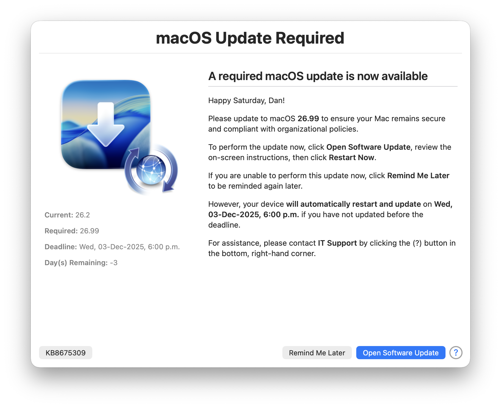

     

# DDM OS Reminder
> A major update to Mac Admins’ new favorite, MDM-agnostic, “set-it-and-forget-it” end-user reminder for Apple’s Declarative Device Management-enforced macOS update deadlines — now with **Configuration Profile** support and a `demo` mode for easy reminder dialog testing

## Overview

While Apple’s Declarative Device Management (DDM) provides Mac Admins a powerful way to _enforce_ macOS updates, its built-in notification is often _too subtle_ for most:

**DDM OS Reminder** evaluates the most recent `EnforcedInstallDate` and `setPastDuePaddedEnforcementDate` entries in `/var/log/install.log`, then leverages a [swiftDialog](https://github.com/swiftDialog/swiftDialog/wiki)-enabled script  and LaunchDaemon pair to dynamically deliver a more prominent end-user dialog reminding users to update their Mac to comply with DDM-enforced macOS update deadlines.

## Features

> Mac Admins can configure `daysBeforeDeadlineBlurscreen` to control how many days before the DDM-specified deadline the screen blurs when displaying your customized reminder dialog

- **Customizable**: Easily customize the reminder dialog’s title, message, icons and button text to fit your organization’s requirements by editing the included [`.plist`](org.churchofjesuschrist.dorm.plist) and distributing as part of a Configuration Profile via any MDM solution.
- **Easy Installation**: The [assemble.zsh](assemble.zsh) script makes it easy to deploy your reminder dialog and display frequency customizations via any MDM solution, so you can quickly roll out DDM OS Reminder across your entire organization.
- **Set-it-and-forget-it**: Once configured and installed, a LaunchDaemon displays your customized reminder dialog — which automatically checks the installed version of macOS against the DDM-required macOS version — to remind your users if an update is required.
- **Deadline Awareness**: Each time a DDM-enforced macOS version or its deadline is updated via your MDM solution, the reminder dialog dynamically updates the countdown to the deadline and required macOS version, creating a sense of urgency for end users to update their Macs.
- **Intelligently Intrusive**: The reminder dialog is designed to be informative without being overly disruptive — first checking if the user is in an online meeting — so users can continue their work while still being reminded of the need to update.
- **Logging**: The script logs its actions to a specified log file, allowing administrators to monitor its activity and troubleshoot as necessary.
- **Demonstration Mode**: A built-in `demo` mode allows Mac Admins to easily test the reminder dialog’s appearance and functionality: `zsh reminderDialog.zsh demo`

## Support

Community-supplied, best-effort support is available on the [Mac Admins Slack](https://www.macadmins.org/) (free, registration required) [#ddm-os-reminders](https://slack.com/app_redirect?channel=C09LVE2NVML) channel, or you can open an [issue](https://github.com/dan-snelson/DDM-OS-Reminder/issues).

## What’s New
See the [CHANGELOG](CHANGELOG.md) for a detailed list of changes and improvements.

## Deployment
[Continue reading on snelson.us …](https://snelson.us/ddm)