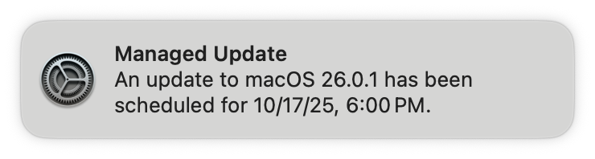
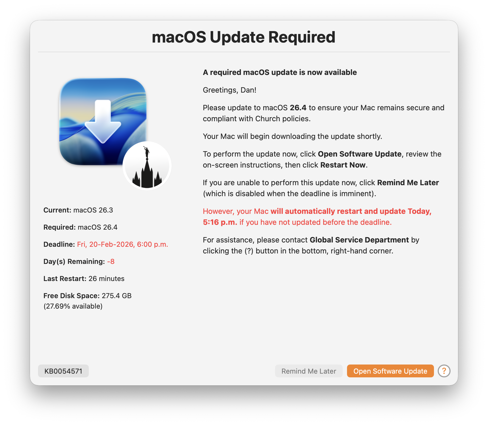
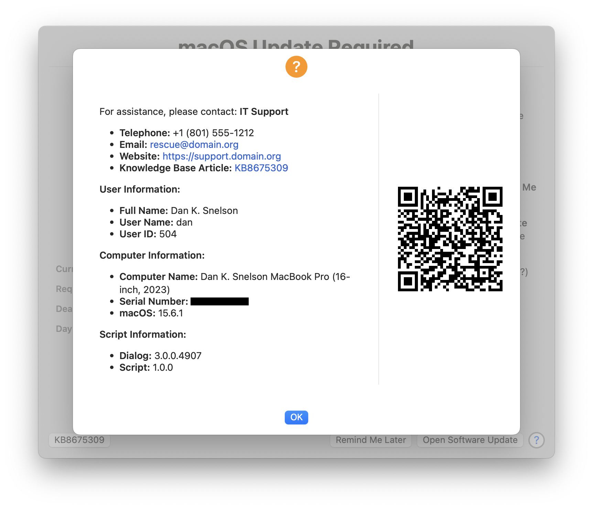
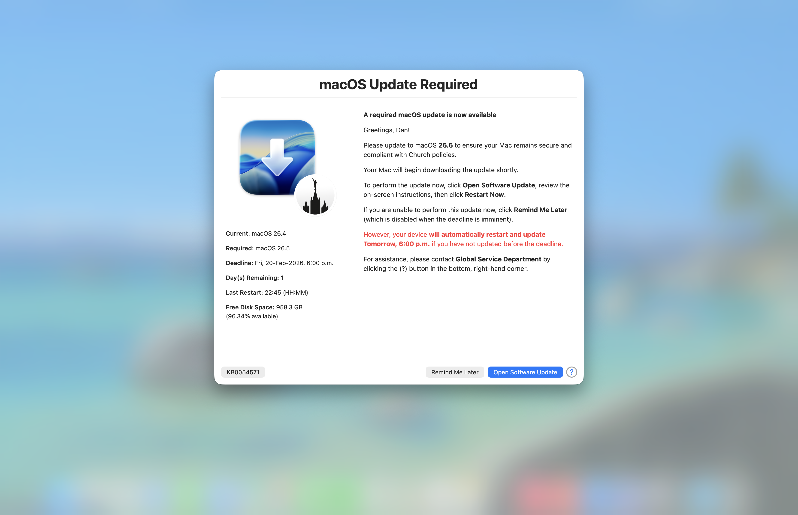

     

# DDM-OS-Reminder
> A swiftDialog and LaunchDaemon pair for "set-it-and-forget-it" end-user notifications for DDM-required macOS updates

## Overview

While Apple's Declarative Device Management (DDM) provides Mac Admins a powerful method to enforce macOS updates, its built-in notification _tends_ to be too subtle for most Mac Admins:

**DDM OS Reminder** evaluates the most recent `EnforcedInstallDate` entry in `/var/log/install.log`, then leverages a [swiftDialog](https://github.com/swiftDialog/swiftDialog/wiki) and LaunchDaemon pair to dynamically deliver a more prominent end-user notification of when the user's Mac needs to be updated to comply with DDM-configured OS version requirements:

Configure `daysBeforeDeadlineBlurscreen` to control when the screen blurs.

## Features
- **Set-it-and-forget-it**: Once installed, a LaunchDaemon executes the script which automatically checks the installed version of macOS against the DDM-enforced macOS version twice daily and displays the swiftDialog message if an update is required.
- **Customizable**: Easily customize the swiftDialog message's title, message, icon, and button text to fit your organization's needs.
- **Deadline Awareness**: Each time a DDM-enforced macOS version and deadline is set, the message will dynamically include a countdown to the deadline, creating a sense of urgency for end-users to update their Macs.
- **Tastefully Intrusive**: The message is designed to be informative without being overly disruptive, allowing users to continue their work while being reminded of the need to update. (Configure `daysBeforeDeadlineBlurscreen` to control when the screen blurs.)
- **Easy Installation**: The script can be easily deployed via MDM solutions, making it simple to roll out across an organization.
- **Logging**: The script logs its actions to a specified log file, allowing administrators to monitor its activity and troubleshoot if necessary.

## Deployment
[Continue reading …](https://snelson.us/ddm-os-reminder/)