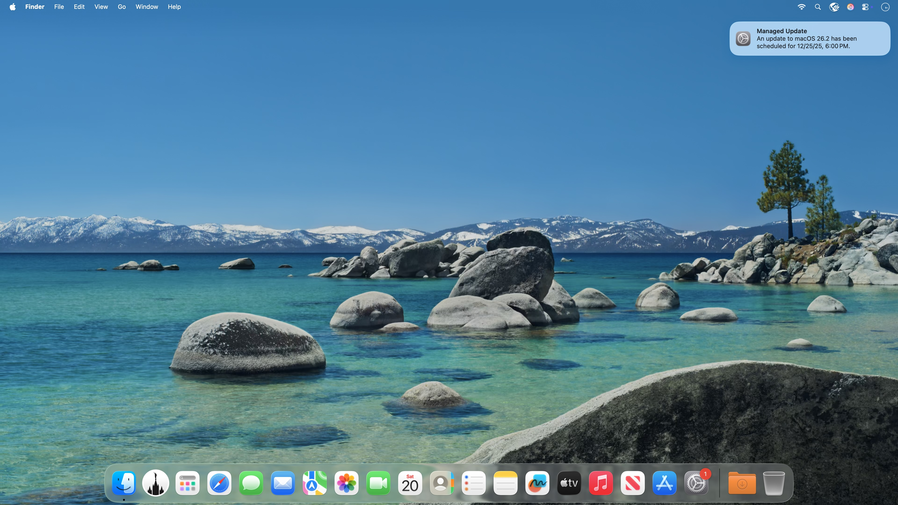
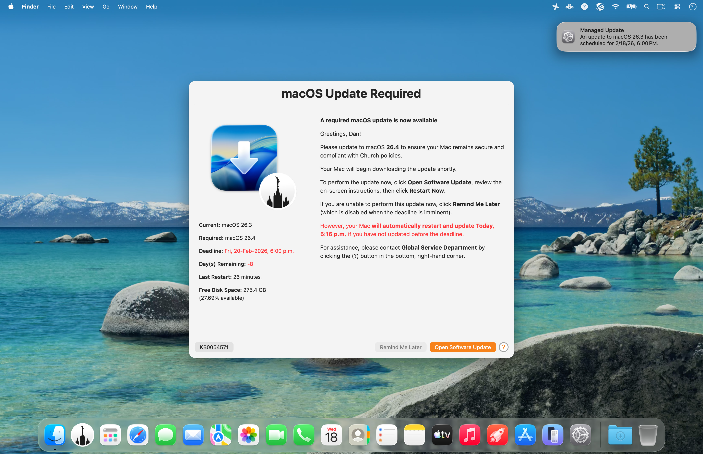

     

# DDM OS Reminder
> Yet another maintenance release of Mac Admins’ new favorite, MDM-agnostic, **“set-it-and-forget-it”** end-user reminder for Apple’s Declarative Device Management-enforced macOS update deadlines, with a new **allowlist for more robust meeting detection**, **dark‑mode overlay icon support**, and **enhanced error checking**.

## Overview

While Apple’s Declarative Device Management (DDM) provides Mac Admins with a powerful way to _enforce_ macOS updates, its built-in notification is often _too subtle_ for most administrators:
 
 

**DDM OS Reminder** evaluates the most recent `EnforcedInstallDate` and `setPastDuePaddedEnforcementDate` entries in `/var/log/install.log`, then leverages a [swiftDialog](https://github.com/swiftDialog/swiftDialog/wiki)-enabled script plus a LaunchDaemon to deliver a more prominent end-user dialog that reminds users to update their Mac to comply with DDM-enforced macOS update deadlines.

## Features

> Mac Admins can configure `daysBeforeDeadlineBlurscreen` to control how many days before the DDM-specified deadline the screen blurs when displaying your customized reminder dialog

- **Customizable**: Easily customize the reminder dialog’s title, message, icons (including light/dark overlay icons) and button text to fit your organization’s requirements by distributing a Configuration Profile via any MDM solution.
- **Multi-language Ready**: Optionally configure localized profile keys (`*_Localized_en`, `*_Localized_de`, `*_Localized_fr`) and let the script auto-select by logged-in user language, with optional `LanguageOverride`; unsupported locales normalize to English, and missing localized fields fall back to the scalar key.
- **Easy Installation**: The [assemble.zsh](assemble.zsh) script makes it easy to deploy your reminder dialog and display frequency customizations via any MDM solution, enabling quick rollout of DDM OS Reminder organization-wide.
- **Set-it-and-forget-it**: Once configured and installed, a LaunchDaemon displays your customized reminder dialog — automatically checking the installed macOS version against the DDM-required version — to remind users if an update is required.
- **Deadline Awareness**: Whenever a DDM-enforced macOS version or its deadline is updated via your MDM solution, the reminder dialog dynamically updates the countdown to both the deadline and required macOS version to drive timely compliance.
- **Intelligently Intrusive**: The reminder dialog is designed to be informative without being disruptive, first checking whether a user is in an online meeting — via an allowlist of approved apps — before displaying the dialog, so users can remain productive while still being reminded to update.
- **Logging**: The script logs its actions to your specified log file, allowing Mac Admins to monitor its activity and troubleshoot as necessary.
- **Demonstration Mode**: A built-in `demo` mode allows Mac Admins to test the appearance and functionality of the reminder dialog with ease: `zsh reminderDialog.zsh demo`.

> Version `3.0.0`, currently in its first _alpha_ release, will support multiple languages:

## Support

Community-supplied, best-effort support is available on the [Mac Admins Slack](https://www.macadmins.org/) (free, registration required) [#ddm-os-reminders](https://slack.com/app_redirect?channel=C09LVE2NVML) channel, or you can open an [issue](https://github.com/dan-snelson/DDM-OS-Reminder/issues).

See also: [Diagrams/README.md](Diagrams/README.md) for architecture and sequence diagrams.

## What’s New
See [CHANGELOG](CHANGELOG.md) for a detailed list of changes and improvements.

## Deployment
[Continue reading on snelson.us …](https://snelson.us/ddm)
