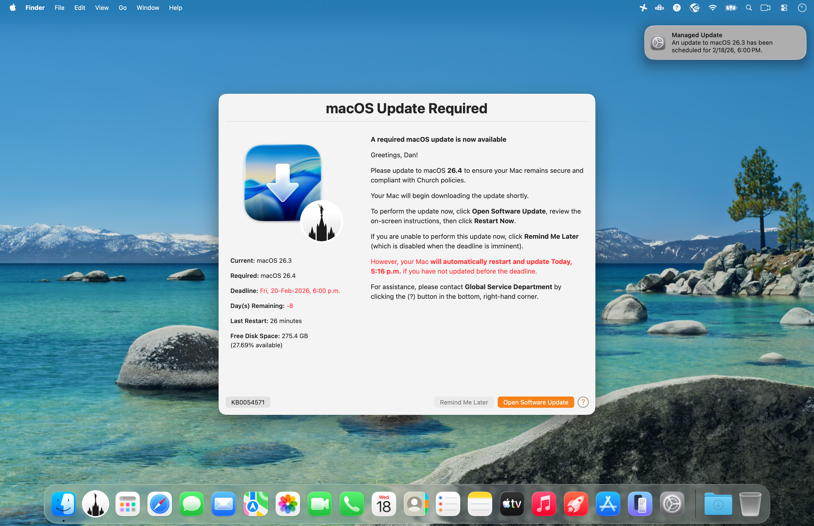
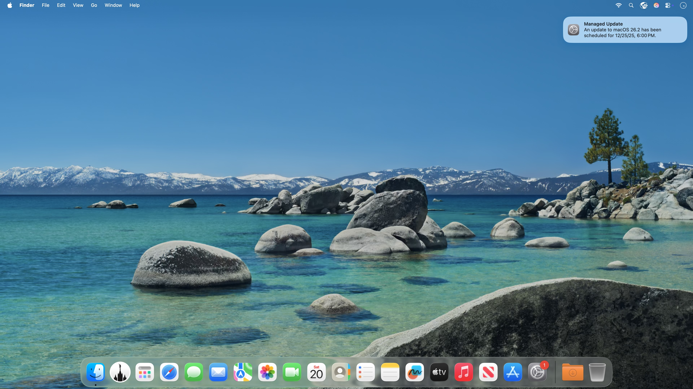
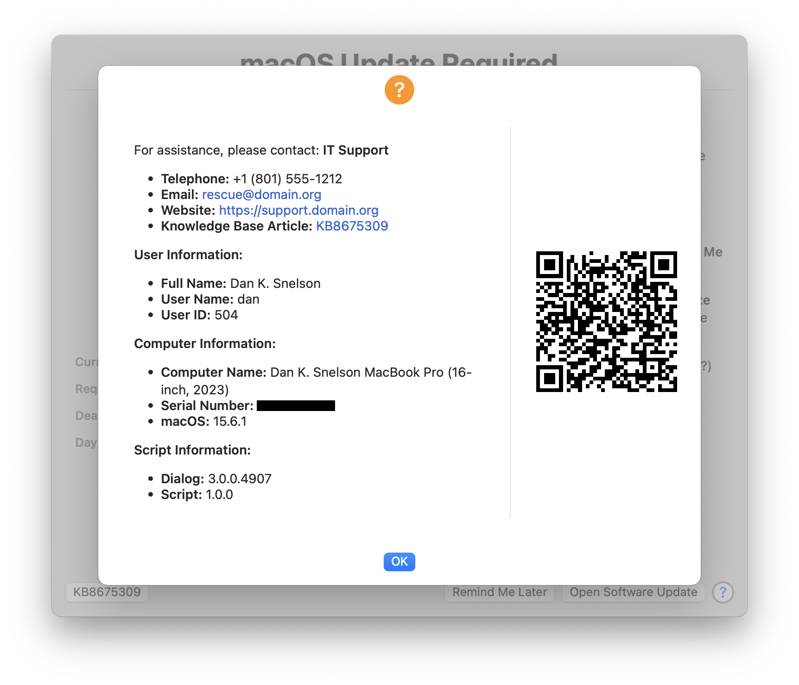
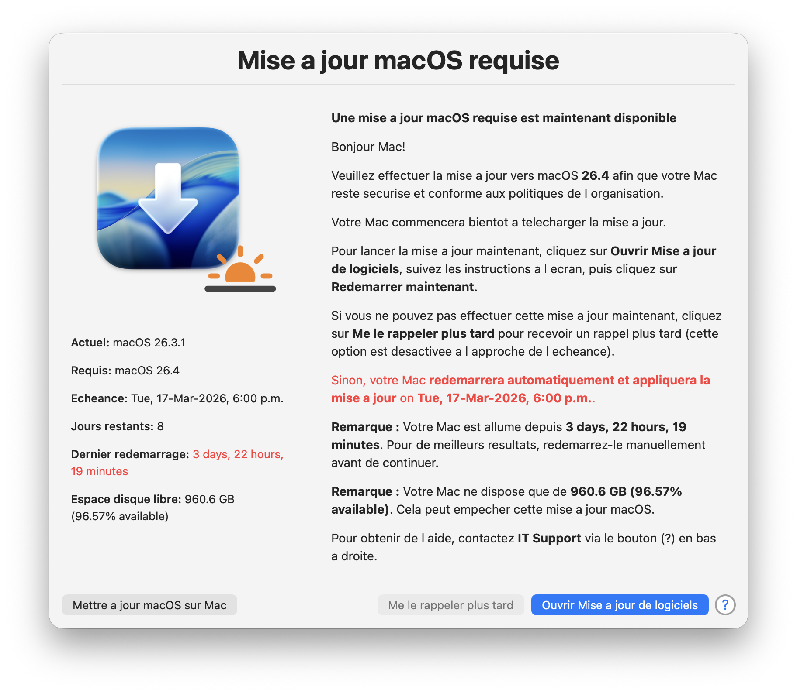
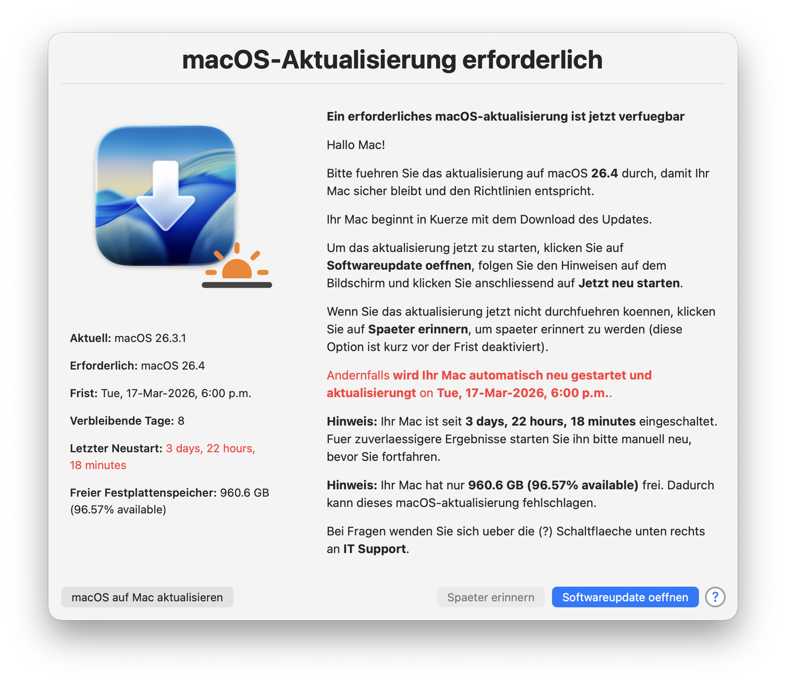
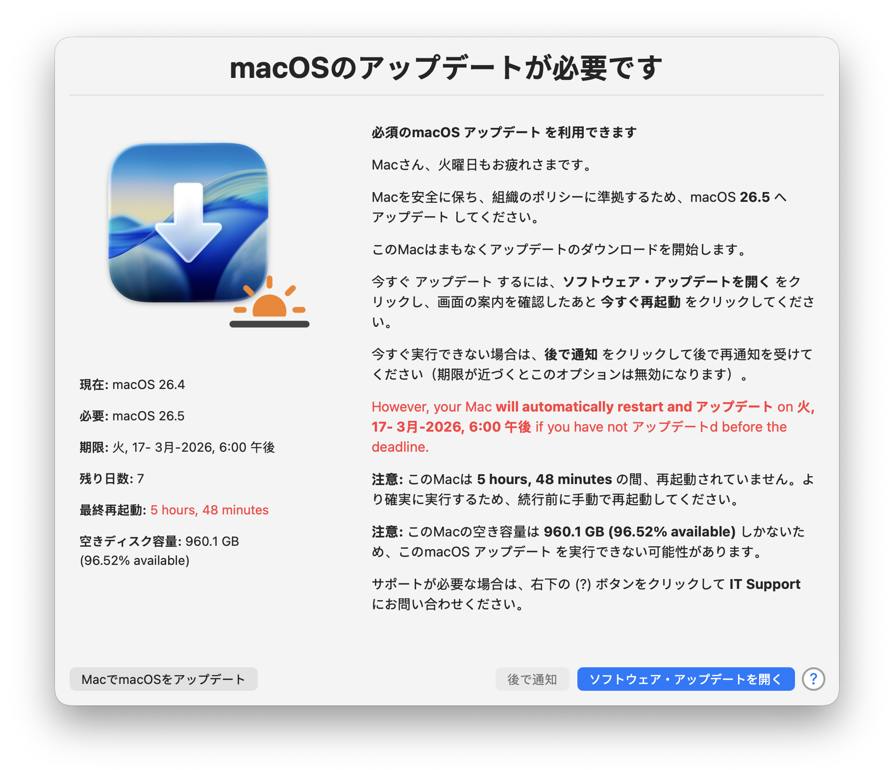
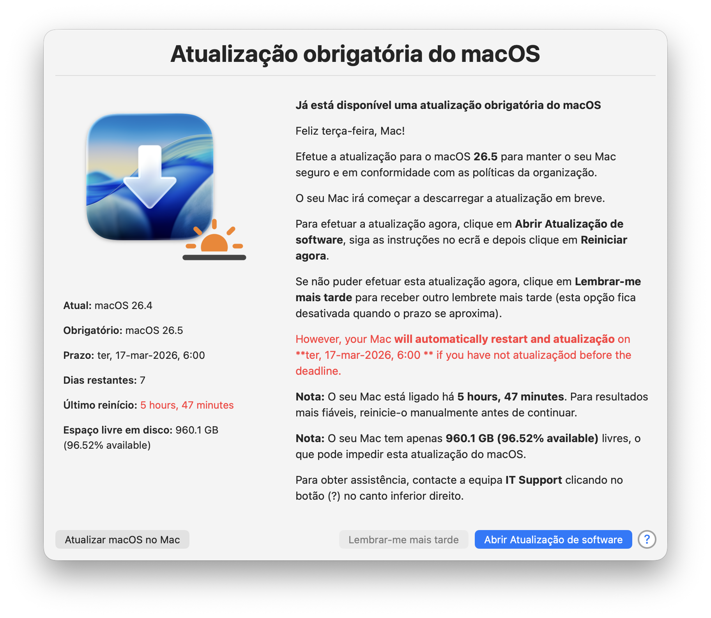
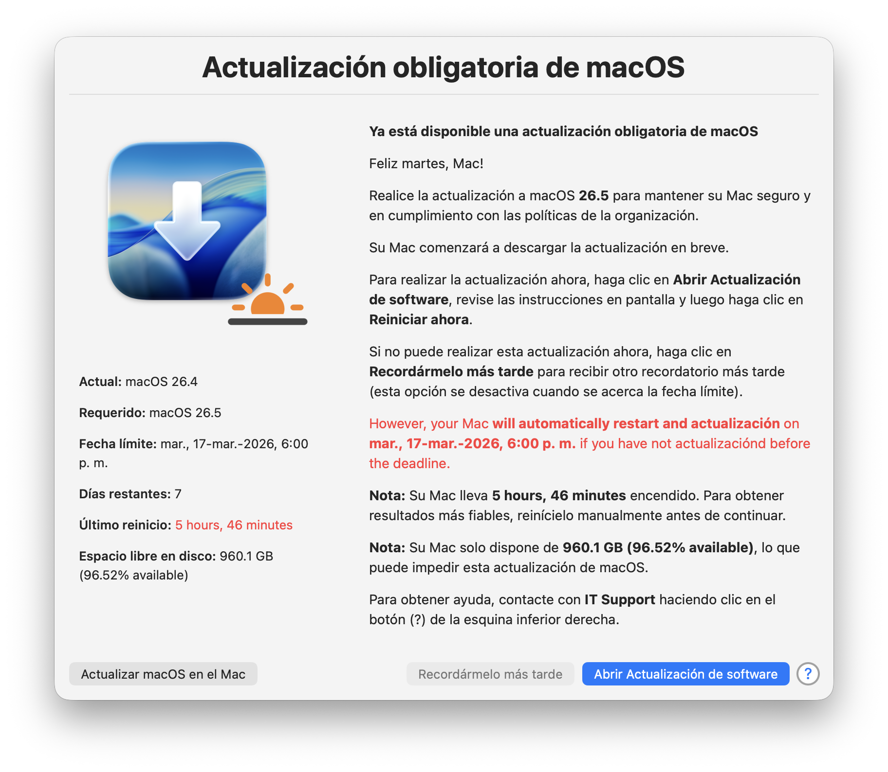
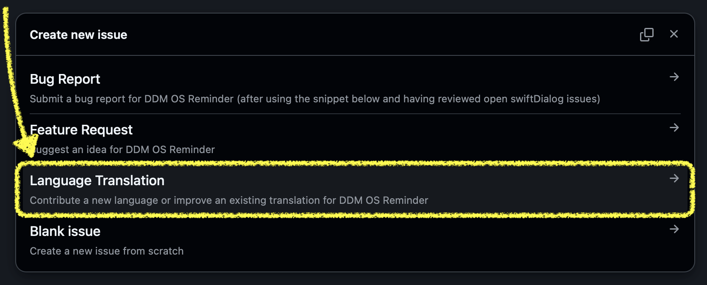

      [](https://swiftdialog.app) [](https://semgrep.dev)

# DDM OS Reminder (3.2.0)

> A **Mac Admin quality-of-life** update to the new favorite MDM-agnostic, **“set-it-and-forget-it”** reminder with **improved multiple language** support, **granular control for displaying IT Support information** and a **new, easy-to-use `reminderDialogPreferenceTest.zsh`** script for validating preference configurations and dialog appearance in real-time



## Overview

While Apple’s Declarative Device Management (DDM) provides Mac Admins with a powerful way to _enforce_ macOS updates, its built-in notification is often _too subtle_ for most administrators:
<br/>
 

**DDM OS Reminder** intelligently resolves DDM-enforced macOS update deadlines from recent `/var/log/install.log` activity, while using a declaration-aware resolver which prioritizes applicable enforced-install signals. End-user reminders are suppressed when declaration state is missing, conflicting, or invalid, only honoring `setPastDuePaddedEnforcementDate` when it safely matches the resolved declaration, before using a [swiftDialog](https://swiftdialog.app)-enabled script and `LaunchDaemon` to deliver a more prominent end-user reminder dialog.




---

## Features

- **Customizable**: Easily customize the reminder dialog’s title, message, icons (including light/dark overlay icons) and button text to fit your organization’s requirements by distributing a Configuration Profile via any MDM solution.
- **Easy Installation**: The [assemble.zsh](assemble.zsh) script makes it easy to deploy your reminder dialog and display frequency customizations via any MDM solution, enabling quick rollout of DDM OS Reminder organization-wide.
- **Set-it-and-forget-it**: Once configured and installed, a LaunchDaemon displays your customized reminder dialog — automatically checking the installed macOS version against the DDM-required version — to remind users if an update is required.
- **Deadline Awareness**: Whenever a DDM-enforced macOS version or its deadline is updated via your MDM solution, the reminder dialog dynamically updates the countdown to both the deadline and required macOS version to drive timely compliance.
- **Intelligently Intrusive**: The reminder dialog is designed to be informative without being disruptive, first checking whether a user is in an online meeting — via an allowlist of approved apps — before displaying the dialog, so users can remain productive while still being reminded to update.
- **Logging**: The script logs its actions to your specified log file, allowing Mac Admins to monitor its activity and troubleshoot as necessary.
- **Demonstration Mode**: A built-in `demo` mode allows Mac Admins to test the appearance and functionality of the reminder dialog with ease: `zsh reminderDialog.zsh demo`.
- **Configurable Post-Deadline Restart Policy**: Choose whether past-deadline devices are left alone, prompted to restart, or forced to restart (`Off`, `Prompt`, `Force`) after your defined grace period, balancing user flexibility with reliable compliance.
- **Upgrade-friendly:** `assemble.zsh` can now import supported settings from a previously generated DDM OS Reminder `.plist`, infer the `RDNN` and, when the filename is unambiguous, the deployment lane (dev, test, prod), and generate a matched assembled script, organizational `.plist`, and unsigned `.mobileconfig` in a single pass.
- **Full Multi-language Experience**: Beginning with version `3.1.0`, English dialog defaults are provided in-script, with `.plist` support for: German, French, Spanish, Italian, Dutch, Portuguese, and Japanese. Additional languages through localized `*Localized_<code>` preference keys, with locale-aware dialog content, support messaging, human-readable deadline dates, and past-deadline restart copy that match the resolved language.
- :new: **Granular Control for Displaying IT Support Information**: New `HideSupport*` preferences allow Mac Admins to easily choose which IT Support fields are displayed to their end-users.
- :new: **Use [`Resources/reminderDialogPreferenceTest.zsh`](Resources/reminderDialogPreferenceTest.zsh)** when you want to easily validate dialog copy, localization, branding, support contact details, button visibility, and infobox rendering from deployed preferences without waiting for an actual DDM deadline.

---

## Upgrading

Mac Admins using version `2.2.0` (or later) can import their prior `.plist` via drag-and-drop to `assemble.zsh`.

If the prior plist filename ends exactly with `-dev.plist`, `-test.plist`, or `-prod.plist`, `assemble.zsh` infers the deployment lane automatically. Older plists without that exact suffix still import supported values, but continue to prompt for deployment mode.
Near-miss filenames like `org.churchofjesuschrist.dorm-prod-2.2.0.plist` now print an explicit warning so the extra version suffix does not look like a failed auto-detection.

<details>
<summary><code>zsh assemble.zsh drag-and-drop prior .plist</code></summary>

```
zsh assemble.zsh '/Users/dan/Downloads/DDM-OS-Reminder-2.2.0/Artifacts/us.snelson.dorm-2026-01-06-073608.plist'

===============================================================
🧩 Assemble DDM OS Reminder (3.2.0)
===============================================================

📍 Full Paths:

        Reminder Dialog: ~/Downloads/DDM-OS-Reminder-main/reminderDialog.zsh
LaunchDaemon Management: ~/Downloads/DDM-OS-Reminder-main/launchDaemonManagement.zsh
      Working Directory: ~/Downloads/DDM-OS-Reminder-main
    Resources Directory: ~/Downloads/DDM-OS-Reminder-main/Resources

🔍 Checking Reverse Domain Name Notation …

    Reminder Dialog (reminderDialog.zsh):
        reverseDomainNameNotation = org.churchofjesuschrist
        organizationScriptName    = dorm

    LaunchDaemon Management (launchDaemonManagement.zsh):
        reverseDomainNameNotation = org.churchofjesuschrist
        organizationScriptName    = dor


📥 Prior plist provided via command-line argument: '/Users/dan/Downloads/DDM-OS-Reminder-2.2.0/Artifacts/us.snelson.dorm-2026-01-06-073608.plist'

ℹ️  Importing supported values from: /Users/dan/Downloads/DDM-OS-Reminder-2.2.0/Artifacts/us.snelson.dorm-2026-01-06-073608.plist
🔎 Inferred RDNN from prior plist: 'us.snelson'

━━━━━━━━━━━━━━━━━━━━━━━━━━━━━━━━━━━━━━━━━━━━━━━━━━━━━━━━━━━━━━━━━━━━━━━━━━━━━━━━━━━━━
🏷️  Using 'us.snelson' as the Reverse Domain Name Notation
━━━━━━━━━━━━━━━━━━━━━━━━━━━━━━━━━━━━━━━━━━━━━━━━━━━━━━━━━━━━━━━━━━━━━━━━━━━━━━━━━━━━━


━━━━━━━━━━━━━━━━━━━━━━━━━━━━━━━━━━━━━━━━━━━━━━━━━━━━━━━━━━━━━━━━━━━━━━━━━━━━━━━━━━━━━
🛠️  Interactive Configuration
━━━━━━━━━━━━━━━━━━━━━━━━━━━━━━━━━━━━━━━━━━━━━━━━━━━━━━━━━━━━━━━━━━━━━━━━━━━━━━━━━━━━━


ℹ️  Prior plist supplied; skipping IT support, branding and restart policy prompts.


━━━━━━━━━━━━━━━━━━━━━━━━━━━━━━━━━━━━━━━━━━━━━━━━━━━━━━━━━━━━━━━━━━━━━━━━━━━━━━━━━━━━━
🚦 Select Deployment Mode:
━━━━━━━━━━━━━━━━━━━━━━━━━━━━━━━━━━━━━━━━━━━━━━━━━━━━━━━━━━━━━━━━━━━━━━━━━━━━━━━━━━━━━

  1) 🧪 Development - Keep placeholder text for local testing
  2) 🔬 Testing     - Replace placeholder text with 'TEST' for staging
  3) 🚀 Production  - Remove placeholder text for clean deployment

  [Press ‘X’ to exit]

Enter mode [1/2/3]: 3

📦 Deployment Mode: prod

🔧 Inserting reminderDialog.zsh into launchDaemonManagement.zsh  …

✅ Assembly complete [2026-03-28-151200]
   → Artifacts/ddm-os-reminder-assembled-2026-03-28-151200.zsh

🔁 Updating reverseDomainNameNotation to 'us.snelson' in assembled script …

🔍 Performing syntax check on 'Artifacts/ddm-os-reminder-assembled-2026-03-28-151200.zsh' …
    ✅ Syntax check passed.

🗂  Generating LaunchDaemon plist …
    🗂  Creating us.snelson.dorm plist from /Users/dan/Documents/GitHub/dan-snelson/DDM-OS-Reminder/Resources/sample.plist …

    🔧 Updating internal plist content …
    🔓 Production mode: removing placeholder text for clean deployment
    🔧 Importing supported values from prior plist …
    ℹ️  Preserving imported ScriptLog: /var/log/us.snelson.log
   → Artifacts/us.snelson.dorm-2026-03-28-151200-prod.plist

🧩 Generating Configuration Profile (.mobileconfig) …
   → Artifacts/us.snelson.dorm-2026-03-28-151200-prod-unsigned.mobileconfig

🔍 Performing syntax check on 'Artifacts/us.snelson.dorm-2026-03-28-151200-prod-unsigned.mobileconfig' …
    ✅ Profile syntax check passed.

🔁 Renaming assembled script …

🔁 Updating scriptLog path based on RDNN …

🏁 Done.

Deployment Artifacts:
        Assembled Script: Artifacts/ddm-os-reminder-us.snelson-2026-03-28-151200-prod.zsh
    Organizational Plist: Artifacts/us.snelson.dorm-2026-03-28-151200-prod.plist
   Configuration Profile: Artifacts/us.snelson.dorm-2026-03-28-151200-prod-unsigned.mobileconfig

━━━━━━━━━━━━━━━━━━━━━━━━━━━━━━━━━━━━━━━━━━━━━━━━━━━━━━━━━━━━━━━━━━━━━━━━━━━━━━━━━━━━━
⚠️  Important Next Steps:
━━━━━━━━━━━━━━━━━━━━━━━━━━━━━━━━━━━━━━━━━━━━━━━━━━━━━━━━━━━━━━━━━━━━━━━━━━━━━━━━━━━━━

  Production Artifacts Generated:
    - All placeholder text removed (clean output)
    - Supported configuration values imported from prior plist
    - Prior plist: /Users/dan/Downloads/DDM-OS-Reminder-2.2.0/Artifacts/us.snelson.dorm-2026-01-06-073608.plist
    - ScriptLog resolved to '/var/log/us.snelson.log'

  Recommended review items:
    - Support team name, phone, email, website
    - Imported ScriptLog path and any carried-forward KB/help visibility
    - Organization overlay icon URLs
    - Button labels and dialog messages

  Files to review:
    - Artifacts/us.snelson.dorm-2026-03-28-151200-prod.plist
    - Artifacts/us.snelson.dorm-2026-03-28-151200-prod-unsigned.mobileconfig

===============================================================

```

</details>

---

## Multi-language Support

<table>
  <tr>
    <td></td>
    <td></td>
  </tr>
  <tr>
    <td></td>
    <td></td>
  </tr>
  <tr>
    <td></td>
    <td></td>
  </tr>
</table>

## Localization Contributions

> For additional language support, contributors only need to edit [Resources/sample.plist](Resources/sample.plist). The runtime defaults and generated plist/mobileconfig output are derived from that localization surface.
> 
> See [Language Translation: Italian](https://github.com/dan-snelson/DDM-OS-Reminder/issues/89) for a real-world example.




Use `LanguageOverride` to force a locale, run the script, capture screenshots, then restore `auto`.

For custom text authoring, use base keys such as `Message` and `HelpMessage` when you want one shared string across every language. Add `MessageLocalized_<code>` or `HelpMessageLocalized_<code>` only for languages that truly need an override.

Starting with `3.1.0`, `reminderDialog.zsh` only ships English built-in fallback strings. To display a non-English interface, provide localized preference keys such as `TitleLocalized_it`, `MessageLocalized_it`, and related `*Localized_<code>` entries in managed or local preferences.

```zsh
# German screenshots
rm -f /var/log/org.churchofjesuschrist.log
defaults write /Library/Preferences/org.churchofjesuschrist.dorm LanguageOverride -string "de"
zsh reminderDialog.zsh

# French screenshots
rm -f /var/log/org.churchofjesuschrist.log
defaults write /Library/Preferences/org.churchofjesuschrist.dorm LanguageOverride -string "fr"
zsh reminderDialog.zsh

# Spanish screenshots
rm -f /var/log/org.churchofjesuschrist.log
defaults write /Library/Preferences/org.churchofjesuschrist.dorm LanguageOverride -string "es"
zsh reminderDialog.zsh

# Italian screenshots
rm -f /var/log/org.churchofjesuschrist.log
defaults write /Library/Preferences/org.churchofjesuschrist.dorm LanguageOverride -string "it"
zsh reminderDialog.zsh

# Portuguese screenshots
rm -f /var/log/org.churchofjesuschrist.log
defaults write /Library/Preferences/org.churchofjesuschrist.dorm LanguageOverride -string "pt"
zsh reminderDialog.zsh

# Dutch screenshots
rm -f /var/log/org.churchofjesuschrist.log
defaults write /Library/Preferences/org.churchofjesuschrist.dorm LanguageOverride -string "nl"
zsh reminderDialog.zsh

# Japanese screenshots
rm -f /var/log/org.churchofjesuschrist.log
defaults write /Library/Preferences/org.churchofjesuschrist.dorm LanguageOverride -string "ja"
zsh reminderDialog.zsh

# Restore automatic language detection
defaults write /Library/Preferences/org.churchofjesuschrist.dorm LanguageOverride -string "auto"
```

Optional verification in log output:
- `LanguageOverride is 'de'; using 'de'`
- `LanguageOverride is 'fr'; using 'fr'`
- `LanguageOverride is 'es'; using 'es'`
- `LanguageOverride is 'it'; using 'it'`
- `LanguageOverride is 'nl'; using 'nl'`
- `LanguageOverride is 'pt'; using 'pt'`
- `LanguageOverride is 'ja'; using 'ja'`


## Deadline Date Format

`DateFormatDeadlineHumanReadable` remains the single date format key.

Swiss-style numeric format example:

```zsh
sudo defaults write /Library/Preferences/org.churchofjesuschrist.dorm \
    DateFormatDeadlineHumanReadable -string "+%d.%m.%Y %H:%M"
```

## Support

Community-supplied, best-effort support is available on the [Mac Admins Slack](https://www.macadmins.org/) (free, registration required) [#ddm-os-reminders](https://slack.com/app_redirect?channel=C09LVE2NVML) channel, or you can open an [issue](https://github.com/dan-snelson/DDM-OS-Reminder/issues).

See also: [Diagrams/README.md](Diagrams/README.md) for architecture and sequence diagrams.

## What’s New
See [CHANGELOG](CHANGELOG.md) for a detailed list of changes and improvements.

## Deployment
[Continue reading on snelson.us …](https://snelson.us/ddm)
